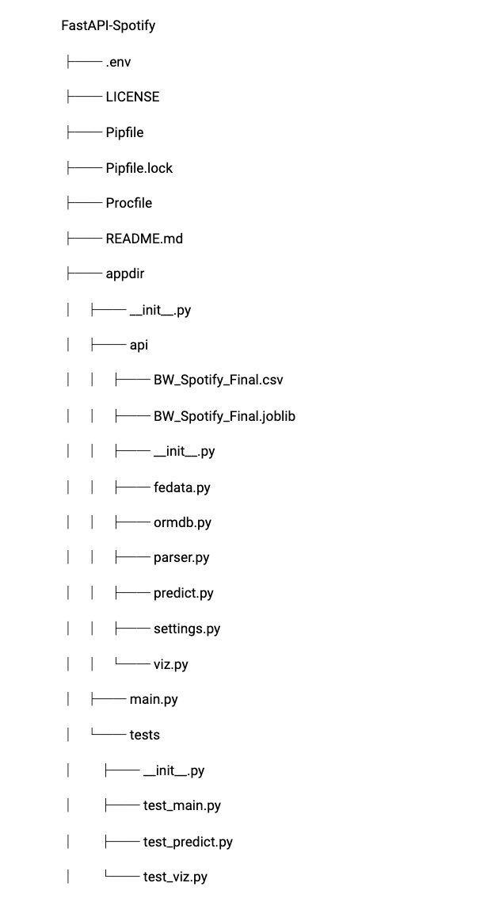

This article will discuss how to use FastAPI framework to implement a data science API. The data science API as a micro service allows deployment of a machine learning model and provides multiple endpoints to interact with a frontend JavaScript Web App. The data is sent over to the frontend as JSON format. This is a part of a Web application that interacts with Spotify API.


### File structure

The file structure of the project is shown below.



```zsh
FastAPI-Spotify
├── .env
├── LICENSE
├── Pipfile
├── Pipfile.lock
├── Procfile
├── README.md
├── appdir
│   ├── __init__.py
│   ├── api
│   │   ├── BW_Spotify_Final.csv
│   │   ├── BW_Spotify_Final.joblib
│   │   ├── __init__.py
│   │   ├── fedata.py
│   │   ├── ormdb.py
│   │   ├── parser.py
│   │   ├── predict.py
│   │   ├── settings.py
│   │   └── viz.py
│   ├── main.py
│   └── tests
│       ├── __init__.py
│       ├── test_main.py
│       ├── test_predict.py
│       └── test_viz.py
├── spotify_query.csv
```

The metadata files are in the project directories. That includes 
* *FastAPI-Spotify:* Project directory
* *Pipfile:* For package dependency which is managed in a virtual environment using pipenv.
* *Procfile:* This is the process file which tells a web service such as heroku how to run the app
* *.env:* Database and, Spotify Keys, environment variable are all set in this file and it’s in .gitignore
* *appdir:* This is the api app directory that is also referred to as the top level package.
* *main.py:* This is the main file that will be run by a webserver such as uvicorn.
* *api:* A subpackage directory that contains multiple modules
* *tests:* Another subpackage directory for unit testing


### Setting up the project

Create a repository in the [github](https://github.com/skhabiri/FastAPI-Spotify) and clone the repo to your local machine, `git clone https://github.com/skhabiri/FastAPI-Spotify.git`. In order to be able to reproduce the work make sure to create a virtual environment, `pipenv --python 3.7`. Now with `pipenv shell` activate the virtual environment.


### Install required packages and dependencies

List of main packages that are required are:
* _fastapi:_ A python web framework to build new applications
* _uvicorn:_ ASGI web server 
* _sqlalchemy:_ A SQL toolkit and object-relational mapper for the Python programming
* _psycopg2:_ PostgreSQL database adapter for Python
* _python-dotenv:_ to read key values from .env file
* _spotipy:_ Python library for the Spotify Web API
* _joblib:_ used for object serialization based on pickle protocol
* _scikit-learn:_ machine learning library for Python
* _pandas:_ data analysis library
* _plotly:_ for visualization

Use `pipenv install <package_name>`


### API modules

* __main.py:__ The app runs by `uvicorn appdir.main:app`. main.py is the main module to run. Inside main.py, we instantiate the app as an instance of FastAPI() and define most of the routes including the root.
```
from fastapi import FastAPI
app = FastAPI()
```
A route is defined by use of a decorator and a function right afterwards. Depending on http method we’ll use a get or post method. Here are two examples on how to use a get and post method.
```
from appdir.api import fedata, predict, parser, ormdb, viz
@app.post('/SpotifySearch/')
def spotifysearch(phrase: str, limit: int = 5):
""" An API call to Spotify, to search for a keyword and return a list of "limit" number of items containing the artist, album and track names.
ex/ key_word = {"california dreamin"}
return: list of dictionary """
return parser.spotify_parser(phrase, limit)
@app.get("/DB_reload")
def DB_reload(file_name: str = "./spotify_query.csv"):
"""Reset and reload the database from a csv file"""
ormdb.reset_db(ormdb.engine)
session = ormdb.get_session()
ormdb.load_csv(session, file_name)
songs = session.query(ormdb.Songdb).all()
session.close()
return f"{len(songs)} records from {file_name} loaded to the DB" 
```

Under appdir/api we have several modules that are organized as follows.
* __fedata.py:__ FastAPI is built on top of pydantic, a data validation and setting library in python. This file defines a data model for the songs, “Song” that is received by Frontend JavaScript app. “Song” is a child class of pydantic.BaseModel data model. FastAPI uses the type hint to validate the receiving data type. 
```
from pydantic import BaseModel
class Song(BaseModel):
"""Front end data model used by fastapi"""
album: str
aluri: str
track_number: int
trid: str
name: str
artist: str
arid: str
acousticness: float = Field(..., example=0.029400)
energy: float = Field(..., example=0.579)
instrumentalness: float
liveness: float
loudness: float
speechiness: float
tempo: float
valence: float
popularity: int
```


* __ormdb.py:__ Connects sqlalchemy engine to ElephantSQL, a cloud based database. It defines the database schema, “Songdb”, which is a subclass of sqlalchemy.ext.declarative.declarative_base. “Songdb” happens to have similar types and fields as the one defined by pydantic.BaseModel, which is received by frontend app. This is common as we usually pass the same data stored in the database to the frontend.
```
from sqlalchemy.ext.declarative import declarative_base
from sqlalchemy import create_engine
from sqlalchemy.orm import sessionmaker
from .settings import DATABASE_URL
import psycopg2
# connect an engine to ElephantSQL
engine = create_engine(DATABASE_URL)
# create a SessionLocal class bound to the engine
SessionLocal = sessionmaker(autocommit=False, autoflush=False, bind=engine)
Base = declarative_base()
Base.metadata.create_all(bind=engine)
class Songdb(Base):
    __tablename__ = "Song_table"
    """Song_db data model based on sqlalchemy used by elephant postgres database """
    index = Column(Integer, primary_key=True, index=True)
    album = Column(String)
    aluri = Column(String(255), index=True)
    track_number = Column(Integer)
    trid = Column(String(255), index=True)
    name = Column(String(255))
    artist = Column(String)
    arid = Column(String(255), index=True)
    acousticness = Column(Float)
    danceability = Column(Float)
    energy = Column(Float)
    instrumentalness = Column(Float)
    liveness = Column(Float)
    loudness = Column(Float)
    speechiness = Column(Float)
    tempo = Column(Float)
    valence = Column(Float)
    popularity = Column(Integer)
    def __repr__(self):
        return '-name:{}, artist:{}, trid:{}-'.format(self.name, self.artist, self.trid)
```


* __parser.py:__ It uses spotipy library to connect to Spotify API and pull data from it. Here is code snippet for this purpose.
```
import spotipy
from spotipy.oauth2 import SpotifyClientCredentials
from .settings import *
client_cred = SpotifyClientCredentials(client_id=CLIENT_ID, client_secret=CLIENT_SECRET)
sp = spotipy.Spotify(client_credentials_manager=client_cred)
def spotify_parser(phrase: str, limit: int):
""" An API call to Spotify, to search for a keyword and return a list of dictionaries with    three keys for each of "limit" number of items
:return: record_list = [{"artist":<value>, "album":<value>,"track":<value>}, {...}, ...]"""
result = sp.search(phrase, limit)
record_list = []
for item in range(len(result['tracks']['items'])):
        keyword_dict = {}
        keyword_dict['artist'] = result['tracks']['items'][item]['artists'][0]['name']
        keyword_dict['album'] = result['tracks']['items'][item]['album']['name']
        keyword_dict['track'] = result['tracks']['items'][item]['name']
        record_list.append(keyword_dict)
return record_list 
```


* __predict.py:__ This module imports a pre trained machine learning model to suggest a list of songs based on a song audio features.
```
from fastapi import APIRouter, HTTPException
import joblib
apipath = dirname(__file__)
FILENAME = join(apipath, "BW_Spotify_Final.joblib")
csv_url = join(apipath, "BW_Spotify_Final.csv")
router = APIRouter()
knn = joblib.load(FILENAME)
@router.get('/predict/{id}')
async def predict_func(id: str):
"""Takes a trackID string as input and returns a list of similar trackIDs"""
try:
pred = predict_model(track_id= id, df=df, knn=knn)
except Exception as e:
print(e.args)
raise HTTPException(status_code=500, detail="Input is not in trained database")
return {'Suggested track IDs': pred} 
```


* __viz.py:__ Returns the JSON format of the radar plot for the audio features of the inquired song and the average of those audio features for the suggested songs.
```
import plotly.graph_objects as go
@router.get('/viz/{track_id}')
async def viz_func(track_id: str):
r = feature_average(track_id)
attributes = ['acousticness', 'danceability', 'energy', 'instrumentalness', 'liveness', 'speechiness', 'valence']
rid = (df[df["id"]==track_id][attributes].values.round(3)).tolist()[0]
fig = go.Figure()
fig.add_trace(go.Scatterpolar(r=r, theta=attributes, fill='toself', name='Suggestion'))
fig.add_trace(go.Scatterpolar(r=rid, theta=attributes, fill='toself', name='Query'))   
fig.update_layout(polar=dict(radialaxis=dict(visible=True)), showlegend=True)
return fig.to_json(), fig.show()
```


### API endpoints

The endpoints provided by the data science API are listed below, with a brief description for each of them. 
* _predict:_ Receives a song track-id and uses a pre trained machine learning model to return a list of suggested songs based on the audio features of the provided track.
* _viz:_ provide a JSON format of a plotly radar chart comparing the audio features of the provided song and the average of the list of suggested songs.
* _spotifysearch:_ Receives a phrase and requested number of queries. Then makes an API call to Spotify to find the matching tracks limited by the number of queries.
* _cvs_dump:_ gets a keyword and find all the related tracks for a limited number of artists and saves all the provided information into spotify_query.csv.
* _db_reload:_ initialize an elephantSQL database and load it with spotify_query.csv
* _db_query:_ Instead of a query to Spotify makes a query to database and fetch the first n number of rows.
* _db_reset:_ resets the database
* _readme:_ documentation


### Deploy the app to Heroku

When deploying to the cloud we usually need a process file to instruct how to run the app. It is something like `web: uvicorn --host 0.0.0.0 --port $PORT appdir.main:app`. For simple apps, Heroku platform automatically detects the language and creates a default web process type to boot the application server. To deploy the app to Heroku after committing all the changes, login to Heroku, create an app name, and create a heroku remote, and push the code to heroku remote
```
heroku login
heroku create fastapi-spotify
heroku git:remote -a fastapi-spotify
git push heroku main
```


