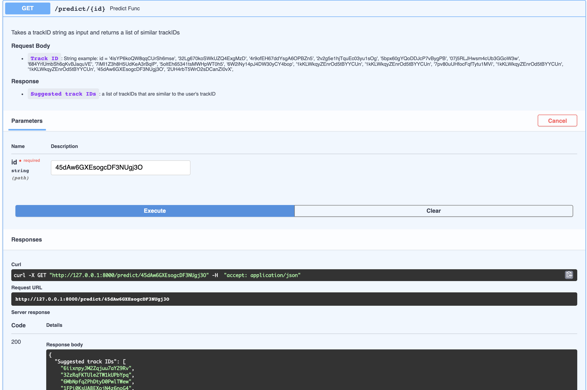
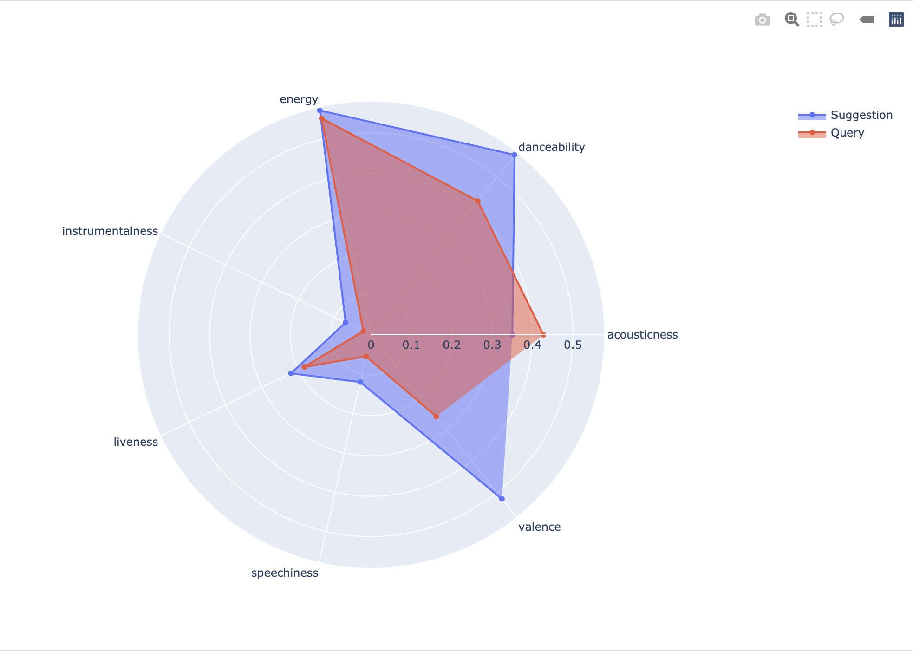
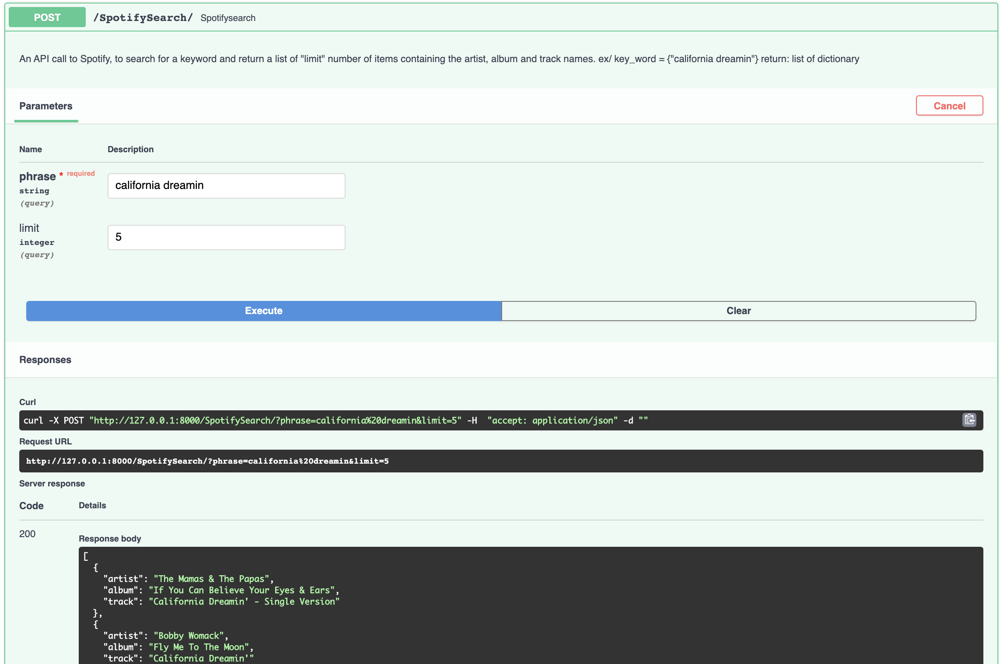
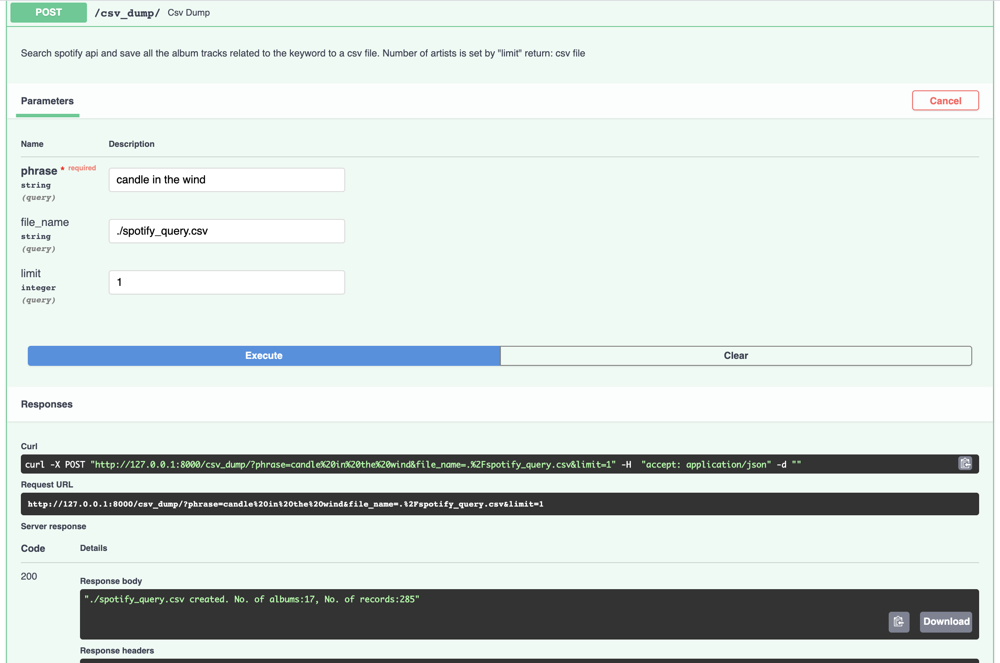
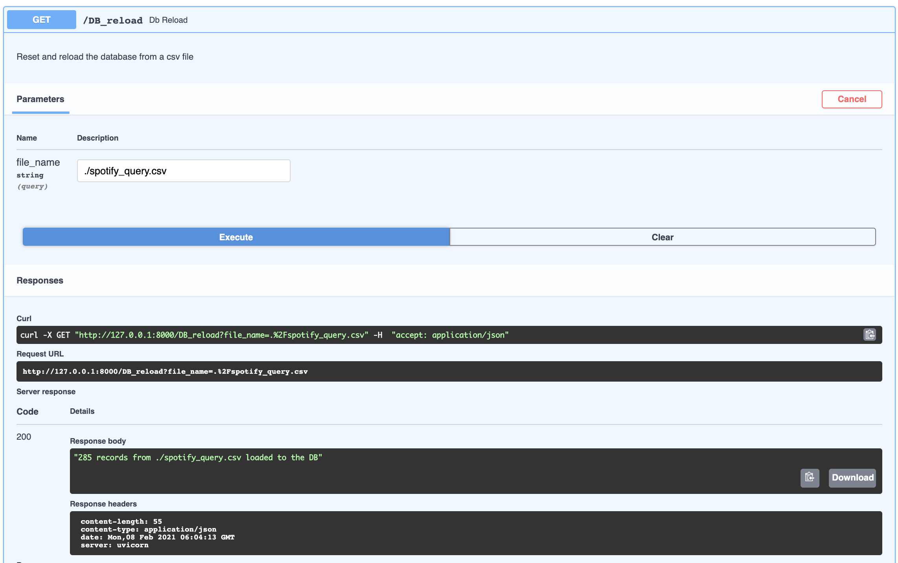
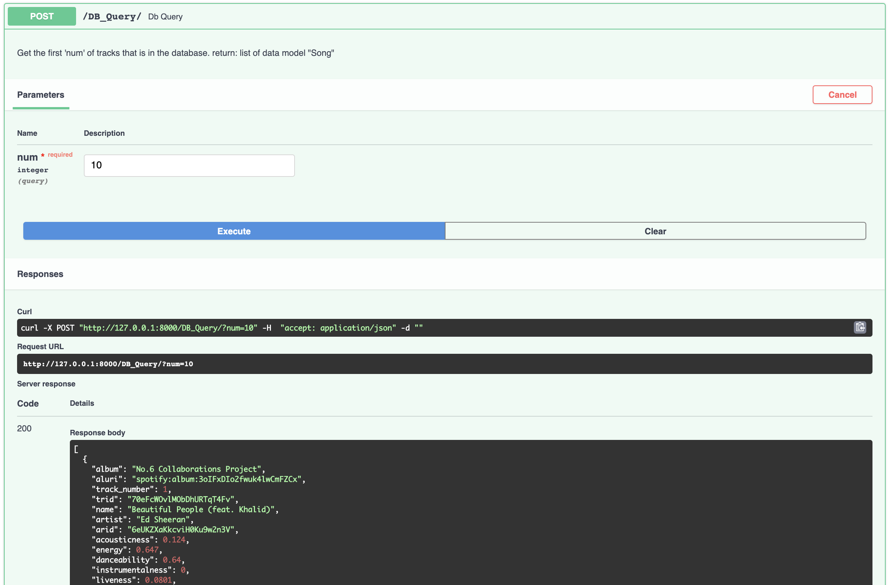
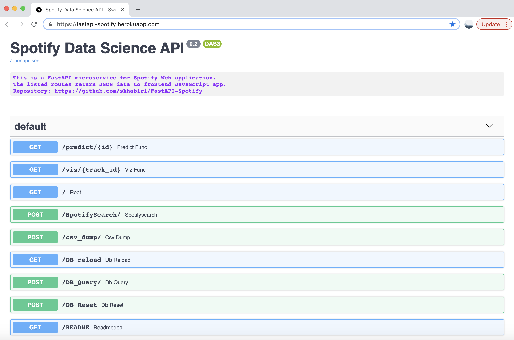

HypoTweet is a machine learning a web application that takes up to 4 users. It connects to Twitter API to pull the user information including user id, latest tweets, tweet id. For a hypothetical tweet the application predicts which of the users might be the author.

Once a tweet is entered it fits a multiclass logistic regression on the selected users' tweets which have previousely been embeded with spacy and stored in Heroku PostgreSQL. Then it uses the lightweight version of spacy to embed the hypothetical tweet into 96 vectors. Then vectorized tweet is passed as an input to the trained model to predict which user might send a similar tweet.

### File structure
The file structure of the project is shown below.

```zsh
HypoTweet
├── .env
├── LICENSE
├── Pipfile
├── Pipfile.lock
├── Procfile
├── README.md
├── tree.text
└── twitapp
    ├── __init__.py
    ├── app.py
    ├── db.sqlite3
    ├── models.py
    ├── predict.py
    ├── templates
    │   ├── base.html
    │   ├── base.html0
    │   ├── base.html4
    │   ├── prediction.html
    │   └── user.html
    └── twitter.py
```

`HypoTweet` is the project directory. We use pipenv to manage the virtual environment for handling package dependency and producibility. The final app is deployed onto the cloud using heroku a cloud platform. `Procfile` is the process file that directs heroku how to run the app.
`twitapp` is the application directory where all the app related files reside. `__init__.py` marks the app directory as a Python package. It also serves as the point of entry for the app.
`app.py` is the main python file assigned to create the app and handle most of the routings. `db.sqlite` is a local database that stores the users information for testing the app locally. Later on when the app is deployed to the cloud we switch to a cloud base database.
For creating the database we use SQLAlchemy an object-relational mapper (ORM) database toolkit for python. `models.py` specify the database data models. To pull twitter data we use tweepy. It's a python library to connect to Twitter API. `twitter.py` interacts with Twitter API and stores the data in database.
The machine learning model and classification tasks are performed in `predict.py`.

### Setting up the project
Create a repository in the github to fork the [repo](https://github.com/skhabiri/HypoTweet) or clone it to your local machine. We use en_core_web_sm,  model for spacy to speed up the prediction and minimize the file sizes before being deployed to heroku. Version 3.0.0 of the spacy model requires python version >= 3.8.

### Install required packages and dependencies
List of main packages that are required are:
* Flask==1.1.2:_ A python web framework to build web applications
* _gunicorn==20.0.4:_ WSGI web server 
* _Flask-SQLAlchemy==2.4.4:_ A SQL toolkit and object-relational mapper for the Python programming
* _psycopg2-binary==2.8.6:_ PostgreSQL database adapter for Python
* _python-dotenv==0.15.0:_ to read key values from .env file
* _tweepy==3.10.0:_ Python library for the Twitter API
* _joblib==1.0.1:_ used for object serialization based on pickle protocol
* _scikit-learn==0.24.1_ machine learning library for Python
* _spacy==3.0.3:_ A library for Natural Language Processing
* _en-core-web-sm==3.0.0:_ NLP model for vectorizing documents
* _Jinja2==2.11.3:_Jinja is a web template engine for the Python programming language

Use `pipenv install <package_name>`

### Web Application Development with Flask
A web application is composed of three elements: front-end, back-end and database. The front-end part of any application is what displays the information to the viewer and runs on the client browser. The back-end processes information and runs on a server that is remote from the user’s device. The database is also located remotely and stores all the data necessary for the application to run.
When the web browser makes a request for the page, this content is stored in a database and the particular page created full only when the user requests it. Before the page is returned to the caller, the back-end server retrieves the data from the database and populates it on the html page. 
Flask is a micro-framework because it is lightweight and only provides components that are essential, such as routing, request handling, sessions, and so on. In our application Flask is used for the backend, but it makes use of a templating language called Jinja2 which is used to create HTML, and other markup formats that are returned to the user via an HTTP request. We use jinja2 use inside HTML so that the content on the HTML page becomes dynamic. ANother key aspect of Flask is being able to work with WSGI. The Web Server Gateway Interface, or more commonly known as WSGI, is a standard that describes the specifications concerning the communication between a web server and a client application. 

### Creating the Flask App
Main components of our Flask app is in `app.py`. For creating the Flask app we need to import the Flask and the modules that interacts with frontend.
```
from flask import Flask, render_template, request
```
`request` is used to pass variable from html POST to python module. `render_template` passes variable from python module to jinja2 which is a template inside html.


### API modules
* __main.py:__ The app runs by `uvicorn appdir.main:app`. main.py is the main module to run. Inside main.py, we instantiate the app as an instance of FastAPI() and define most of the routes including the root.
```
from fastapi import FastAPI
app = FastAPI()
```
A route is defined by use of a decorator and a function right afterwards. Depending on http method we’ll use a get or post method. Here are two examples on how to use a get and post method.
```
from appdir.api import fedata, predict, parser, ormdb, viz
@app.post('/SpotifySearch/')
def spotifysearch(phrase: str, limit: int = 5):
""" An API call to Spotify, to search for a keyword and return a list of "limit" number of items containing the artist, album and track names.
ex/ key_word = {"california dreamin"}
return: list of dictionary """
return parser.spotify_parser(phrase, limit)
@app.get("/DB_reload")
def DB_reload(file_name: str = "./spotify_query.csv"):
"""Reset and reload the database from a csv file"""
ormdb.reset_db(ormdb.engine)
session = ormdb.get_session()
ormdb.load_csv(session, file_name)
songs = session.query(ormdb.Songdb).all()
session.close()
return f"{len(songs)} records from {file_name} loaded to the DB" 
```

Under appdir/api we have several modules that are organized as follows.
* __fedata.py:__ FastAPI is built on top of pydantic, a data validation and setting library in python. This file defines a data model for the songs, “Song” that is received by Frontend JavaScript app. “Song” is a child class of pydantic.BaseModel data model. FastAPI uses the type hint to validate the receiving data type. 
```
from pydantic import BaseModel
class Song(BaseModel):
"""Front end data model used by fastapi"""
album: str
aluri: str
track_number: int
trid: str
name: str
artist: str
arid: str
acousticness: float = Field(..., example=0.029400)
energy: float = Field(..., example=0.579)
instrumentalness: float
liveness: float
loudness: float
speechiness: float
tempo: float
valence: float
popularity: int
```


* __ormdb.py:__ Connects sqlalchemy engine to ElephantSQL, a cloud based database. It defines the database schema, “Songdb”, which is a subclass of sqlalchemy.ext.declarative.declarative_base. “Songdb” happens to have similar types and fields as the one defined by pydantic.BaseModel, which is received by frontend app. This is common as we usually pass the same data stored in the database to the frontend.
```
from sqlalchemy.ext.declarative import declarative_base
from sqlalchemy import create_engine
from sqlalchemy.orm import sessionmaker
from .settings import DATABASE_URL
import psycopg2
# connect an engine to ElephantSQL
engine = create_engine(DATABASE_URL)
# create a SessionLocal class bound to the engine
SessionLocal = sessionmaker(autocommit=False, autoflush=False, bind=engine)
Base = declarative_base()
Base.metadata.create_all(bind=engine)
class Songdb(Base):
    __tablename__ = "Song_table"
    """Song_db data model based on sqlalchemy used by elephant postgres database """
    index = Column(Integer, primary_key=True, index=True)
    album = Column(String)
    aluri = Column(String(255), index=True)
    track_number = Column(Integer)
    trid = Column(String(255), index=True)
    name = Column(String(255))
    artist = Column(String)
    arid = Column(String(255), index=True)
    acousticness = Column(Float)
    danceability = Column(Float)
    energy = Column(Float)
    instrumentalness = Column(Float)
    liveness = Column(Float)
    loudness = Column(Float)
    speechiness = Column(Float)
    tempo = Column(Float)
    valence = Column(Float)
    popularity = Column(Integer)
    def __repr__(self):
        return '-name:{}, artist:{}, trid:{}-'.format(self.name, self.artist, self.trid)
```


* __parser.py:__ It uses spotipy library to connect to Spotify API and pull data from it. Here is code snippet for this purpose.
```
import spotipy
from spotipy.oauth2 import SpotifyClientCredentials
from .settings import *
client_cred = SpotifyClientCredentials(client_id=CLIENT_ID, client_secret=CLIENT_SECRET)
sp = spotipy.Spotify(client_credentials_manager=client_cred)
def spotify_parser(phrase: str, limit: int):
""" An API call to Spotify, to search for a keyword and return a list of dictionaries with    three keys for each of "limit" number of items
:return: record_list = [{"artist":<value>, "album":<value>,"track":<value>}, {...}, ...]"""
result = sp.search(phrase, limit)
record_list = []
for item in range(len(result['tracks']['items'])):
        keyword_dict = {}
        keyword_dict['artist'] = result['tracks']['items'][item]['artists'][0]['name']
        keyword_dict['album'] = result['tracks']['items'][item]['album']['name']
        keyword_dict['track'] = result['tracks']['items'][item]['name']
        record_list.append(keyword_dict)
return record_list 
```


* __predict.py:__ This module imports a pre trained machine learning model to suggest a list of songs based on a song audio features.
```
from fastapi import APIRouter, HTTPException
import joblib
apipath = dirname(__file__)
FILENAME = join(apipath, "BW_Spotify_Final.joblib")
csv_url = join(apipath, "BW_Spotify_Final.csv")
router = APIRouter()
knn = joblib.load(FILENAME)
@router.get('/predict/{id}')
async def predict_func(id: str):
"""Takes a trackID string as input and returns a list of similar trackIDs"""
try:
pred = predict_model(track_id= id, df=df, knn=knn)
except Exception as e:
print(e.args)
raise HTTPException(status_code=500, detail="Input is not in trained database")
return {'Suggested track IDs': pred} 
```


* __viz.py:__ Returns the JSON format of the radar plot for the audio features of the inquired song and the average of those audio features for the suggested songs.
```
import plotly.graph_objects as go
@router.get('/viz/{track_id}')
async def viz_func(track_id: str):
r = feature_average(track_id)
attributes = ['acousticness', 'danceability', 'energy', 'instrumentalness', 'liveness', 'speechiness', 'valence']
rid = (df[df["id"]==track_id][attributes].values.round(3)).tolist()[0]
fig = go.Figure()
fig.add_trace(go.Scatterpolar(r=r, theta=attributes, fill='toself', name='Suggestion'))
fig.add_trace(go.Scatterpolar(r=rid, theta=attributes, fill='toself', name='Query'))   
fig.update_layout(polar=dict(radialaxis=dict(visible=True)), showlegend=True)
return fig.to_json(), fig.show()
```


### API endpoints
The endpoints provided by the data science API are listed below, with a brief description for each of them. 
* _predict:_ Receives a song track-id and uses a pre trained machine learning model to return a list of suggested songs based on the audio features of the provided track.


* _viz:_ provide a JSON format of a plotly radar chart comparing the audio features of the provided song and the average of the list of suggested songs.


* _spotifysearch:_ Receives a phrase and requested number of queries. Then makes an API call to Spotify to find the matching tracks limited by the number of queries.


* _cvs_dump:_ gets a keyword and find all the related tracks for a limited number of artists and saves all the provided information into spotify_query.csv.


* _db_reload:_ initialize an elephantSQL database and load it with spotify_query.csv


* _db_query:_ Instead of a query to Spotify makes a query to database and fetch the first n number of rows.


* _db_reset:_ resets the database
* _readme:_ documentation


### Unit testing
In addition to _api_ subpackage that includes all the production modules there is another subpackage named _tests_ that contains unit test modules for test automation. Those test modules do not provide a 100% coverage and can be expanded to cover more functionalities.


### Deploy the app to Heroku
When deploying to the cloud we usually need a process file to instruct how to run the app. It is something like `web: uvicorn --host 0.0.0.0 --port $PORT appdir.main:app`. For simple apps, Heroku platform automatically detects the language and creates a default web process type to boot the application server. To deploy the app to Heroku after committing all the changes, login to Heroku, create an app name, and create a heroku remote, and push the code to heroku remote
```
heroku login
heroku create fastapi-spotify
heroku git:remote -a fastapi-spotify
git push heroku main
```
The deployed API app is accessible [here](https://fastapi-spotify.herokuapp.com/).




### Tech Stack
More details about the technologies and tools that are used in this work can be found below.
- [deployed App](https://fastapi-spotify.herokuapp.com/)
- [FastAPI](https://fastapi.tiangolo.com/)
- [Heroku](https://devcenter.heroku.com/)
- [Pipenv](https://pipenv.pypa.io/en/latest/)
- [Plotly](https://plotly.com/python/)
- [Uvicorn](https://www.uvicorn.org/#quickstart)
- [SQLAlchemy](https://www.sqlalchemy.org/)
- [Spotipy](https://spotipy.readthedocs.io/)
- [SciKit-Learn](https://scikit-learn.org/stable/getting_started.html)


