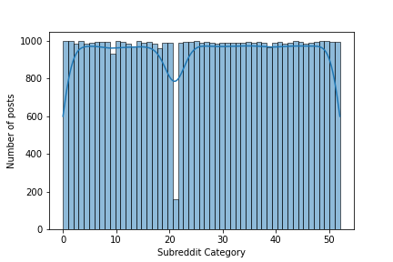
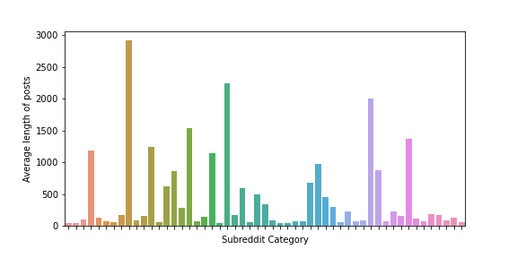

Whenever a user submit a post to Reddit, The poster is required to submit it to some subreddit. A subreddit is topic/interest specific link aggregation pages with posts related to that topic. Reddit provides a default list of popular subreddits for the user to submit the post to. If none of those subreddits are appropriate, the user can choose to search for a different subreddit and submit it there. In this article we discuss ML models that use NLP techniques to generate a better list of subreddit recommendations based the post information. More specifically, the input is a text as a string or multiple texts in an iterable format such as ndarray or list, and return value is a list of recommended Subreddit categories from a list of pre-selected categories that the model has been trained on.

### Scraping Reddit data
In order to train any model first we need to collect the training and validation data. As its name suggests [PRAW](https://praw.readthedocs.io) is a Python wrapper for the Reddit API, which enables to scrape data from subreddits. For package management and reproducibility we use conda environment. 
PRAW can be installed using conda-forge channel:
```
conda install -c conda-forge praw
```
A python file connects to PRAW python API for Reddit and pulls information from 1000 posts in each of the 44 selected subreddit categories. The pulled information includes: `subreddit name`, `subreddit id`, `title`, and `post body`. The pulled information are stored in a local sql database.
The created database contains 51610 rows and 4 columns. 
```
import sqlite3
conn = sqlite3.connect('subreddit_db.sqlite3')
c = conn.cursor()
c.execute('''create table submission_table (
               subreddit_name text,
               subreddit_id text,
               title text,
               text text
             )
             ''')
```
Before `praw` can be used to scrape data we need to authenticate ourselves. For this we need to create a Reddit instance and provide it with a client_id , client_secret and a user_agent .
```
import praw
import os
from dotenv import load_dotenv

# instantiate praw
load_dotenv()
reddit = praw.Reddit(client_id=os.getenv('CLIENT_ID'),
                     client_secret=os.getenv('CLIENT_SECRET'),
                     user_agent='veggiecode')
```
The model recommendation is limited to a selected number of subreddit categories that the model is trained on. Hence we pull data for those specific subreddits.
```
import time

sleep_min = 2
sleep_max = 5
start_time = time.time()

# sub_list is the list of pre selected categories
for name in sub_list:
    subreddit = reddit.subreddit(name)
    records = []
    for submission in subreddit.top(limit=1000):
        records.append([subreddit.display_name, subreddit.id, submission.title, submission.selftext])
    print(records[0])
    c.executemany('''insert into submission_table
                  (subreddit_name, subreddit_id, title, text)
                  values (?, ?, ?, ?)
                  ''', records)
    conn.commit()
    subreddit_count += 1
    if subreddit_count % 5 == 0:
        time.sleep(np.random.uniform(sleep_min, sleep_max))


c.close()
conn.close()
```
### Data Cleaning:
For cleaning data first import the stored data into a notebook.
```
data = pd.read_sql_query("select * from submission_table order by random() limit 100000;", conn)
# subreddit_subs: is the number of subscriber in the subreddit category
print(data.shape)
(51610, 4)
```
Here is a sample of the data:

<table border="1" class="dataframe" style="overflow-x: scroll;display: block; max-height: 300px;"><thead><tr style="text-align: right;"><th></th><th>subreddit_name</th><th>subreddit_id</th><th>title</th><th>text</th></tr></thead><tbody><tr><th>0</th><td>literature</td><td>2qhps</td><td>James Franco's poems: hard to forgive</td><td></td></tr><tr><th>1</th><td>technology</td><td>2qh16</td><td>Predator Drone Spotted in Minneapolis During George Floyd Protests</td><td></td></tr><tr><th>2</th><td>DIY</td><td>2qh7d</td><td>I restored a $5 Kitchen Aid mixer I found at the thrift store</td><td></td></tr><tr><th>3</th><td>news</td><td>2qh3l</td><td>Alabama just passed a near-total abortion ban with no exceptions for rape or incest</td><td></td></tr><tr><th>4</th><td>Parenting</td><td>2qhn3</td><td>I thought my 6 year old was doing one of his math activities on the tablet, but nah</td><td>My 6 year old has a bunch of new apps and activities that his teacher sent us to put on his tablet. He's been occasionally asking me, from the other room, the answers to different math problems, like what's 12+7 or what's 22-8.  I'm like sweet he's doing his math! Nope. He's trying to bypass the parental locks on kids YouTube so he can watch shit that is blocked. He keeps exiting out and going back in which is I assume why he had to ask multiple times.</td></tr></tbody></table>

The database contains 51610 rows and 4 columns.
```
 #   Column          Non-Null Count  Dtype 
---  ------          --------------  ----- 
 0   subreddit_name  51610 non-null  object
 1   subreddit_id    51610 non-null  object
 2   title           51610 non-null  object
 3   text            51610 non-null  object
 ```
Let's check the unique categories in our collected data:
```
 subreddit_names = data['subreddit_name'].unique()
len(subreddit_names), subreddit_names
 ```
 Our created dataset consists of 53 categories.
 ```
 (53,
 array(['literature', 'technology', 'DIY', 'news', 'Parenting', 'cars',
        'WTF', 'MachineLearning', 'socialskills', 'Art', 'biology',
        'politics', 'personalfinance', 'sports', 'worldpolitics',
        'Documentaries', 'food', 'LifeProTips', 'movies',
        'TwoXChromosomes', 'nottheonion', 'mildlyinteresting', 'Health',
        'AskReddit', 'history', 'Cooking', 'Music', 'Fitness',
        'GetMotivated', 'Design', 'gaming', 'entertainment', 'television',
        'books', 'JusticeServed', 'math', 'investing', 'science',
        'camping', 'Coronavirus', 'PublicFreakout', 'travel', 'funny',
        'HomeImprovement', 'scifi', 'worldnews', 'AdviceAnimals',
        'programming', 'gadgets', 'conspiracy', 'space', 'Showerthoughts',
        'announcements'], dtype=object))
 ```
 Let's look at number of posts per subreddit category.
 ```
sns.histplot(
    x=data['subreddit_name'].astype('category').cat.codes, 
    bins=data['subreddit_id'].nunique(),
    kde=True)
 ```
 

Ideally we would use the entire dataset for the training. However for practical reasons that would substantially increase the size of the serialized model and complicate the deployment of the model. For this reason we are going to use a smaller subset of the dataset for training. 
The above graph shows that we have about 1000 posts per subreddit category as expected. However some the posts might have small amount of text that would not be sufficient for our natural language processing. 
Hence we choose the posts that have enough text content. Later on we are going to choose only the categories (features) that  have enough number of posts (instances) to train on.

To get an idea of the posts lengths, let's plot the average length of posts per subreddit category.
```
post_mean = data1.groupby(by='subreddit_name').apply(lambda x: x['text_length'].mean())
plt.figure(figsize=(8,4))
ax = sns.barplot(x=post_mean.index, y=post_mean.values)
ax.set(xlabel='Subreddit Category', ylabel='Average length of posts')
ax.set(xticklabels=[])
plt.show()
```


The above graph shows the average length of posts is not the same in different subreddit categories.
After filtering the low count subreddit categories we end up with 44 categories and 4400 posts. We take a note that in a production setup we need more training data to achieve a reliable results.

### Machine Learning Model
The model is supposed to recieve a text as a post content and classify it to one of the 44 subreddit categories. We consider a random classifier as baseline with an accuracy of 1/44, which is very low. To build our model we use a two stage pipeline. The first stage encodes the text into a numerical format and the the seconf stage classifies the text into one of the target labels.

#### spaCy Embedding
For the first stage of the pipeline we are going to use [spaCy](https://spacy.io) embedding. spaCy is an open-source software library for natural language processing. spaCy performs two major tasks for us, tokenizing and vectorizing. The `tokenizer` is a component that segments texts into tokens. In spaCy, it's rule-based and not trainable. It looks at whitespace and punctuation to determine which are the unique tokens in a sentence. The `tok2vec` layer is a machine learning component that learns how to produce context-based vectors for tokens. It does this by looking at lexical attributes of the token. The tok2vec component is already pretrained from external vectors data. The external vectors data already embeds some "meaning" or "similarity" of the tokens. 
```
import spacy
from spacy.tokenizer import Tokenizer
from spacy.lang.en.stop_words import STOP_WORDS
#Create the nlp object
nlp = spacy.load("en_core_web_md")
```
the `en_core_web_md` model has 685k keys, 20k unique vectors of 300 dimensions. We can define a function to embed the text and use it in a Scikit-learn `FunctionTransformer` as the first stage of the pipeline.
```
# Spacy embedding
def get_word_vectors(docs):
    """
    docs: can be string or a list of strings
    """
    if isinstance(docs, str):
      docs = [docs]
    return np.array([nlp(str(doc)).vector for doc in docs])

# Instantiate functiontransformer of the spacy vectorizer
embed = FunctionTransformer(get_word_vectors)
```
The pipeline is defined as:
```
pipe = Pipeline([
                 ('emb', embed), 
                 ('clf', clfi)])
```
clfi is an instance of a classifier. For this work we try different classifers from Scikit-learn library, namely, KNeighborsClassifier(), GradientBoostingClassifier, and XGBClassifier from xgboost library.

#### Hyperparameter Tuning
We are going to benefit from hyperparameter tuning to optimize our model. For this purpose we use `RandomizedSearchCV()`. This would also perform the cross validation that is helpful considering the fact that our training data is rather small. Nevertheless we split the data into train and test to keep some data away to evaluate the model overfit.
After model fit, KNeighborsClassifier, GradientBoostingClassifier, and XGBClassifier produce the test accuracy of 0.34, 0.51, and 0.53, respectively.


 
 
 


### Tech stack and links
More details about the technologies and tools that are used in this work can be found below.

- [HypoTweet](https://hypotweet.herokuapp.com)
- [Heroku](https://devcenter.heroku.com/)
- [Pipenv](https://pipenv.pypa.io/en/latest/)
- [Jinja2](https://jinja.palletsprojects.com/)
- [gunicorn](https://docs.gunicorn.org/)
- [SQLAlchemy](https://www.sqlalchemy.org/)
- [Tweepy](https://docs.tweepy.org/)
- [SciKit-Learn](https://scikit-learn.org/stable/getting_started.html)
- [spaCy](https://spacy.io/)
- [PostgreSQL](https://www.postgresql.org/)
- [Flask](https://flask.palletsprojects.com/)

