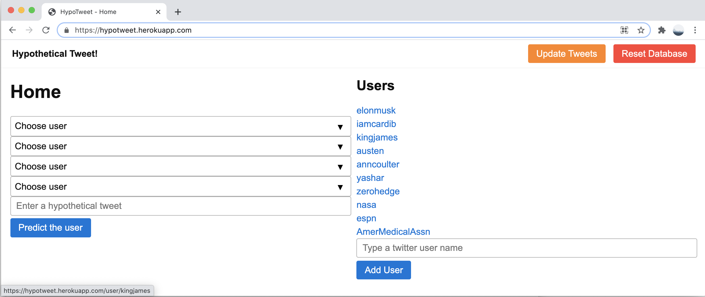

Whenever a user submit a post to Reddit, The poster is required to submit it to some subreddit. A subreddit is topic/interest specific link aggregation pages with posts related to that topic. Reddit provides a default list of popular subreddits for the user to submit the post to. If none of those subreddits are appropriate, the user can choose to search for a different subreddit and submit it there. In this article we discuss ML models that use NLP techniques to generate a better list of subreddit recommendations based the post information. More specifically, the input is a text as a string or multiple texts in an iterable format such as ndarray or list, and return value is a list of recommended Subreddit categories from a list of pre-selected categories that the model has been trained on.

### Scraping Reddit data
In order to train any model first we need to collect the training and validation data. As its name suggests [PRAW](https://praw.readthedocs.io) is a Python wrapper for the Reddit API, which enables to scrape data from subreddits. For package management and reproducibility we use conda environment. 
PRAW can be installed using conda-forge channel:
```
conda install -c conda-forge praw
```
A python file connects to PRAW python API for Reddit and pulls information from 1000 posts in each of the 44 selected subreddit categories. The pulled information includes: `subreddit name`, `subreddit id`, `title`, and `post body`. The pulled information are stored in a local sql database.
The created database contains 51610 rows and 4 columns. 
```
import sqlite3
conn = sqlite3.connect('subreddit_db.sqlite3')
c = conn.cursor()
c.execute('''create table submission_table (
               subreddit_name text,
               subreddit_id text,
               title text,
               text text
             )
             ''')
```
Before `praw` can be used to scrape data we need to authenticate ourselves. For this we need to create a Reddit instance and provide it with a client_id , client_secret and a user_agent .
```
import praw
import os
from dotenv import load_dotenv

# instantiate praw
load_dotenv()
reddit = praw.Reddit(client_id=os.getenv('CLIENT_ID'),
                     client_secret=os.getenv('CLIENT_SECRET'),
                     user_agent='veggiecode')
```
The model recommendation is limited to a selected number of subreddit categories that the model is trained on. Hence we pull data for those specific subreddits.
```
import time

sleep_min = 2
sleep_max = 5
start_time = time.time()

# sub_list is the list of pre selected categories
for name in sub_list:
    subreddit = reddit.subreddit(name)
    records = []
    for submission in subreddit.top(limit=1000):
        records.append([subreddit.display_name, subreddit.id, submission.title, submission.selftext])
    print(records[0])
    c.executemany('''insert into submission_table
                  (subreddit_name, subreddit_id, title, text)
                  values (?, ?, ?, ?)
                  ''', records)
    conn.commit()
    subreddit_count += 1
    if subreddit_count % 5 == 0:
        time.sleep(np.random.uniform(sleep_min, sleep_max))


c.close()
conn.close()
```
### Data Cleaning:
For cleaning data first we'll import the stored data into a notebook.
```
data = pd.read_sql_query("select * from submission_table order by random() limit 100000;", conn)
# subreddit_subs: is the number of subscriber in the subreddit category
print(data.shape)
(51610, 4)
```
Here is a sample of the data:

<table border="1" class="dataframe"><thead><tr style="text-align: right;"><th></th><th>subreddit_name</th><th>subreddit_id</th><th>title</th><th>text</th><th>joint_text</th></tr></thead><tbody><tr><th>0</th><td>LifeProTips</td><td>2s5oq</td><td>LPT: If someone you love is living with dementia or Alzheimer's, don't correct their mistaken memories — say "yes, and" and treat it like an improv game</td><td>Just lost my pop to a long fight with Alzheimer's. It sucked watching the kind, warm, and generous man I knew become a shell of his former self.   \n\n\nDuring his decline, he showed all the hallmarks of the disease: forgetting family faces and names, telling stories about false memories, and, in the end, a bit of belligerence (the kind you might typically see in a toddler).   \n\n\nThroughout his decline, I saw my family approach it in one of two ways: some would try to correct his mistakes over and over (to no avail), and some would just roll with the punches.   \n\n\nPlaying along with things in the moment always seemed to keep him more centered and grounded. Not only did it help calm him down, it made those painful visits a little less so by knowing he felt comforted by my validating his reality, and not trying to yank him out of whatever timeline/alternate universe he was visiting.   \n\n\nA simple example would be if he asked where his (long dead) mother was, I would just say "she's visiting with your sister and will be back soon." What good would correcting him do? Then he'd have to re-live that trauma of losing his mom all over again, possibly many times a day.   \n\n\nOr when he would say something outlandish like, "I used to be a senator, you know" I would just say, "oh that's right, I forgot all about that, tell me more!"   \n\n\nI have to give credit to a [TEDMED talk](https://www.tedmed.com/talks/show?id=526821) that I saw describing this whole approach, many years ago. I'm so glad I saw it because it absolutely changed the way I spent time with my dad, and made it easier, richer, and more gratifying in spite of the misery of the disease. Hope it helps you, too.   \n\n\nAnd fuck you, Alzheimer's.\n\nEdit: I can’t keep up with all the replies and awards, but I am so grateful to everyone for your kind words. I’m glad you’re able to find this useful; it totally changed how I talked with my dad    \n\nBest wishes to all of you.\n\nEdit 2: This is not a magic wand that wipes dementia away. It’s an approach to managing some of the challenges of its effects. I am definitely not a doctor, do not take this as medical advice. YMMV depending on each individual.\n\nEdit 3: For the love of god, the (attempted) political jokes are just not landing, please stop. You’re embarrassing yourself.</td><td>lpt if someone you love is living with dementia or alzheimer's don't correct their mistaken memories say yes and and treat it like an improv game just lost my pop to a long fight with alzheimer's it sucked watching the kind warm and generous man i knew become a shell of his former self during his decline he showed all the hallmarks of the disease forgetting family faces and names telling stories about false memories and in the end a bit of belligerence the kind you might typically see in a toddler throughout his decline i saw my family approach it in one of two ways some would try to correct his mistakes over and over to no avail and some would just roll with the punches playing along with things in the moment always seemed to keep him more centered and grounded not only did it help calm him down it made those painful visits a little less so by knowing he felt comforted by my validating his reality and not trying to yank him out of whatever timeline alternate universe he was visiting a simple example would be if he asked where his long dead mother was i would just say she's visiting with your sister and will be back soon what good would correcting him do then he'd have to re live that trauma of losing his mom all over again possibly many times a day or when he would say something outlandish like i used to be a senator you know i would just say oh that's right i forgot all about that tell me more i have to give credit to a tedmed talk https www tedmed com talks show id 526821 that i saw describing this whole approach many years ago i'm so glad i saw it because it absolutely changed the way i spent time with my dad and made it easier richer and more gratifying in spite of the misery of the disease hope it helps you too and fuck you alzheimer's edit i can t keep up with all the replies and awards but i am so grateful to everyone for your kind words i m glad you re able to find this useful it totally changed how i talked with my dad best wishes to all of you edit 2 this is not a magic wand that wipes dementia away it s an approach to managing some of the challenges of its effects i am definitely not a doctor do not take this as medical advice ymmv depending on each individual edit 3 for the love of god the attempted political jokes are just not landing please stop you re embarrassing yourself</td></tr><tr><th>3</th><td>history</td><td>2qh53</td><td>Why did the number "0" take so long to develop?</td><td>So the Sumerians had the number system, but no decimals or 0. Zero was only developed with the ~~Arabs~~ Indians thousands of years later. Why is it hard to come up with 0? It seems intuitive that when you have 1 of something, and you taketh it away, you should get a number that corresponds to nothingness. \n\n**Edit** So I messed up citing Arabs when it should be Indians. Fixed now, though this shouldn't change the general nature of the question. Thanks for all the answers!\n\n**Edit** Thanks for the gold!</td><td>why did the number 0 take so long to develop so the sumerians had the number system but no decimals or 0 zero was only developed with the arabs indians thousands of years later why is it hard to come up with 0 it seems intuitive that when you have 1 of something and you taketh it away you should get a number that corresponds to nothingness edit so i messed up citing arabs when it should be indians fixed now though this shouldn't change the general nature of the question thanks for all the answers edit thanks for the gold</td></tr><tr><th>5</th><td>scifi</td><td>2qh2z</td><td>AMC will be playing Gravity, The Martian, Interstellar, Star Trek 2009/Into Darkness/Beyond as well as some documentaries in IMAX during Space Week this October!</td><td></td><td>amc will be playing gravity the martian interstellar star trek 2009 into darkness beyond as well as some documentaries in imax during space week this october</td></tr><tr><th>6</th><td>personalfinance</td><td>2qstm</td><td>I've been homeless. I have no valid ID. I don't know where to start.</td><td>I've been homeless, a combination of real homeless, and crashing on couches homeless, for about two years, in that time my drivers license expired, and my birth certificate and social security card were stolen (along with other stuff). I have court fees related to my car which is now gone, and my license even if valid is suspended. I just got a job and am looking to get myself together, but all this bureaucracy, I don't even know where to start. It seems like to get any ID you have to already have ID. I feel stuck in a hole I can't get out of. \n\nEdit: Thanks for the help guys. I ordered my birth certificate and will get my social security card when I can. I'm staying at a friends for now. I'm in NY if that helps. It really means a lot that there are people out there willing to help and give advice.</td><td>i've been homeless i have no valid id i don't know where to start i've been homeless a combination of real homeless and crashing on couches homeless for about two years in that time my drivers license expired and my birth certificate and social security card were stolen along with other stuff i have court fees related to my car which is now gone and my license even if valid is suspended i just got a job and am looking to get myself together but all this bureaucracy i don't even know where to start it seems like to get any id you have to already have id i feel stuck in a hole i can't get out of edit thanks for the help guys i ordered my birth certificate and will get my social security card when i can i'm staying at a friends for now i'm in ny if that helps it really means a lot that there are people out there willing to help and give advice</td></tr><tr><th>8</th><td>AskReddit</td><td>2qh1i</td><td>To all of those actually named Chad, Stacy, or Karen, how does it make you feel knowing that your names are used as insults?</td><td></td><td>to all of those actually named chad stacy or karen how does it make you feel knowing that your names are used as insults</td></tr></tbody></table>


Once a tweet is entered it fits a multiclass logistic regression on the selected users' tweets which have previousely been embeded with spacy and stored in Heroku PostgreSQL. Then it uses the lightweight version of spacy to embed the hypothetical tweet into 96 vectors. Then vectorized tweet is passed as an input to the trained model to predict which user might send a similar tweet.

### File structure
The file structure of the project is shown below.

```zsh
HypoTweet
├── .env
├── LICENSE
├── Pipfile
├── Pipfile.lock
├── Procfile
├── README.md
├── tree.text
└── twitapp
    ├── __init__.py
    ├── app.py
    ├── db.sqlite3
    ├── models.py
    ├── predict.py
    ├── templates
    │   ├── base.html
    │   ├── base.html0
    │   ├── base.html4
    │   ├── prediction.html
    │   └── user.html
    └── twitter.py
```

`HypoTweet` is the project directory. We use pipenv to manage the virtual environment for handling package dependency and producibility. The final app is deployed onto the cloud using heroku a cloud platform. `Procfile` is the process file that directs heroku how to run the app.
`twitapp` is the application directory where all the app related files reside. `__init__.py` marks the app directory as a Python package. It also serves as the point of entry for the app.
`app.py` is the main python file assigned to create the app and handle most of the routings. `db.sqlite` is a local database that stores the users information for testing the app locally. Later on when the app is deployed to the cloud we switch to a cloud base database.
For creating the database we use SQLAlchemy an object-relational mapper (ORM) database toolkit for python. `models.py` specify the database data models. To pull twitter data we use tweepy. It's a python library to connect to Twitter API. `twitter.py` interacts with Twitter API and stores the data in database.
The machine learning model and classification tasks are performed in `predict.py`. The templates irectory include a few html templates for different url routes.

### Setting up the project
Create a repository in the github to fork the [repo](https://github.com/skhabiri/HypoTweet) or clone it to your local machine. We use en_core_web_sm,  model for spacy to speed up the prediction and minimize the file sizes before being deployed to heroku. Version 3.0.0 of the spacy model requires python version >= 3.8.

### Install required packages and dependencies
List of main packages that are required are:
* Flask==1.1.2:_ A python web framework to build web applications
* _gunicorn==20.0.4:_ WSGI web server 
* _Flask-SQLAlchemy==2.4.4:_ A SQL toolkit and object-relational mapper for the Python programming
* _psycopg2-binary==2.8.6:_ PostgreSQL database adapter for Python
* _python-dotenv==0.15.0:_ to read key values from .env file
* _tweepy==3.10.0:_ Python library for the Twitter API
* _joblib==1.0.1:_ used for object serialization based on pickle protocol
* _scikit-learn==0.24.1_ machine learning library for Python
* _spacy==3.0.3:_ A library for Natural Language Processing
* _en-core-web-sm==3.0.0:_ NLP model for vectorizing documents
* _Jinja2==2.11.3:_Jinja is a web template engine for the Python programming language

Use `pipenv install <package_name>`

### Web Application Development with Flask
A web application is composed of three elements: front-end, back-end and database. The front-end part of any application is what displays the information to the viewer and runs on the client browser. The back-end processes information and runs on a server that is remote from the user’s device. The database is also located remotely and stores all the data necessary for the application to run.
When the web browser makes a request for the page, this content is stored in a database and the particular page created full only when the user requests it. Before the page is returned to the caller, the back-end server retrieves the data from the database and populates it on the html page. 
Flask is a micro-framework because it is lightweight and only provides components that are essential, such as routing, request handling, sessions, and so on. In our application Flask is used for the backend, but it makes use of a templating language called Jinja2 which is used to create HTML, and other markup formats that are returned to the user via an HTTP request. We use jinja2 use inside HTML so that the content on the HTML page becomes dynamic. ANother key aspect of Flask is being able to work with WSGI. The Web Server Gateway Interface, or more commonly known as WSGI, is a standard that describes the specifications concerning the communication between a web server and a client application. 

### Connecting Frontend to Backend in Flask 
There are three ways to interact between python file (back-end) and html file (front-end).

* Using `flask.request.values` to access user entries through the html post method argument “name”. With this method we retrieve informations such as user1, user2, user3, user4, tweet_text, user_name.

```html
<form action="/compare" method="post">
<select name="user1">

<form action="/user" method="post">
    <input type="text" name="user_name" placeholder="Type a user">
```

and in .py file

```python
request.values['user1'],
request.values['user_name']`
```

* In .py file we use arguments of render_template(), such as tweets, users, title, message to pass a value to jinja2 variables in html

```



<h1>{{ title }}</h1>



```

in .py file
```python
return render_template('user.html', title=name, tweets=tweets, message=message)
return render_template('base.html', title='Home', users=User.query.all())
```

Through jinja2 we add a variable to the route in GET method such as /user/{{ user.name }}. Then in .py we pass the variable to the function under the decorator.

```html
<a href="/user/{{ user.name }}">
```

in.py file
```python
@app.route('/user/<name>', methods=['GET'])
    def user(name=None, message=''):
```

### Creating the Flask App
Main components of our Flask app is in `app.py`. Here are the steps that we need to take to create our app.

#### Importing modules
Let's import the Flask and the modules that interacts with frontend.
```
from flask import Flask, render_template, request

from .models import DB, User
from .predict import predict_user
from .twitter import add_or_update_user, insert_example_users
```
`request` is used to pass variable from html POST to python module. `render_template` passes variable from python module to jinja2 which is a template inside html.

#### Create the Flask object
To create the app we need to instantiate a Flask object. This object will be our WSGI application called `app`.
```
 app = Flask(__name__)   
```

#### Connect the app to the database
In this step we the datbase server is initialized and connected to the application.
```
app.config['SQLALCHEMY_DATABASE_URI'] = getenv('DATABASE_URL')
app.config['SQLALCHEMY_TRACK_MODIFICATIONS'] = False
DB.init_app(app)
```
#### Creating the routes
A URL route defines the available routes in the frontend. Each url route is associated with a view function. This association is created by using the route() decorator. The view function tell the app how to render the information on the browser. By default, the Flask route responds to GET requests. However, you can change this preference by providing method parameters for the route() decorator, such as a POST method in a URL route.
In our app the root route loads all the users from database onto the home page. `base.html` will serve as the home page, where we will have all the field required to run the model.
```
@app.route('/')
def root():
    return render_template('base.html', title='Home', users=User.query.all())
```
It is possible to have two decorators with the same view function. The `/user` route could have a POST or GET method. If it's a POST method we update add the user to the database and update it's timeline. If the user click on an existing user it directs to `/user/<name>` route which renders a page with the user's timeline.
```
@app.route('/user', methods=['POST'])
@app.route('/user/<name>', methods=['GET'])
def user(name=None, message=''):
    name = name or request.values['user_name']
    try:
        if request.method == 'POST':
            add_or_update_user(name)
            message = "User {} successfully added!".format(name)
        tweets = User.query.filter(User.name == name).one().tweets
    except Exception as e:
        message = "Error adding {}: {}".format(name, e)
        tweets = []
    return render_template('user.html', title=name, tweets=tweets, message=message)
```
There is also another route in the app that fits a logistic regression model based on the suggested tweet and predicts which user might say that.
```
@app.route('/compare', methods=['POST'])
def compare(message=''):
    count = 0
    username, filler = [None] * 4, None

    for i in range(4):
        name = f'user{i+1}'

        try:
            username[i] = request.values[name]
            count += 1
        except Exception as e:
            pass
```
After handling exceptions the route returns:
```
user_name = predict_user(username[0], username[1], username[2], username[3], hypotext)
message = '"{}" is more likely to be said by {}'.format(hypotext, user_name)
return render_template('prediction.html', title='Prediction', message=message)
```
We can also define /reset and /update routes which would reset or update the timeline in the database.

### Data model for database
Here we define two data model. One for the User and another for the Tweet. Therefore our database has two tables where instances of the corresponding data models are enteries in the database table. Each datamodel has a primary key and they are joined together through back reference. 
```
class User(DB.Model):
    id = DB.Column(DB.BigInteger, primary_key=True)
    name = DB.Column(DB.String(15), nullable=False)
    newest_tweet_id = DB.Column(DB.BigInteger)

class Tweet(DB.Model):
    id = DB.Column(DB.BigInteger, primary_key=True)
    text = DB.Column(DB.Unicode(300))
    embedding = DB.Column(DB.PickleType, nullable=False)
    user_id = DB.Column(DB.BigInteger, DB.ForeignKey('user.id'), nullable=False)
    user = DB.relationship('User', backref=DB.backref('tweets', lazy=True))
```
The maximum tweet length is 270 characters to cover longer urls we define the text column to be 300 Unicode chatrcaters to be able to capture emojis too.

### Connect to Twitter API
tweepy is a python library that acts as a wrapper to access the Twitter API. `twitter.py` module create an authenticated tweepy instance that can retrieve various information through the Twitter API. In this module we also use spacy to get an embedding representation of the tweets and store them in the database for future modeling tasks. 
```
from os import getenv
import spacy
import tweepy
from .models import DB, Tweet, User

TWITTER_API_KEY = getenv('TWITTER_API_KEY')
TWITTER_API_KEY_SECRET = getenv('TWITTER_API_KEY_SECRET')
TWITTER_AUTH = tweepy.OAuthHandler(TWITTER_API_KEY, TWITTER_API_KEY_SECRET)
TWITTER = tweepy.API(TWITTER_AUTH)

nlp = spacy.load("en_core_web_sm")

def add_or_update_user(username):
    twitter_user = TWITTER.get_user(username)
    db_user = (User.query.get(twitter_user.id) or User(id=twitter_user.id, name=username))
    DB.session.add(db_user)

    tweets = twitter_user.timeline(count=200, exclude_replies=True, include_rts=False, tweet_mode='extended',                   
    since_id=db_user.newest_tweet_id)
    
    for tweet in tweets:
        embedding = nlp(tweet.full_text).vector
        db_tweet = Tweet(id=tweet.id, text=tweet.full_text[:300], embedding=embedding)
        db_user.tweets.append(db_tweet)
        DB.session.add(db_tweet)
        DB.session.commit()
```

### Machine learning model
There are generally three different ways to train and serve models into production. It can be a one-off, batch, real-time/online training. A model can be just trained ad-hoc and pushed to production as a pickle object until its performance deteriorates enough that it's called to be refreshed. Batch training allows us to have a constantly refreshed version of a model based on the latest batch train data . For this application change of selected users means changing the input features. Therefore it's more suitable to use real-time training aka online training. For that reason we select the small version of spacy model for  embedding tweets. It convert a tweet to a numerical vector with 96 dimenstions. The small model helps to shorten the response time and ease the deployment. Alternatively we can use [Basilica](https://www.basilica.ai) for embedding. Basilica has it's own API that we need to connect to get the 760 dimension embedding vector in real-time.
The data science model is mostly in predict.py. For real time training we use sklearn.LogisticRegression which is relatively fast and suitable demonstrate proof of concept.

* **Installing spacy for deployment:**
In the activated virtual environment use `pipenv instal spacy`. For the model if we were only running locally, we would simply download and install the model with `python -m spacy download en_core_web_sm`. However, for deploying on heroku We need to add `pipenv install https://github.com/explosion/spacy-models/releases/download/en_core_web_sm-3.0.0/en_core_web_sm-3.0.0.tar.gz` to the Pipfile, so that heroku can download and install the model in the process of building the app. This version of en_core_web_sm requires python 3.8.

```
from sklearn.linear_model import LogisticRegression
from .models import User
from .twitter import nlp 

def predict_user(user1_name, user2_name, user3_name, user4_name, tweet_text):
    user_names = set((user1_name, user2_name, user3_name, user4_name))
    
    # Create X for sklearn model
    users = []
    user_embeddings = []
    for username in user_names:
        user = User.query.filter(User.name == username).one()
        users.append(user)
        user_embeddings.append(np.array([tweet.embedding for tweet in user.tweets]))

    embeddings = np.vstack(user_embeddings)

    # create target labels y
    ulabels = []
    for i, user in enumerate(users):
        ulabels.append(i * np.ones(len(user.tweets)))

    labels = np.concatenate(ulabels)

    log_reg = LogisticRegression().fit(embeddings, labels)

    tweet_embedding = nlp(tweet_text).vector

    # predict returns float
    return users[int(log_reg.predict(np.array(tweet_embedding).reshape(1, -1))[0])].name
```

### Deploying HypoTweet app to Heroku
Heroku is a multi-language cloud application platform that enables developers to deploy, scale, and manage their applications. So far we have trained the ML model and created the web app using Flask. To deploy the app to Heroku after committing all the changes, login to Heroku, create an app name, and create a heroku remote, and push the code to heroku remote. ALternatively, we may commit the code to Github and by connecting Github to Heroku instead of Heroku CLI we can build the app and deploy it to the cloud. 
Heroku uses the Pipfile to build the app with all the package dependencies and uses the Procfile to instruct the web server how to run the app. For simple apps, Heroku platform automatically detects the language and creates a default web process type to boot the application server. Other than the code, there are two local elements in our app that we need to move them to Heroku platform. `.env` and local database created by sqlite3. Heroku interface allows to define the envionment variables in `config Vars` and setup an add-on Heroku PostgreSQL database for the app as a replacement for the local setup, `heroku addons:create heroku-postgresql`. The cloud base database is empty and we need to initialize it by reset route before we can access it. 

Deployed HypoTweet is accessible [here](https://hypotweet.herokuapp.com).



#### Exception handling and corner cases:
It's nice to have common cases of errors to be handled gracefully by our application to avoid unexpected results. By catching different exceptions and corner cases we can pass useful information to the user. Here is a list of common errors and the way the app would handle it.
* Less than four but more than one different users are selected:
    > The classification will be carried on as normal
* Only one user or none is seleted:
    > Returns an output message asking for more users to be selected
* More than one user is selected but all the selected users are the same:
    > Returns an output message asking for different users
* Users are selected properly but no text tweet has been entered:
    > Returns an output messsage asking for a text tweet to be entered.
* A user name requested to be added does not exist in Twitter:
    > Returns a message informing that the user does not exist
* Requesting to add a valid twitter user that already exists in PostgreSQL database
    > The app simply updates its timeline with the latest tweets

Here is an example of how the prediction works. It's worth noting that the model accuracy is not high and the this is more for proff of concept rather than production.


The updated tweets for any user routes to /user/<name>. Here is an example:


#### HypoTweet architecture
The figure below summeraize the main element of HypoTweet app and the ecosystem surrounding it.


### Tech stack and links
More details about the technologies and tools that are used in this work can be found below.

- [HypoTweet](https://hypotweet.herokuapp.com)
- [Heroku](https://devcenter.heroku.com/)
- [Pipenv](https://pipenv.pypa.io/en/latest/)
- [Jinja2](https://jinja.palletsprojects.com/)
- [gunicorn](https://docs.gunicorn.org/)
- [SQLAlchemy](https://www.sqlalchemy.org/)
- [Tweepy](https://docs.tweepy.org/)
- [SciKit-Learn](https://scikit-learn.org/stable/getting_started.html)
- [spaCy](https://spacy.io/)
- [PostgreSQL](https://www.postgresql.org/)
- [Flask](https://flask.palletsprojects.com/)

