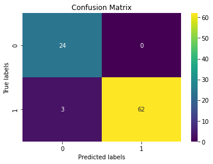
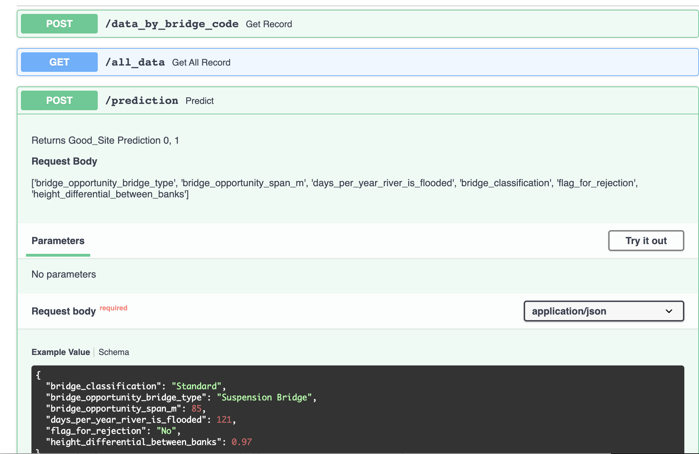
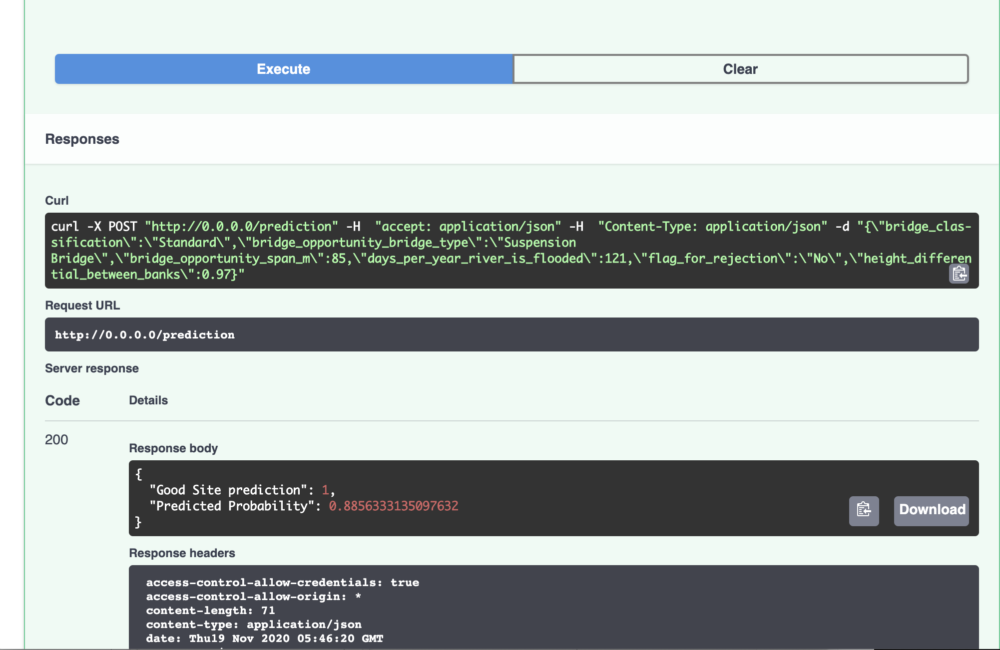
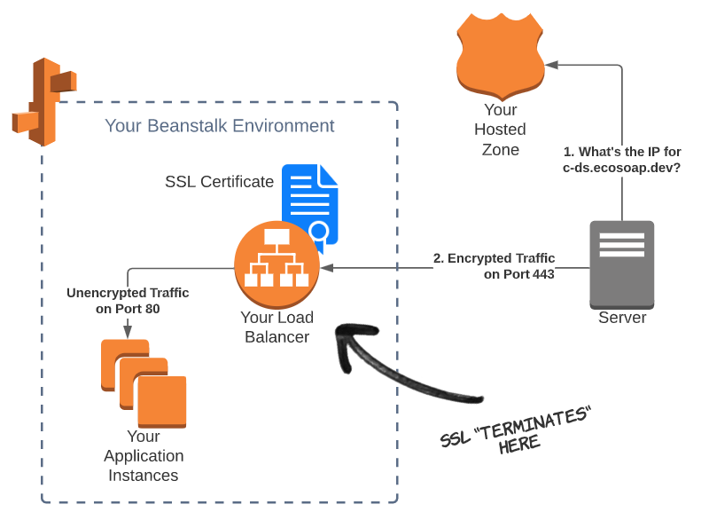
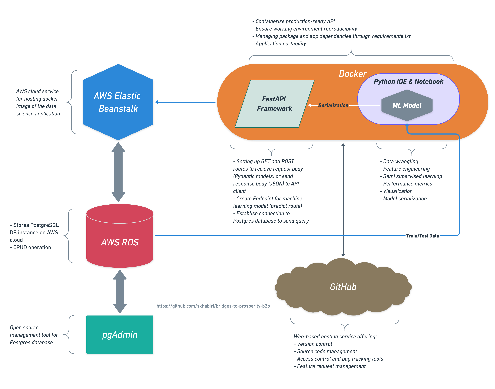

***About the Organization:**
[Bridges to Prosperity (B2P)](https://www.bridgestoprosperity.org/) footbridges works with isolated communities to create access to essential health care, education and economic opportunities by building footbridges over impassable rivers.

Bridges to Prosperity currently operates field programs in Bolivia, Rwanda, Uganda, and is currently in its first year of a scaling initiative in Rwanda, which will see the completion of more than 300 footbridges over a five-year period, creating new safe access for more than a million people.

Independent studies have demonstrated that B2P footbridges increase labor income by an average of 35.8%, farm profits by 75%, and the participation of women in the wage labor force by 60%, and that the annual return on investment at a community level is 20%. B2P believes that footbridges are a powerful and cost-effective tool for addressing poverty at scale.


***Dataset:**
The dataset consists of survey data of 1472 sites (rows) with 44 features. The "Stage" column shows the status of the project. The "senior_engineering_review" shows if the site has been reviewed by engineering team or not. Among all the rows of the dataset only 65 projects are reviewed and approved and 24 projects are reviewed and rejected. The rest (1383 rows) do not have any target label.


***Project Challenge:**
Based on the existing input data we want to know if we can classify the sites as being rejected or not in any future review conducted by senior engineering team. In other words we want to find out which sites will be technically rejected in future engineering reviews.


***Project Overview:**
We use Synthetic Minority Oversampling Technique (SMOTE) to deal with highly imbalanced B2P dataset. Then we will apply label propagation, a semi-supervise alorithm available in scikit-learn, for binary classification.

The database is stored as PostgreSQL in AWS RDS (Amazon Relational Database Service). We use pgAdmin to manage the PostgreSQL database stored in AWS RDS. FastAPI framework is used as data science API to connect to database and provide a route for live prediction on target. The FastAPI app is deployed onto AWS Elastic Beanstalk and interfaces with Web Frontend. Installed packages in the project are managed with docker container.


### Loading dataset
After loading and cleaning the dataset:

```
print(df.shape)
df.head(1)
```
(1472, 44)

<table border="1" class="dataframe" style="overflow-x: scroll;display: block;">
  <thead>
    <tr style="text-align: right;">
      <th></th>
      <th>bridge_name</th>
      <th>bridge_opportunity_project_code</th>
      <th>bridge_opportunity_needs_assessment</th>
      <th>bridge_opportunity_level1_government</th>
      <th>bridge_opportunity_level2_government</th>
      <th>bridge_opportunity_stage</th>
      <th>bridge_opportunity_gps_latitude</th>
      <th>bridge_opportunity_gps_longitude</th>
      <th>bridge_opportunity_bridge_type</th>
      <th>bridge_opportunity_span_m</th>
      <th>bridge_opportunity_individuals_directly_served</th>
      <th>bridge_opportunity_comments</th>
      <th>form_form_name</th>
      <th>form_created_by</th>
      <th>proposed_bridge_location_gps_latitude</th>
      <th>proposed_bridge_location_gps_longitude</th>
      <th>current_crossing_method</th>
      <th>nearest_all_weather_crossing_point</th>
      <th>days_per_year_river_is_flooded</th>
      <th>flood_duration_during_rainy_season</th>
      <th>market_access_blocked_by_river</th>
      <th>education_access_blocked_by_river</th>
      <th>health_access_blocked_by_river</th>
      <th>other_access_blocked_by_river</th>
      <th>primary_occupations</th>
      <th>primary_crops_grown</th>
      <th>river_crossing_deaths_in_last_3_years</th>
      <th>river_crossing_injuries_in_last_3_years</th>
      <th>incident_descriptions</th>
      <th>notes_on_social_information</th>
      <th>cell_service_quality</th>
      <th>four_wd _accessibility</th>
      <th>name_of_nearest_city</th>
      <th>name_of_nearest_paved_or_sealed_road</th>
      <th>bridge_classification</th>
      <th>flag_for_rejection</th>
      <th>rejection_reason</th>
      <th>bridge_type</th>
      <th>estimated_span_m</th>
      <th>height_differential_between_banks</th>
      <th>bridge_opportunity_general_project_photos</th>
      <th>bridge_opportunity_casesafeid</th>
      <th>senior_engineering_review_conducted</th>
      <th>country</th>
    </tr>
  </thead>
  <tbody>
    <tr>
      <th>111</th>
      <td>Karama_Muhengeri</td>
      <td>1010917</td>
      <td>Rwanda Needs Assessment 2018</td>
      <td>Northern Province</td>
      <td>Gicumbi</td>
      <td>Identified</td>
      <td>-1.671847</td>
      <td>30.057339</td>
      <td>Suspended Bridge</td>
      <td>45.0</td>
      <td>1619.0</td>
      <td>There is no longer an existence of timbers to Karama Bridge, the commuinty just pass through the water Karama bridge . Gitumba Secondary School and Mutete health center are social services needed by the community while crossing the river.In case of flooding,the nearest crossing point is at 7km from Karama Bridge.</td>
      <td>Project Assessment - 2018.8.5</td>
      <td>graceumumararungu taroworks</td>
      <td>-1.66992</td>
      <td>30.05585</td>
      <td>None</td>
      <td>None</td>
      <td>16.0</td>
      <td>3</td>
      <td>Market,church, school, health center on both side, maize factor(Isaro) right side of the river,</td>
      <td>Both side primary and secondary school</td>
      <td>Health center both side but the closer one is on right side, and on left side there is post of health</td>
      <td>Churches on both sides</td>
      <td>School, Market, Farms</td>
      <td>soghrom</td>
      <td>3.0</td>
      <td>0.0</td>
      <td>They was died when they are trying to cross the river and it was flooded</td>
      <td>Information given by people who were cultivating near to the proposed site, one of them was in charge of security of Karama community and the team was compose of different communities which used the crossing existing even they don't have bridge</td>
      <td>Good</td>
      <td>Never</td>
      <td>Gicumbi city</td>
      <td>Base_Kisaro_ nyagatare</td>
      <td>Standard</td>
      <td>NaN</td>
      <td>NaN</td>
      <td>Suspension</td>
      <td>37.0</td>
      <td>NaN</td>
      <td>NaN</td>
      <td>006f100000c5ivZAAQ</td>
      <td>NaN</td>
      <td>Rwanda</td>
    </tr>
  </tbody>
</table>


Next we will use "bridge_opportunity_stage" and "senior_engineering_review_conducted" columns to create a new feature "good_site" representing the sites that are rejected or approved or not labeled:

```
# Positives:
positive = (
  (df['senior_engineering_review_conducted']=='Yes') & 
  (df['bridge_opportunity_stage'].isin(
  ['Complete', 'Prospecting', 'Confirmed', 'Under Construction']))
  )
  
# Negatives:
negative = (
  (df['senior_engineering_review_conducted']=='Yes') & 
  (df['bridge_opportunity_stage'].isin(['Rejected', 'Cancelled']))
  )

# Unknown:
unknown = df['senior_engineering_review_conducted'].isna()

# Create a new column named "Good Site." This is the target to predict.
# Assign a 1 for the positive class, 0 for the negative class and -1 for unkown class.
df.loc[positive, 'good_site'] = 1
df.loc[negative, 'good_site'] = 0
df.loc[unknown, 'good_site'] = -1

df['good_site'].value_counts()
```


|-1.0|1383|
|----|----|
|1.0 |65  |
|0.0 |24  |

Name: good_site, dtype: int64

Many of the features in the dataset are not directly related to identifying the sites that would technically be a approved for construction. e could have used feature permutation or feature importances to identify the more relevant features. However, since the features are very descriptive and relatively easy to interpret we select six features, which are most relevant for our modeling purpose.

```
# Columns that are related to predicting whether final engineering review would pass or fail
keep_list = ['bridge_opportunity_bridge_type', 'bridge_opportunity_span_m', 'days_per_year_river_is_flooded',
             'bridge_classification', 'flag_for_rejection', 'height_differential_between_banks']
```


### Semi-supervised model
Before we create any model let's define the input and target column, as following:

```
# Includes unlabeled sites
y = df['good_site']
X = df[keep_list]
```
Some of the selected features are categorical. We will use One hot encoder to convert them to numbers.

```
# Numeric and categorical featuers
numeric_features = X.select_dtypes(include='number').columns.to_list()
nonnum_features = X.columns[~X.columns.isin(numeric_features)].to_list()
print("nonnum_features:\n", nonnum_features)
```

nonnum_features:
['bridge_opportunity_bridge_type', 'bridge_classification', 'flag_for_rejection']

Missing values in numerical features are filled with the mean value of each feature. This would prevent the FastAPI to arbitrary fills them with 0.

```
X[numeric_features] = X[numeric_features].fillna(value=X[numeric_features].mean().round(decimals=2))
```
We need to process the input data in multiple steps. First using an encoder to convert the categorical data into numerical values. Then We'll apply SimpleImputer to fill the nan values based on the selected strategy. Next we'll apply StandardScaler to normalize our numerical data. After standardizing our data we use SMOTE to synthetically generate data as a remedy to our imbalanced dataset. Finally we'll use LabelSpreading to label the majority of the data that is unlabeled. Label propagation is a semi supervised technique that uses labeled data in the training set to define the proximity and then the algorithm attempts to label the rest of the data that are unlabeled. It’s also possible to give the algorithm a degree of freedom so that it can relax the boundaries and reassign some unlabelled data to an adjacent category that is more appropriate. This can be used in hypertuning to optimize the performance of the classifier. We wrap all the mentioned steps into a pipeline and fit the estimator based on our X and y.

```
# Semi supervised pipeline
ss_model = make_pipeline_imb(
    ce.OneHotEncoder(use_cat_names=True, cols=nonnum_features),
    SimpleImputer(strategy='median'),
    StandardScaler(),
    SMOTE(random_state=42),
    LabelSpreading(kernel='knn', n_neighbors=2)
    )

# Fit
ss_model.fit(X, y)
```
After fitting the model all the predicted values are labeled now.

```
y_pred = ss_model.predict(X)
pd.Series(y_pred).value_counts()
```


|0.0|1333|
|---|----|
|1.0|139 |

dtype: int64

Now we can plot the confusion matrix to evaluate the training accuracy.

```
mask = (y==0) + (y==1)
import seaborn as sns
import matplotlib.pyplot as plt
ax= plt.subplot()
cm = confusion_matrix(y[mask], y_pred[mask], labels=ss_model.classes_)

sns.heatmap(cm, annot=True, ax = ax, cmap='viridis'); #annot=True to annotate cells
ax.set_xlabel('Predicted labels');ax.set_ylabel('True labels'); 
ax.set_title('Confusion Matrix'); 
```


The classifier has not misclassified any of the labeled documents. It's a good idea to examine the effect of clamping factor (alpha) in LabelSpreading to avoid overfitting. On another note, considering the small number of labeled data we did not split the data into training and validation set which would give us a way to evaluate the model. 
As an alternative approach we use GridSearchCV combined with a supervised classifier such as RandomForestClassifier and perform cross validation to get a validation accuracy score.

```
pipe = make_pipeline_imb(
    ce.OneHotEncoder(use_cat_names=True, cols=nonnum_features),
    SimpleImputer(strategy='median'),
    StandardScaler(),
    SMOTE(random_state=42),
    RandomForestClassifier(n_estimators=100, random_state=42)
    )

gs_params = {'randomforestclassifier__n_estimators': [100, 200, 50],
              'randomforestclassifier__max_depth': [4, 6, 10, 12], 
              'simpleimputer__strategy': ['mean', 'median']
}

gs_model = GridSearchCV(pipe, param_grid=gs_params, cv=10, 
                        scoring='precision',
                        return_train_score=True, verbose=0)
gs_model.fit(X_train, y_train)

gs_best = gs_model.best_estimator_
```

Here we get some misclassifications in the form of FN.



### Deployment of the model on AWS Elastic Beanstalk using FastAPI Framework

For the rest of this post we talk about how to create an endpoint for our machine learning model using a production-ready API such as FastAPI and deploy the model on AWS cloud.
In general there are two different ways to use python web frameworks. We can use a full-stack web app with a user interface such as plotly dash that renders html or use a web/micro service as an API that its routes will return JSON data to the JavaScript app. This work utilizes the second approach to integrate the machine learning model with frontend web app.
Our tech stack include three components:
- [AWS Elastic Beanstalk](https://docs.aws.amazon.com/elasticbeanstalk/latest/dg/Welcome.html): Platform as a service, hosts the API.
- [Docker](https://www.docker.com/blog/tag/python-env-series/): Container used for a reproducible environment.
- [FastAPI](https://fastapi.tiangolo.com/): A Web framework similar to Flask, but faster, with automatic interactive docs.

We start by instantiating fastapi app and creating routes.

```
from fastapi import APIRouter FastAPI
from pydantic import BaseModel, Field, validator
app = FastAPI()

router = APIRouter()
```
FastAPI is able to create documentation by creating a class Data which inherits from pydantic.BaseModel. In this class, we provide information about the features we are using to generate the prediction.

```
class Item_query(BaseModel):
    """Selected columns used in the model in JSON format"""

    bridge_classification: str = Field(..., example='Standard')
    bridge_opportunity_bridge_type: str = Field(..., example='Suspension Bridge')
    bridge_opportunity_span_m: float = Field(..., example=85.0)
    days_per_year_river_is_flooded: float = Field(..., example=121.0)
    flag_for_rejection: str = Field(..., example='No')
    height_differential_between_banks: float = Field(..., example=0.97)
```

The most important step in creating endpoint is handling GET or POST request. For the prediction route we are accessing the API by using a POST request.

```
@router.post('/prediction')
async def predict(item: Item_query):
    
    def modelpredict(model, query):
        return model.predict(query)[0], model.predict_proba(query)[0][int(model.predict(query)[0])]
    
    model = pickle.load(open("./app/api/gs_model",'rb'))
    (y_pred, y_proba) = modelpredict(model, query)

    return {'Good Site prediction': y_pred, 'Predicted Probability': y_proba}
```


#### *Containerizing the application:*

The portability aspect in containers enables easy and quick deployment to multiple hardware platforms and operating systems. To achieve this we will be using docker. To set up docker follow the instructions [here](https://docs.docker.com/compose/).

After updating requirements.txt we need to update the docker image by `docker-compose build`. We can run the FastAPI app with `docker-compose up`.

To recreate this work, clone the [repository](https://github.com/skhabiri/bridges-to-prosperity-b2p) into your local machine.
`$ git clone https://github.com/skhabiri/bridges-to-prosperity-b2p.git`

Use this [Docker Compose](https://docs.docker.com/compose/) command, `docker-compose build` to build your Docker web service image. You may get the docker image id by `docker-compose images`. Please note the you don't need to rebuild the docker image anytime you update the code. You'd only need to rebuild if you update your requirements.txt or Dockerfile.

Our docker-compose.yml looks like this:

version: '3.7'
services:
  web:
    build: ./project
    command: uvicorn app.main:app --reload --workers 1 --host 0.0.0.0 --port 8000
    volumes:
      - ./project:/usr/src/app
    ports:
      - 80:8000

80:8000 on the last line connects host port 80 (the default port for HTTP) to container port 8000 (where the app is running).
Commit your work by `git add --all` and `git commit -m "Your commit message"`. Then launch the web service in docker container locally with `docker-compose up`.
Entering http://0.0.0.0:80 in web browser should launch the API locally.







#### *Deployment on AWS Elastic Beanstalk:*

For first time deployment follow these steps:

- Install [AWS Command Line Interface](https://aws.amazon.com/cli/).
- [Configure AWS CLI](https://docs.aws.amazon.com/cli/latest/userguide/cli-configure-quickstart.html#cli-configure-quickstart-config).
- Install AWS Elastic Beanstalk CLI.

```
$ aws configure`
$ pip install pipx
$ pipx install awsebcli
```

After commiting the changes, use these EB CLI (Elastic Beanstalk command line interface) commands to deploy the app.
```
eb init --platform docker b2p-app --region us-east-1
eb create b2p-app
eb open
```

For subsequent redeployment, we won't need to initialize and create the app anymore.

```
$ git commit ...
$ eb deploy
$ eb open
```


#### *AWS Route 53 and Configuring SSL Termination:*

When the application is deployed to Elastic Beanstalk, we'll get an automatically generated URL that can be used to connect to the API.
Route 53 is Amazon's [Domain Name System (DNS)](https://simple.wikipedia.org/wiki/Domain_Name_System) web service.
Follow the [instructions](https://docs.aws.amazon.com/Route53/latest/DeveloperGuide/resource-record-sets-creating.html#resource-record-sets-elb-dns-name-procedure) to configure a domain name with [HTTPS] for our data science API (https://console.aws.amazon.com/route53/).

The way it works is, When a machine (or human) wants to connect to the API, they first need to find the IP address of the endpoint where the API is hosted.
This is step one, where the caller (aka client) asks the name servers in the hosted zone to translate the domain name (e.g. b2p.skhabiri.com) to a proper IP address. Once the client has the IP address, it will connect to the API, which is hosted in the Elastic Beanstalk environment. We'll make this connection secure by adding an SSL certificate to the load balancer and enabling HTTPS. The client will then send encrypted traffic over the internet to your API. Then, the load balancer sends the traffic to your actual API instances, running on servers or in containers. Since your load balance and application instances are on the same private network (not on the internet) we don't need to keep the traffic encrypted, which adds cost and reduces performance.
The traffic is decrypted by the load-balancer and sent to your application as unencrypted HTTP traffic on port 80.




#### *AWS RDS Postgres:*

In order to have access to the dataset while connecting to data science API, We create a PostgreSQL database instance in Amazon RDS. Here you can find instruction for [creating a PostgreSQL DB Instance](https://docs.aws.amazon.com/AmazonRDS/latest/UserGuide/CHAP_GettingStarted.CreatingConnecting.PostgreSQL.html#CHAP_GettingStarted.Creating.PostgreSQL).
After DB instance is created, you can use any standard SQL client application such as [pgAdmin](https://www.pgadmin.org/) to connect to the database instance. We can download and use pgAdmin without having a local instance of PostgreSQL on our client computer. Using the database client we create a database in RDS cloud and connect to it from client computer through psycopg2 a python library for PostgreSQL.

Here is a snippet of the code in Jupyter Notebook.
```
# Install database related packages
!pip install python-dotenv
!pip install psycopg2-binary
!pip install SQLAlchemy

# Add the newly installed packages to the requirements.txt file to rebuild docker-compose
echo python-dotenv >> requirements.txt
echo psycopg2-binary>> requirements.txt
echo SQLAlchemy>> requirements.txt

# Import packages
import psycopg2
from dotenv import load_dotenv
import sqlalchemy
from sqlalchemy.ext.declarative import declarative_base
import logging

# Loading .env file with database credentials
file_path = os.path.abspath('$APP_DIR')
load_dotenv(os.path.join(file_path, '.env'))

db_name = os.getenv("DB_NAME")
db_user = os.getenv("DB_USER")
db_password = os.getenv("DB_PASSWORD")
db_host = os.getenv("DB_HOST")
db_port = os.getenv("DB_PORT")

# Connect to database
engine = sqlalchemy.create_engine(f"postgresql://{db_user}:{db_password}@{db_host}:{db_port}/{db_name}")
con = engine.connect()

# Upload the data into database tables
dfp = pd.read_csv("../Data/predict_df.csv")
df = pd.read_csv("../Data/main_data_clean.csv")
df.to_sql('cleaneddata_table', con, if_exists='replace')
dfp.to_sql('model_table', con, if_exists='replace')
con.close()
```

Let's make a query to validate the data in the created tables.

```
# test query
def conn_curs():
    """
    makes a connection to the database
    """
    global db_name
    global db_user
    global db_password
    global db_host
    global db_port

    connection = psycopg2.connect(dbname=db_name, user= db_user, password=db_password, host= db_host,port=db_port)
    cursor = connection.cursor()
    return connection, cursor

def fetch_query_records(query):
    global conn_curs
    conn, cursor = conn_curs()
    cursor.execute(query)
    result = cursor.fetchall()
    cursor.close()
    conn.close()
    return result

fetch_query_records("""SELECT bridge_name from cleaneddata_table LIMIT 5;""")
```

[('Bukinga',),
 ('Kagarama',),
 ('Karambi',),
 ('Rugeti',),
 ('Nyakabuye - Nkomane',)]


An overall architecture of this work is presented in teh following diagram. The deployed app is available [here](https://b2p.skhabiri.com)




### Conclusion
This work applied semi supervised learning techniques to create a predictive model for classification of an unbalanced dataset. We used SMOTE and LabelSpreading to generate synthetic data and construct similarity graph over all items in the input dataset. We also used cross validation as a way to evaluate the model performance in the absence of enough training data. The second part of the work explains in detail the deployment of the machine learning model on AWS elastic beanstalk using FastAPI framework.


