***About the Organization:**
[Bridges to Prosperity (B2P)](https://www.bridgestoprosperity.org/) footbridges works with isolated communities to create access to essential health care, education and economic opportunities by building footbridges over impassable rivers.

Bridges to Prosperity currently operates field programs in Bolivia, Rwanda, Uganda, and is currently in its first year of a scaling initiative in Rwanda, which will see the completion of more than 300 footbridges over a five-year period, creating new safe access for more than a million people.

Independent studies have demonstrated that B2P footbridges increase labor income by an average of 35.8%, farm profits by 75%, and the participation of women in the wage labor force by 60%, and that the annual return on investment at a community level is 20%. B2P believes that footbridges are a powerful and cost-effective tool for addressing poverty at scale.


***Dataset:**
The dataset consists of survey data of 1472 sites (rows) with 44 features. The "Stage" column shows the status of the project. The "senior_engineering_review" shows if the site has been reviewed by engineering team or not. Among all the rows of the dataset only 65 projects are reviewed and approved and 24 projects are reviewed and rejected. The rest (1383 rows) do not have any target label.


***Project Challenge:**
Based on the existing input data we want to know if we can classify the sites as being rejected or not in any future review conducted by senior engineering team. In other words we want to find out which sites will be technically rejected in future engineering reviews.


***Project Overview:**
We use Synthetic Minority Oversampling Technique (SMOTE) to deal with highly imbalanced B2P dataset. Then we will apply label propagation, a semi-supervise alorithm available in scikit-learn, for binary classification.

The database is stored as PostgreSQL in AWS RDS (Amazon Relational Database Service). We use pgAdmin to manage the PostgreSQL database stored in AWS RDS. FastAPI framework is used as data science API to connect to database and provide a route for live prediction on target. The FastAPI app is deployed onto AWS Elastic Beanstalk and interfaces with Web Frontend. Installed packages in the project are managed with docker container.


### Loading dataset:
After loading and cleaning the dataset:

```
print(df.shape)
df.head(1)
```
(1472, 44)

<table border="1" class="dataframe" style="overflow-x: scroll;display: block;">
  <thead>
    <tr style="text-align: right;">
      <th></th>
      <th>bridge_name</th>
      <th>bridge_opportunity_project_code</th>
      <th>bridge_opportunity_needs_assessment</th>
      <th>bridge_opportunity_level1_government</th>
      <th>bridge_opportunity_level2_government</th>
      <th>bridge_opportunity_stage</th>
      <th>bridge_opportunity_gps_latitude</th>
      <th>bridge_opportunity_gps_longitude</th>
      <th>bridge_opportunity_bridge_type</th>
      <th>bridge_opportunity_span_m</th>
      <th>bridge_opportunity_individuals_directly_served</th>
      <th>bridge_opportunity_comments</th>
      <th>form_form_name</th>
      <th>form_created_by</th>
      <th>proposed_bridge_location_gps_latitude</th>
      <th>proposed_bridge_location_gps_longitude</th>
      <th>current_crossing_method</th>
      <th>nearest_all_weather_crossing_point</th>
      <th>days_per_year_river_is_flooded</th>
      <th>flood_duration_during_rainy_season</th>
      <th>market_access_blocked_by_river</th>
      <th>education_access_blocked_by_river</th>
      <th>health_access_blocked_by_river</th>
      <th>other_access_blocked_by_river</th>
      <th>primary_occupations</th>
      <th>primary_crops_grown</th>
      <th>river_crossing_deaths_in_last_3_years</th>
      <th>river_crossing_injuries_in_last_3_years</th>
      <th>incident_descriptions</th>
      <th>notes_on_social_information</th>
      <th>cell_service_quality</th>
      <th>four_wd _accessibility</th>
      <th>name_of_nearest_city</th>
      <th>name_of_nearest_paved_or_sealed_road</th>
      <th>bridge_classification</th>
      <th>flag_for_rejection</th>
      <th>rejection_reason</th>
      <th>bridge_type</th>
      <th>estimated_span_m</th>
      <th>height_differential_between_banks</th>
      <th>bridge_opportunity_general_project_photos</th>
      <th>bridge_opportunity_casesafeid</th>
      <th>senior_engineering_review_conducted</th>
      <th>country</th>
    </tr>
  </thead>
  <tbody>
    <tr>
      <th>111</th>
      <td>Karama_Muhengeri</td>
      <td>1010917</td>
      <td>Rwanda Needs Assessment 2018</td>
      <td>Northern Province</td>
      <td>Gicumbi</td>
      <td>Identified</td>
      <td>-1.671847</td>
      <td>30.057339</td>
      <td>Suspended Bridge</td>
      <td>45.0</td>
      <td>1619.0</td>
      <td>There is no longer an existence of timbers to Karama Bridge, the commuinty just pass through the water Karama bridge . Gitumba Secondary School and Mutete health center are social services needed by the community while crossing the river.In case of flooding,the nearest crossing point is at 7km from Karama Bridge.</td>
      <td>Project Assessment - 2018.8.5</td>
      <td>graceumumararungu taroworks</td>
      <td>-1.66992</td>
      <td>30.05585</td>
      <td>None</td>
      <td>None</td>
      <td>16.0</td>
      <td>3</td>
      <td>Market,church, school, health center on both side, maize factor(Isaro) right side of the river,</td>
      <td>Both side primary and secondary school</td>
      <td>Health center both side but the closer one is on right side, and on left side there is post of health</td>
      <td>Churches on both sides</td>
      <td>School, Market, Farms</td>
      <td>soghrom</td>
      <td>3.0</td>
      <td>0.0</td>
      <td>They was died when they are trying to cross the river and it was flooded</td>
      <td>Information given by people who were cultivating near to the proposed site, one of them was in charge of security of Karama community and the team was compose of different communities which used the crossing existing even they don't have bridge</td>
      <td>Good</td>
      <td>Never</td>
      <td>Gicumbi city</td>
      <td>Base_Kisaro_ nyagatare</td>
      <td>Standard</td>
      <td>NaN</td>
      <td>NaN</td>
      <td>Suspension</td>
      <td>37.0</td>
      <td>NaN</td>
      <td>NaN</td>
      <td>006f100000c5ivZAAQ</td>
      <td>NaN</td>
      <td>Rwanda</td>
    </tr>
  </tbody>
</table>

### Loading dataset


Next we plot the  Heatmap of correlation matrix. It shows Elevation and Soil_Type are highly correlated, and Hillshade_3pm is reversely correlated with Hillshade_9am. 

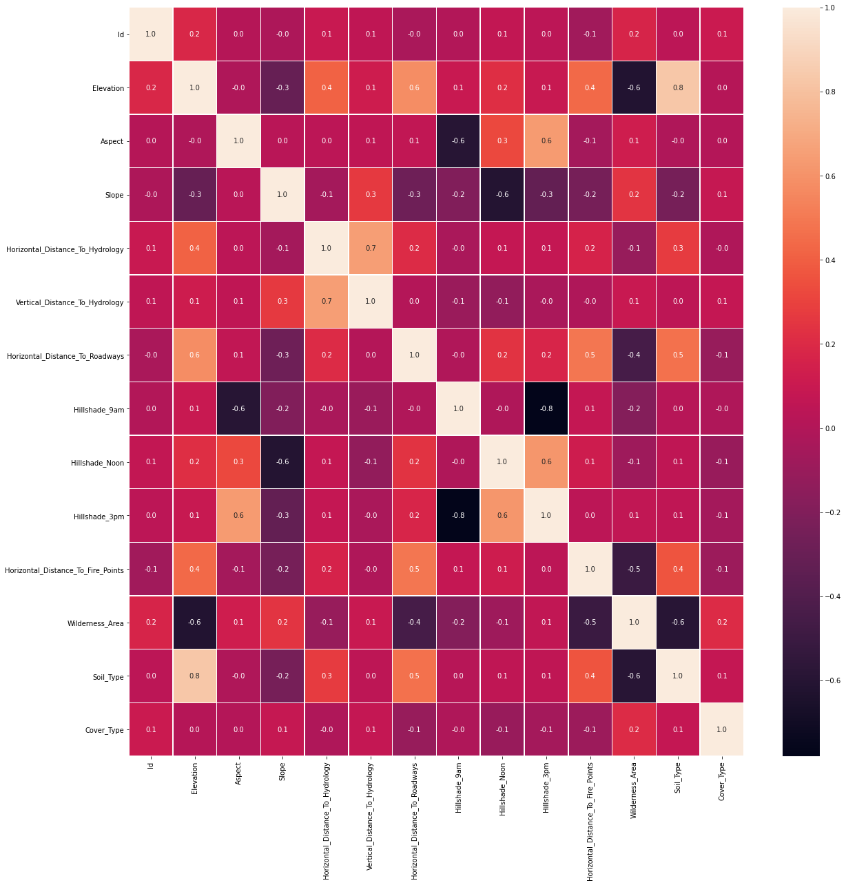

Looking at scatter plot of different features, it seems "Elevation" is an important parameter in separating different classes of target label.


<p float="left">
  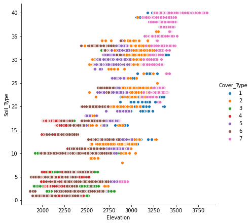
      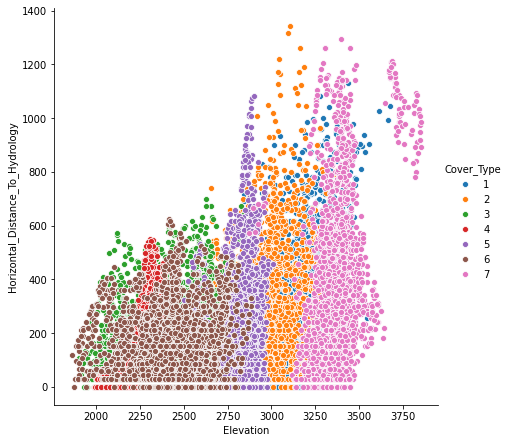 
</p>

We make the following observations from the Count plots below.
* Soil_Type10 shows a significant class distinction for Cover_Type=6.
* Similarly Wilderness_Area4 and Cover_Type=4 are strongly associated.

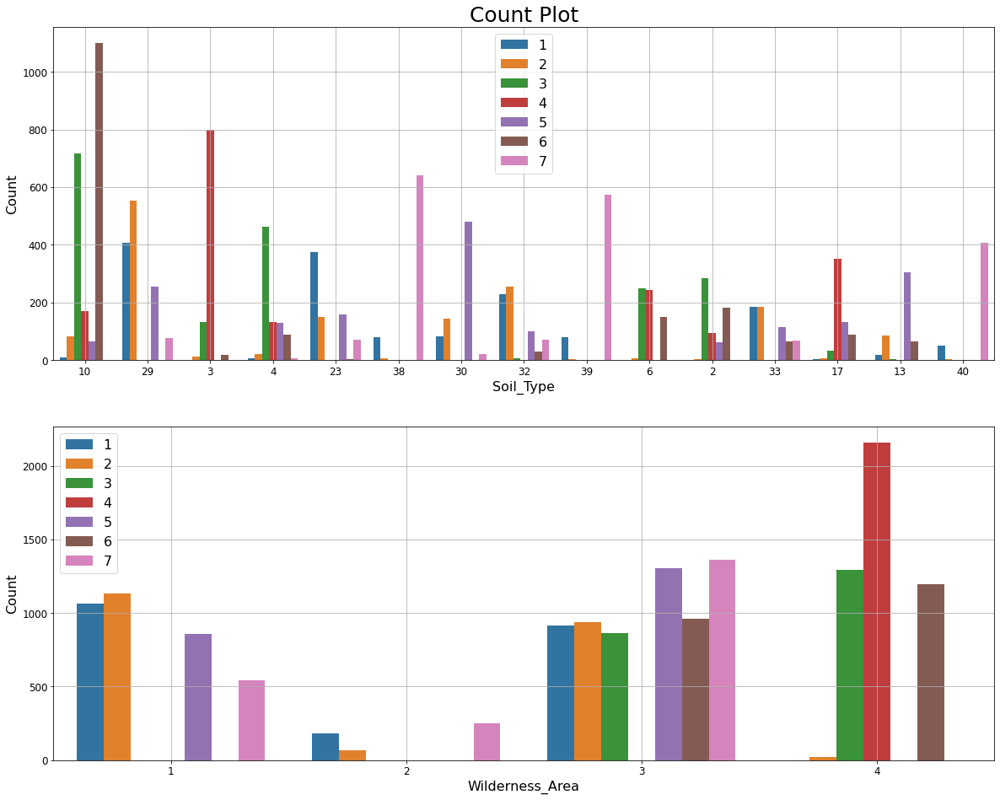

List of unique values in the feature shows Soil_Type15 and Soil_Type7 are constant. Additionally, Id column is a unique identifier for each observation. We'll drop those three columns as they do not carry any information to identify the target label.
There are also skewness in some features. "Horizontal_Distance_To_Hydrology" is an example of that.


### Train-Test Split
After removing "Id" and constant columns, data is split into train and validation set.

```python
from sklearn.model_selection import train_test_split
# Split train into train & val
train, val = train_test_split(data, train_size=0.80, test_size=0.20, stratify=data["Cover_Type"], random_state=42)
# Separate class label and data 
y_train = train["Cover_Type"]
X_train = train.drop("Cover_Type", axis=1)
y_val = val["Cover_Type"]
X_val = val.drop("Cover_Type", axis=1)
print(f'train: {train.shape}, val: {val.shape}')
```
train: (12096, 56), val: (3024, 56)

### Baseline model
Normalized value counts of the target label shows an equal weight distribution for all classes, with baseline prediction of 14.3%.


### Pipeline Estimators, Feature_importances and permutation_importance
We are going to look at five different classifiers to compare their performance. For the regression classifiers we will standardize the data before fitting.

1. LogesticRegression
2. RidgeClassifier
3. RandomForestClassifier
4. GradientBoostingClassifier
5. XGBCLassifier

The following plots show the feature_importances and permutation importances of the tree-base classifiers. "Elevation" is given a higher importance weight compared to other features, as we saw earlier. Without the help of permutation, XGBClassifier does not seem to detect the importance of "Elevation" feature.

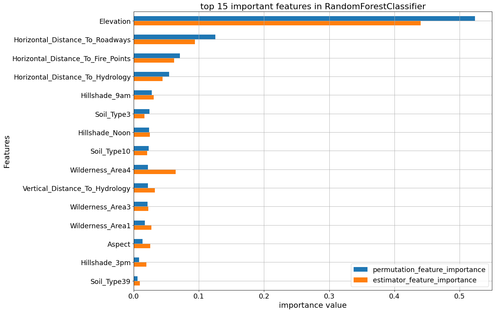
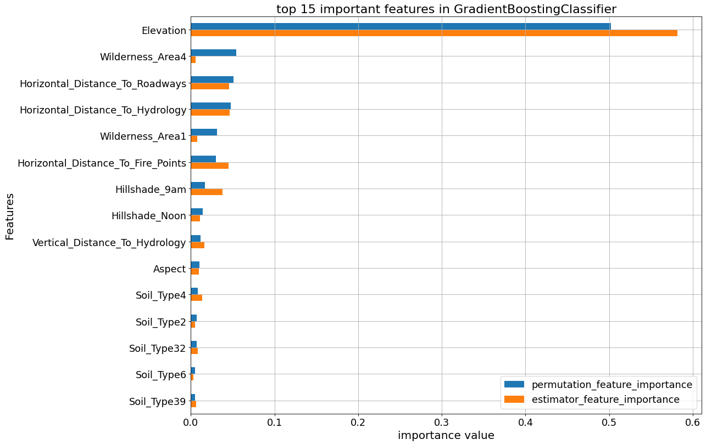
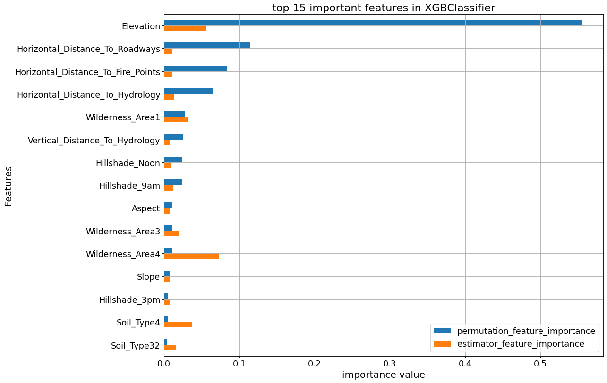

### Avoid Overfitting By Early Stop feature in XGBoost Classifier
XGBClassifier tends to overfit and its growth parameters need to be controlled. To demonstrate that, an early stop fitting with 50 rounds is run below. We notice at some point in fitting process the validation error stops decreasing steady. 
```python
# XGBoost early stop fit
xform = make_pipeline(
    FunctionTransformer(wrangle, validate=False), 
    # ce.OrdinalEncoder(),
)

xform.set_params(functiontransformer__kw_args = kwargs_dict)

X_train_xform = xform.fit_transform(X_train)
X_val_xform = xform.transform(X_val)

clf = XGBClassifier(
    n_estimators = 1000,
    max_depth=8,
    learning_rate=0.5,
    num_parallel_tree = 10,
    n_jobs=-1
)

#eval_set
eval_set = [(X_train_xform, y_train), (X_val_xform, y_val)]

clf.fit(X_train_xform, y_train, 
          eval_set=eval_set, 
          eval_metric=['merror', 'mlogloss'], 
          early_stopping_rounds=50,
          verbose=False) # Stop if the score hasn't improved in 50 rounds

print('Training Accuracy:', clf.score(X_train_xform, y_train))
print('Validation Accuracy:', clf.score(X_val_xform, y_val))
```
Training Accuracy: 0.9987599206349206
Validation Accuracy: 0.8528439153439153

XGBoost trains upto 0.999 and yields 0.85 validation accuracy. The following graph shows how validation error remains constant while training error reduces.

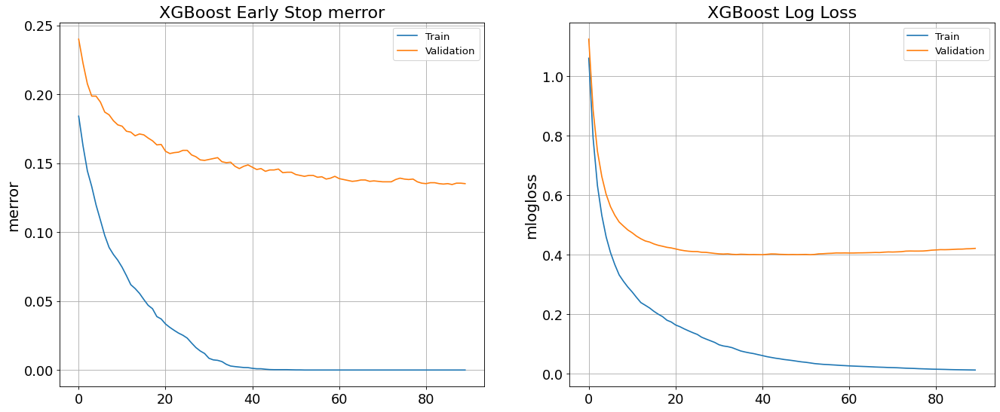

### Cross Validation Curve

The training set is split into kfolds and the model is cross validated based on a classifier parameter.

```python
kfold=4
for k, estimator in enumerate(tree_list):
  print(f"********** {est_dict[estimator][0].__class__.__name__} **********")
  classifier_name = clf_name(estimator, est_dict)  
  # estimator.set_params(functiontransformer__kw_args = kwargs_dict)
  # print(est_dict[estimator][1])
  
  param_distributions = {classifier_name.lower()+'__'+ est_dict[estimator][1][j]: est_dict[estimator][2][j] for j in range(len(est_dict[estimator][1]))}
  
  for i in range(len(est_dict[estimator][1])):
    param_name=classifier_name.lower()+'__'+ est_dict[estimator][1][i]
    param_range = est_dict[estimator][2][i]
    estimator.set_params(functiontransformer__kw_args = kwargs_dict)

    train_scores, val_scores = validation_curve(estimator, X_train, y_train,
    # param_name='functiontransformer__kw_args',
    param_name=param_name, 
    param_range=param_range, 
    scoring='accuracy', cv=kfold, n_jobs=-1, verbose=0
    )

    print(f'**** {param_name} ****\n')
    print("val scores mean:\n", np.mean(val_scores, axis=1))

    # Averaging CV scores
    fig, ax = plt.subplots(figsize=(12,8))

    ax.plot(param_range, np.mean(train_scores, axis=1), color='blue', label='mean training accuracy')
    ax.plot(param_range, np.mean(val_scores, axis=1), color='red', label='mean validation accuracy')
    ax.set_title(f'Cross Validation with {kfold:d} folds', fontsize=20)
    ax.set_xlabel(param_name, fontsize=18)
    ax.set_ylabel('model score: Accuracy', fontsize=18)
    ax.legend(fontsize=12)
    ax.tick_params(axis='both', labelsize=16)
    ax.grid(which='both')
```

<p float="left">
  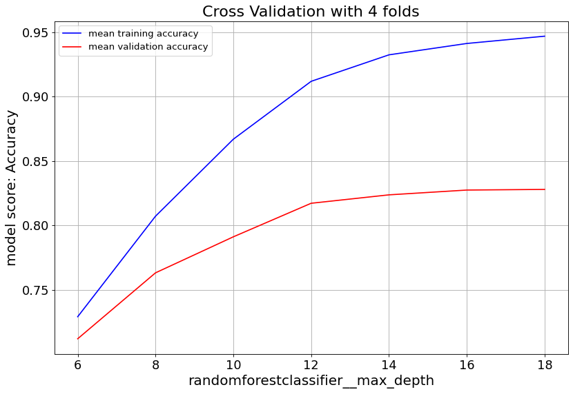
  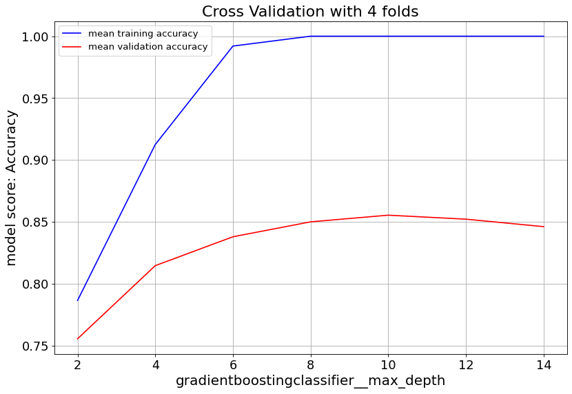 
  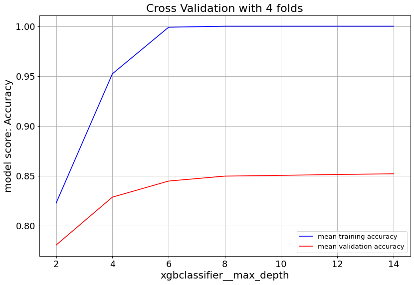 
</p>

Gradient Boost classifier family quickly overfit at max_depth>6. So it's important to keep the tree depth shallow.

<p float="left">
  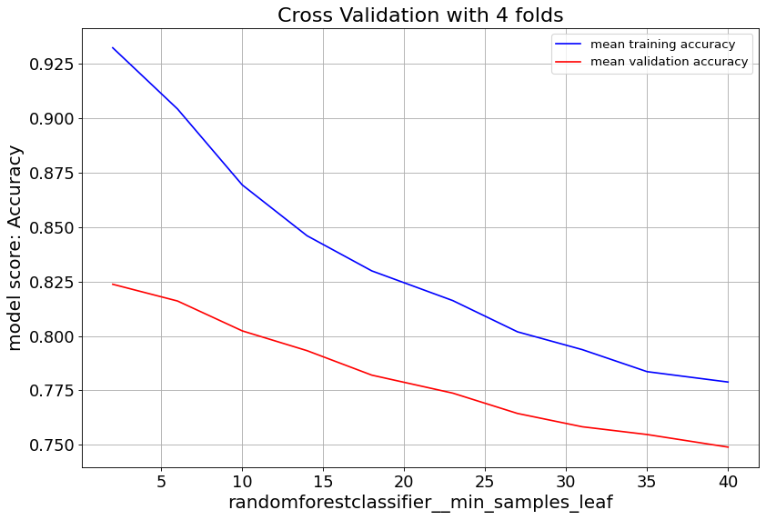
  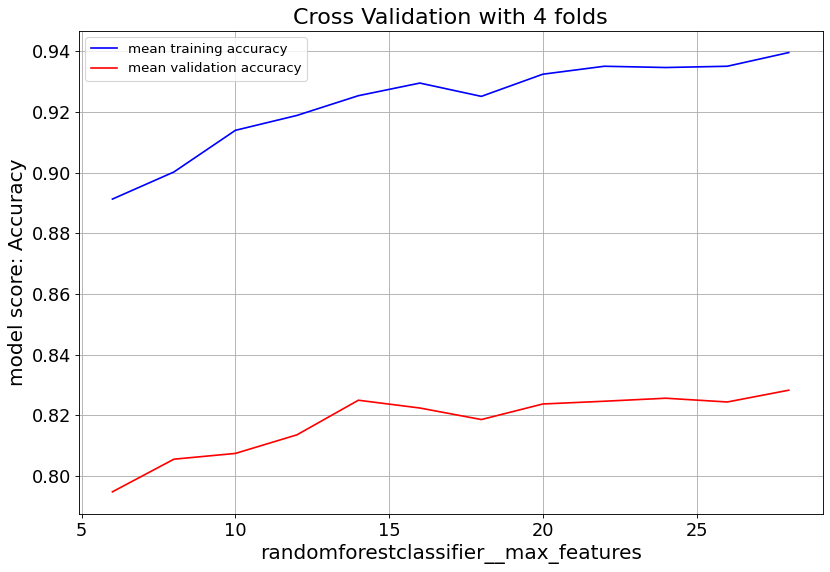
  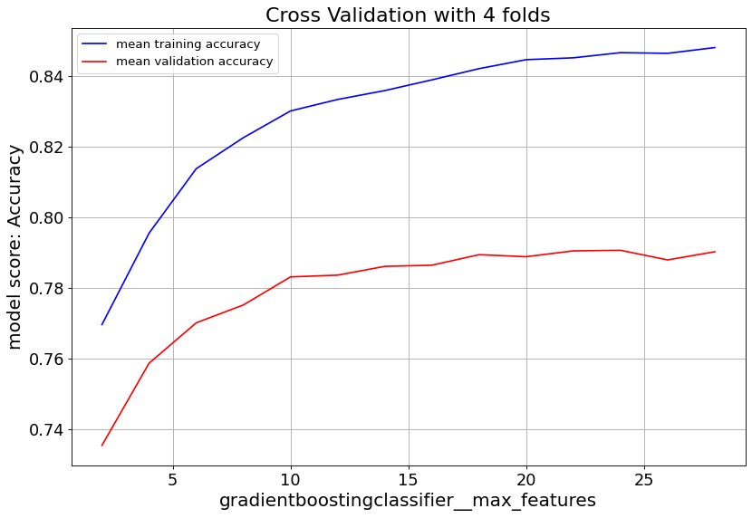 
</p>

max_feat parameter shows validation score saturates at numbers above 20, and starts to overfit. Lowering min_samples_leaf improves validation score. Hence we consider small numbers.

<p float="left">
  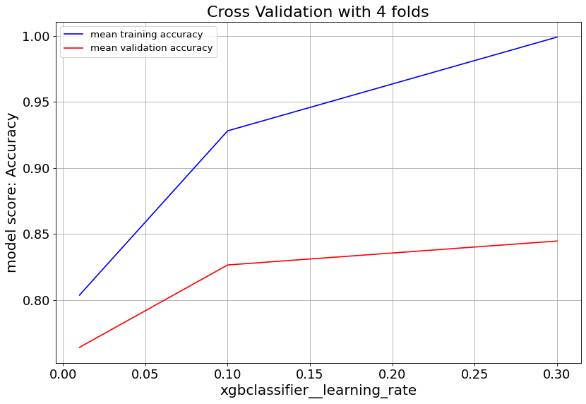
  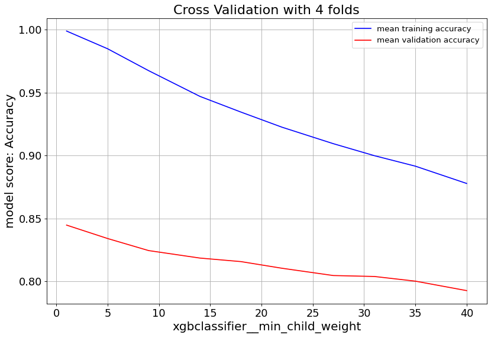
</p>

For XGBoost we can slow down the overfitting issue with min_child_weight and learningrate parameters.

### Hyper Parameter Tunning
The parameters of all five estimators are optimized by RandomizedSearchCV.
```python
kfold=4
n_iter = 10
best_ests = [np.NaN]*len(est)
best_scores = [np.NaN]*len(est)
best_params = [np.NaN]*len(est)

for i, estimator in enumerate(est):
  print(f"\n********** {est_dict[estimator][0].__class__.__name__} **********")
  estimator.set_params(functiontransformer__kw_args = kwargs_dict)

  classifier_name = clf_name(estimator=estimator, est_dict=est_dict)
  print(est_dict[estimator][1])
  
  param_distributions = {classifier_name.lower()+'__'+ est_dict[estimator][1][j]: 
                         est_dict[estimator][2][j] for j in range(len(est_dict[estimator][1]))}

  rscv = RandomizedSearchCV(estimator, param_distributions=param_distributions, 
    n_iter=n_iter, cv=kfold, scoring='accuracy', verbose=1, return_train_score=True, 
    n_jobs=-1)
  
  rscv.fit(X_train, y_train)
  best_ests[i] = rscv.best_estimator_
  best_scores[i] = rscv.best_score_
  best_params[i] = rscv.best_params_

best_ypreds = [best_est.predict(X_val) for best_est in best_ests]
best_testscores = [accuracy_score(y_val, best_ypred) for best_ypred in best_ypreds]
print('Test accuracy\n', best_testscores)
print('best cross validation accuracy\n', best_scores)
```
Test accuracy
 [0.6911375661375662, 0.6326058201058201, 0.7754629629629629, 0.8700396825396826, 0.8498677248677249]
best cross validation accuracy
 [0.7080026455026454, 0.6332671957671958, 0.7709986772486773, 0.8645833333333334, 0.8445767195767195]

The accuracy scores above corresponds to 
LogisticRegression, RidgeClassifier RandomForestClassifier, GradientBoostingClassifier, XGBClassifier accordingly.
In this work, GradientBoostingClassifier with 87% accuracy on the test data shows the best performance among the five. 

## Conclusion
This post evaluates and compares the performance of five multi-class classifiers to predict the "Cover-Type" label of [Covertype dataset](https://archive.ics.uci.edu/ml/datasets/Covertype). The dataset has 54 features, and one target label with 7 different classes. Target label classes are distributed evenly with baseline prediction of 14%. We splitted the total 15120 obeservations into train and test subsets. By applying commonly used classification methods such as feature selection, data scaling, cross validation, and hyperparameter optimization, we were able to achive accuracy scores ranging from 63% to 86% on test data subset. The score metrics of a typical fit of those classifiers can be found in [this](https://forestcover-metrics.herokuapp.com).

## Links
[Dataset](https://archive.ics.uci.edu/ml/datasets/Covertype)
[Project Repository](https://github.com/skhabiri/DS17-Unit-2-Build)
[Web Application](https://forestcover-metrics.herokuapp.com)


