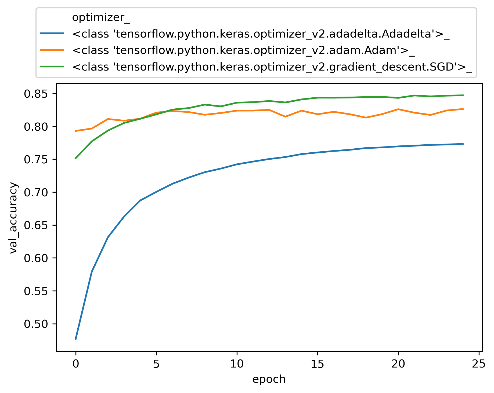
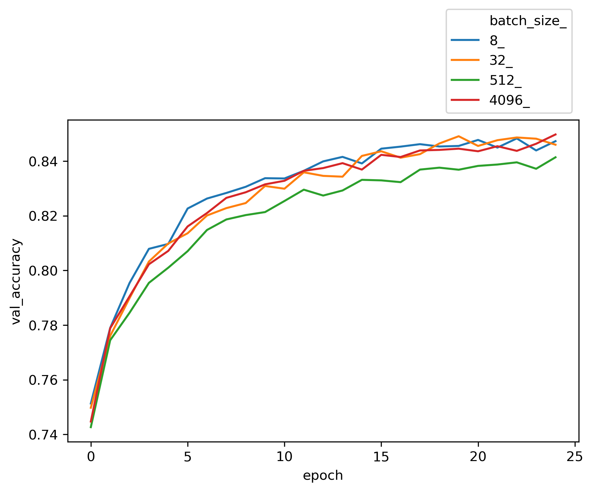
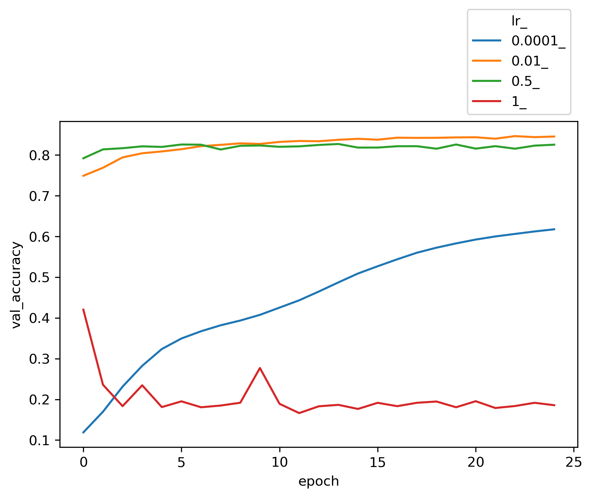
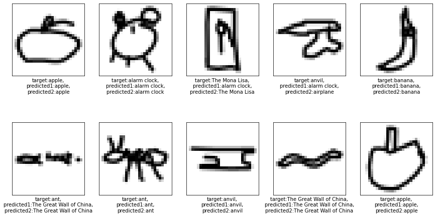

We are going to use [TensorFlow Keras](https://keras.io/) with a 3 layer feed forward perceptron neural network to build a sketch classification model. The dataset is a subset of the [Quickdraw dataset](https://github.com/googlecreativelab/quickdraw-dataset). It has been sampled to only 10 classes and 10000 observations per class. We will build a baseline classification model then run a few experiments with different optimizers and learning rates to benchmark the performance of this simple Neural Network (NN) architecture.

### Load dataset
Our data is in Numpy's compressed array (npz) format. We need to load it from a url address. First, we need to import the following modules.
```
import numpy as np
from sklearn.utils import shuffle
from sklearn.model_selection import train_test_split
import wget
```
We load, shuffle and split the data into train and test with a ratio of 0.2:
```
def load_quickdraw10(path):
  wget.download(path)
  data = np.load('quickdraw10.npz')
  X = data['arr_0']
  y = data['arr_1']

  print(X.shape)
  print(y.shape)

  X, y = shuffle(X, y)
  X_train, X_test, y_train, y_test = train_test_split(X, y, test_size=0.2, random_state=42)
  
  return X_train, y_train, X_test, y_test

path = 'https://github.com/skhabiri/ML-ANN/raw/main/data/quickdraw10.npz'
X_train, y_train, X_test, y_test = load_quickdraw10(path)
```
(100000, 784)
(100000,)
We have 10 classes with 10K samples for each class. Each input sample image is represented by an array of 784 dimensions. Array values are from 0 to 255. As a good practice we normalize the input array values.
```
xmax = X_train.max()
X_train = X_train / xmax
X_test = X_test / xmax
X_train.max()
```
1.0
Whenever all data is normalized to values within 0 and 1, that ensures that the update to all the weights are updated in equal proportions which can lead to quicker convergence on the optimal weight values. If your dataset's values range across multiple orders of magnitude (i.e.  101,  102,  103,  104 ), then gradient descent will update the weights in grossly uneven proportions.

* The selected classes are:
`class_names = ['apple', 'anvil', 'airplane', 'banana', 'The Eiffel Tower', 'The Mona Lisa', 'The Great Wall of China', 'alarm clock', 'ant', 'asparagus']`

### Define and compile the model
We write a function to returns a compiled TensorFlow Keras Sequential Model suitable for classifying the QuickDraw-10 dataset. We leave `learning rate` and  `optimizer` as hyperparamters to tune later.
```
from tensorflow.keras import Sequential
from tensorflow.keras.layers import Dense
from tensorflow.keras.optimizers import *

def create_model(optim, lr=0.01):
    """
    optim: class of the optimizer. values: [Adadelta, Adagrad, Adam, Ftrl, SGD]
    """
    opt = optim(learning_rate=lr)
    model = Sequential(
        [
        #  784 inputs + 1 bias connect to 32 1st layer Hiddent neurons
        Dense(32, activation='relu', input_dim=784),
        #  32 1st-H-Neurons + 1 bias connected to 32 2'nd layer H-Neurons
        Dense(32, activation='relu'),
        #  32 2nd-H-neurons connect to 10 Output neurons
        Dense(10, activation='softmax')       
        ]
    )
    model.compile(optimizer=opt, loss='sparse_categorical_crossentropy', metrics=['accuracy'])
    return model
```
We have 784 inputs, two dense layers each with 32 neurons, and 10 output classes. Including the bias node at each layer, total number of weights are `784+1 * 32+1 * 32+1 * 10`. Since this is a multilable classification with integer classes, we use sparse_categorical_crossentropy.

### Train and validate
Let's sweep different hyperparameters and review its effect on the model accuracy. Below is a function to sweep values of a hyperparameter and fit the model. This would allow us to examine the sensitivity of the model to a particular hyperparameter.
```
def fit_param(param_lst, key, **kwargs):
    """
    This function fits a ANN created by create_model() while sweeping a parameter
    param_list: list of values for the parameter
    key: string key for the parameter. Values: "lr", "batch_size", "epochs", "optimizer"
    return: a dictionary with 
    {f"{par}_": [fitted model, fitted result],
    "key": key, "param_lst": param_lst}
    model_dict[f"{par}_"][0] is the model
    model_dict[f"{par}_"][1] is the fit result
    kwargs: all the keyword arguments that have been used in the function  
    """

    # initialize **kwargs:
    if not kwargs:
        kwargs = {"lr": 0.1, "batch": 128, "epoch": 5, "optimizer": Adam}
    
    model_dict={}
    model_dict["key"] = key
    model_dict["param_lst"] = param_lst
    for par in param_lst:
        kwargs[key] = par
        print(f"********* Fitting for {key}={kwargs[key]} *********")
        print(f""" Fitting for lr, batch, epoch, optimizer=
        {kwargs["lr"]}, {kwargs["batch"]}, {kwargs["epoch"]}, {kwargs["optimizer"]}""")
        # Initialize the dictionary
        model_dict.setdefault(f"{par}_", [None, None])
        model_dict[f"{par}_"][0] = create_model(kwargs["optimizer"], kwargs["lr"])
        model_dict[f"{par}_"][1] = model_dict[f"{par}_"][0].fit(
            X_train, y_train,
            # Hyperparameters!
            epochs=kwargs["epoch"], 
            batch_size=kwargs["batch"], 
            validation_data=(X_test, y_test))
    
    return model_dict
```
This function returns the trained model as well as the fitted results for each value of the swept parameter. Let's now fit the model for different values of each hyperparameter:
```
batch_lst = [8, 32, 512, 4096]
lr_lst = [0.0001, 0.01, 0.5, 1]
opt_lst = [Adadelta, Adam, SGD]

params_dic = { 
    "optimizer": [opt_lst, None, None, {"lr":0.01, "batch":32, "epoch":25, "optimizer":SGD}],
    "batch_size": [batch_lst, None, None, {"lr":0.01, "batch":32, "epoch":25, "optimizer":SGD}],
              "lr": [lr_lst, None, None, {"lr":0.01, "batch":32, "epoch":25, "optimizer":SGD}],
             }
df_lst = []

for key, val in params_dic.items():
    
    kwargs = params_dic[key][3]

    # create model
    params_dic[key][1] = fit_param(params_dic[key][0], key, **kwargs)
```
Now we can plot the validation accuracy for each hyper paramter and review its effect on the trained model.

<p float="left">
  
   
  
</p>

Among different choices for `optimizer` engine, SGD and Adam seems to be more efficient for this dataset. The choices of `batch size` does not seem to be critical to the accuracy of the model. The entire input X is divided into batches of size n and the neural network is trained on each batch of n samples. In our perceptron network, weights W's, and biases b's get updated at the end of each batch. Once all batches in a training dataset are trained the epoch counter goes up and we create another set of batches randomly and exclusively (like Kfold) and re-train based on each of the new batches again.
Considering two extreme cases, in stochastic gradient descent, batch size is set to one sample. Hence the accuracy of each update is low. However, number of updates per epoch are maximum, as there is one back-propagation update per batch. That resuls in long computing time and noisy training trend since the updates are done based on individual samples. On the other side for batch size gradient descent (GD), we have one batch per epoch, or in other word, the size of the batch is equal to the entire training set. Hence the epoch looks at the same set of data repeatedly and makes an update on every epoch run. Here since back propagation takes place after looking at the entire training set, the updates are more generalized and less noisy. Due to less number of batches per epoch, one batch per epoch, runtime is shorter. However, we need a large memory to process the entire dataset in one batch, and with large dataset that is not feasible.
As for `learning rate`, a large number like 1 fails to converge, while a very small number such as 0.0001 underfits and needs more epochs to train. However, a learning rate between 0.01 to 0.5 yields reasonable results. We get a validation accuracy of about 0.84 for these typical runs.

### Evaluation
To get a visual sense of the model performance let's try the test data that has been kept away from the model and try to predict the scetches. For this part we use two different models that have been saved during fitting process with different hyper parameter settings.
```python
plt.figure(figsize=(15,8))
start = np.random.randint(0, len(X_test)-10)
i = 0
for num in range(start, start+10,1):
    plt.subplot(2,5, i+1)
    plt.xticks([])
    plt.yticks([])
    plt.grid(False)
    plt.imshow(X_test[num].reshape(28,28), cmap=plt.cm.binary)
    
    predict1 = params_dic["lr"][1]['0.01_'][0].predict(X_test[num].reshape(1,784))
    predict2 = params_dic["batch_size"][1]["32_"][0].predict(X_test[num].reshape(1,784))
    predicted1 = class_names[predict1.argmax()]
    predicted2 = class_names[predict2.argmax()]
    plt.xlabel(f"target:{class_names[y_test[num]]},\npredicted1:{predicted1},\npredicted2:{predicted2}")
    i += 1
plt.show()
```

The predictions seems to be reasonable and the ones that do not match the target labels are kind of justifiable.

### Conclusion
We selected a feed forward perceptron topology to train a model to classify 10 target label classes from [Quickdraw dataset](https://github.com/googlecreativelab/quickdraw-dataset). The neural network that we used comprised of two dense layers with 32 neurons each and a 10 neuron output layer for 10 classes. The input tensor was 100K samples with 784 dimensions. To train the model we used TensorFlow and Keras API. We tried several Optimizer, batch sizes and learning rates to get a benchmark for this topology. With SGD optimizer, 0.01 learning rate and batch_size of 512 we got an accuracy of 0.84.

### links
- [Github repo](https://github.com/skhabiri/ML-ANN/tree/main/module2-Train)
- [Keras](https://keras.io)
- [TensorFlow](https://www.tensorflow.org)
