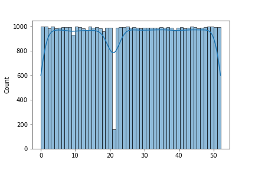
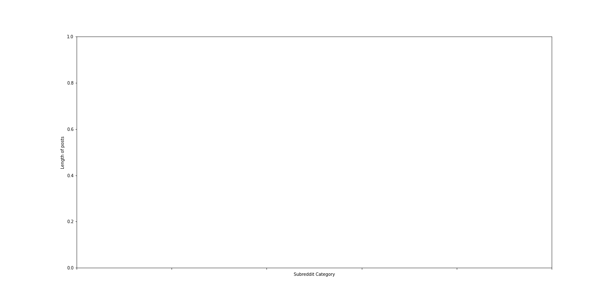

---
layout: post
title: Sketch Classification With_Neural Networks
subtitle: Classification of QuickDraw Dataset
gh-repo: skhabiri/ML-ANN/tree/main/module2-Train
gh-badge: [star, fork, follow]
tags: [Machine Learning, Neural Network, QuickDraw, Classification, TensorFlow, Keras]
image: /assets/img/post7/post7_reddit.jpg
comments: false
---

We are going to use TensorFlow Keras & a sample of the [Quickdraw dataset](https://github.com/googlecreativelab/quickdraw-dataset) to build a sketch classification model. The dataset has been sampled to only 10 classes and 10000 observations per class. We will build a baseline classification model then run a few experiments with different optimizers and learning rates.

### Load dataset
Our data is in Numpy's compressed array (npz) format. We need to load it from a url address. First, we need to import the following modules.
```
import numpy as np
from sklearn.utils import shuffle
from sklearn.model_selection import train_test_split
import wget
```
We load, shuffle and split the data into train and test with a ratio of 0.2:
```
def load_quickdraw10(path):
  wget.download(path)
  data = np.load('quickdraw10.npz')
  X = data['arr_0']
  y = data['arr_1']

  print(X.shape)
  print(y.shape)

  X, y = shuffle(X, y)
  X_train, X_test, y_train, y_test = train_test_split(X, y, test_size=0.2, random_state=42)
  
  return X_train, y_train, X_test, y_test

path = 'https://github.com/skhabiri/ML-ANN/raw/main/data/quickdraw10.npz'
X_train, y_train, X_test, y_test = load_quickdraw10(path)
```
(100000, 784)
(100000,)
We have 10 classes with 10K samples for each class. Each input sample image is represented by an array of 784 dimensions. Array values are from 0 to 255. As a good practice we normalize the input array values.
```
xmax = X_train.max()
X_train = X_train / xmax
X_test = X_test / xmax
X_train.max()
```
1.0
### Build the model
We write a function to returns a compiled TensorFlow Keras Sequential Model suitable for classifying the QuickDraw-10 dataset. We leave `learning rate` and  `optimizer` as hyper paramters for later tuning.
```
from tensorflow.keras import Sequential
from tensorflow.keras.layers import Dense
from tensorflow.keras.optimizers import *

def create_model(optim, lr=0.01):
    """
    784+1 * 32+1 * 32+1 * 10
    optim: name of the optimizer. values: [Adadelta, Adagrad, Adam, Ftrl, SGD]
    """
    opt = optim(learning_rate=lr)
    model = Sequential(
        [
        #  784 inputs + 1 bias connect to 32 1st layer Hiddent neurons
        Dense(32, activation='relu', input_dim=784),
        #  32 1st-H-Neurons + 1 bias connected to 32 2'nd layer H-Neurons
        Dense(32, activation='relu'),
        #  32 2nd-H-neurons connect to 10 Output neurons
        Dense(10, activation='softmax')       
        ]
    )
    # sparse_categorical_crossentropy is for multilable classification with integer classes
    model.compile(optimizer=opt, loss='sparse_categorical_crossentropy', metrics=['accuracy'])
    return model
```


### Data Cleaning:
For cleaning data first import the stored data into a notebook.
```
data = pd.read_sql_query("select * from submission_table order by random() limit 100000;", conn)
# subreddit_subs: is the number of subscriber in the subreddit category
print(data.shape)
(51610, 4)
```
Here is a sample of the data:

<table border="1" class="dataframe" style="overflow-x: scroll;display: block; max-height: 300px;"><thead><tr style="text-align: right;"><th></th><th>subreddit_name</th><th>subreddit_id</th><th>title</th><th>text</th></tr></thead><tbody><tr><th>0</th><td>literature</td><td>2qhps</td><td>James Franco's poems: hard to forgive</td><td></td></tr><tr><th>1</th><td>technology</td><td>2qh16</td><td>Predator Drone Spotted in Minneapolis During George Floyd Protests</td><td></td></tr><tr><th>2</th><td>DIY</td><td>2qh7d</td><td>I restored a $5 Kitchen Aid mixer I found at the thrift store</td><td></td></tr><tr><th>3</th><td>news</td><td>2qh3l</td><td>Alabama just passed a near-total abortion ban with no exceptions for rape or incest</td><td></td></tr><tr><th>4</th><td>Parenting</td><td>2qhn3</td><td>I thought my 6 year old was doing one of his math activities on the tablet, but nah</td><td>My 6 year old has a bunch of new apps and activities that his teacher sent us to put on his tablet. He's been occasionally asking me, from the other room, the answers to different math problems, like what's 12+7 or what's 22-8.  I'm like sweet he's doing his math! Nope. He's trying to bypass the parental locks on kids YouTube so he can watch shit that is blocked. He keeps exiting out and going back in which is I assume why he had to ask multiple times.</td></tr></tbody></table>

The database contains 51610 rows and 4 columns.
```
 #   Column          Non-Null Count  Dtype 
---  ------          --------------  ----- 
 0   subreddit_name  51610 non-null  object
 1   subreddit_id    51610 non-null  object
 2   title           51610 non-null  object
 3   text            51610 non-null  object
 ```
Let's check the unique categories in our collected data:
```
 subreddit_names = data['subreddit_name'].unique()
len(subreddit_names), subreddit_names
 ```
 Our created dataset consists of 53 categories.
 ```
 (53,
 array(['literature', 'technology', 'DIY', 'news', 'Parenting', 'cars',
        'WTF', 'MachineLearning', 'socialskills', 'Art', 'biology',
        'politics', 'personalfinance', 'sports', 'worldpolitics',
        'Documentaries', 'food', 'LifeProTips', 'movies',
        'TwoXChromosomes', 'nottheonion', 'mildlyinteresting', 'Health',
        'AskReddit', 'history', 'Cooking', 'Music', 'Fitness',
        'GetMotivated', 'Design', 'gaming', 'entertainment', 'television',
        'books', 'JusticeServed', 'math', 'investing', 'science',
        'camping', 'Coronavirus', 'PublicFreakout', 'travel', 'funny',
        'HomeImprovement', 'scifi', 'worldnews', 'AdviceAnimals',
        'programming', 'gadgets', 'conspiracy', 'space', 'Showerthoughts',
        'announcements'], dtype=object))
 ```
 Let's look at number of posts per subreddit category.
 ```
sns.histplot(
    x=data['subreddit_name'].astype('category').cat.codes, 
    bins=data['subreddit_id'].nunique(),
    kde=True)
 ```
 

Ideally we would use the entire dataset for the training. However for practical reasons that would substantially increase the size of the serialized model and complicate the deployment of the model. For this reason we are going to use a smaller subset of the dataset for training. 
The above graph shows that we have about 1000 posts per subreddit category as expected. However some the posts might have small amount of text that would not be sufficient for our natural language processing. 
Hence we choose the posts that have enough text content. Later on we are going to choose only the categories (features) that  have enough number of posts (instances) to train on.

To get an idea of the posts lengths, let's plot the average length of posts per subreddit category.
```
post_mean = data1.groupby(by='subreddit_name').apply(lambda x: x['text_length'].mean())
plt.figure(figsize=(8,4))
ax = sns.barplot(x=post_mean.index, y=post_mean.values)
ax.set(xlabel='Subreddit Category', ylabel='Average length of posts')
ax.set(xticklabels=[])
plt.show()
```


The above graph shows the average length of posts is not the same in different subreddit categories.
After filtering the low count subreddit categories we end up with 44 categories and 4400 posts. We take a note that in a production setup we need more training data to achieve a reliable results.

### Machine Learning Model
The model is supposed to recieve a text as a post content and classify it to one of the 44 subreddit categories. We consider a random classifier as baseline with an accuracy of 1/44, which is very low. To build our model we use a two stage pipeline. The first stage encodes the text into a numerical format and the the seconf stage classifies the text into one of the target labels.

#### spaCy Embedding
For the first stage of the pipeline we are going to use [spaCy](https://spacy.io) embedding. spaCy is an open-source software library for natural language processing. spaCy performs two major tasks for us, tokenizing and vectorizing. The `tokenizer` is a component that segments texts into tokens. In spaCy, it's rule-based and not trainable. It looks at whitespace and punctuation to determine which are the unique tokens in a sentence. The `tok2vec` layer is a machine learning component that learns how to produce context-based vectors for tokens. It does this by looking at lexical attributes of the token. The tok2vec component is already pretrained from external vectors data. The external vectors data already embeds some "meaning" or "similarity" of the tokens. 
```
import spacy
from spacy.tokenizer import Tokenizer
from spacy.lang.en.stop_words import STOP_WORDS
#Create the nlp object
nlp = spacy.load("en_core_web_md")
```
the `en_core_web_md` model has 685k keys, 20k unique vectors of 300 dimensions. We can define a function to embed the text and use it in a Scikit-learn `FunctionTransformer` as the first stage of the pipeline.
```
# Spacy embedding
def get_word_vectors(docs):
    """
    docs: can be string or a list of strings
    """
    if isinstance(docs, str):
      docs = [docs]
    return np.array([nlp(str(doc)).vector for doc in docs])

# Instantiate functiontransformer of the spacy vectorizer
embed = FunctionTransformer(get_word_vectors)
```
The pipeline is defined as:
```
pipe = Pipeline([
                 ('emb', embed), 
                 ('clf', clfi)])
```
clfi is an instance of a classifier. For this work we try different classifers from `Scikit-learn` library, namely, `KNeighborsClassifier()`, `GradientBoostingClassifier()`, and `XGBClassifier()` from `xgboost` library.

#### Hyperparameter Tuning
We are going to benefit from hyperparameter tuning to optimize our model. For this purpose we use `RandomizedSearchCV()`. This would also perform the cross validation that is helpful considering the fact that our training data is rather small. Nevertheless we split the data into train and test to keep some data away to evaluate the model overfit.
```
est = {}
for key, value in est_dict.items():
  clfi = value[0]
  # print(clfi, type(clfi))
  param_dist = value[1]
  
  # spacy embedding can be taken out of the pipeline to save time in hyperparameter tunning
  pipe = Pipeline([
                   ('emb', embed), 
                   ('clf', clfi)])
  
  est["{0}_est".format(key)] = RandomizedSearchCV(pipe, 
                                                  param_distributions=param_dist, 
                                                  n_iter=4, cv=2, verbose=1)
  
  print('\n', 5*'*',' fitting',key, ' estimator..... ',5*'*')
  est["{0}_est".format(key)].fit(X_train.values, y_train.values)
  print("best params: ",est["{0}_est".format(key)].best_params_)
  print("best score: ",est["{0}_est".format(key)].best_score_)
  print("Test score: ",est["{0}_est".format(key)].score(X_test.values, y_test.values))
```
After model fit, `KNeighborsClassifier`, `GradientBoostingClassifier`, and `XGBClassifier` produce the test accuracy of 0.34, 0.51, and 0.53, respectively. Compared to our 0.02 baseline accuracy this is a huge leap forward.
It is noteworthy that here in the hyperparameter tuning for every parameter set we are repeating the embedding process. Changing the hyperparameters should not affect the embedding. This is obviousely adds to the training time and to speed up the training we could have embed the training set beforehand. On the other side for our small training dataset this is not a showstopper and it is only done once. Additionally it streamlines the later use of the trained model as we could simply feed the string text and let the trained model embed it internally. Otherwise we would have needed to preprocess any query and embed it separately before feeding it to the trained model. 


Despite having the embedding stage as a part of the trained model we can still access the specific internal methods of the classifier. For example let's take the pipeline model that includes `KNeighborsClassifier`. Let's say we want to give a random text and find the neighboring samples from the training set. First we define a function to preprocess the input text, which simply means embeding the text here.
```
# Convert input string to embedded vector
def preprocess(query, vectorize):
  """
  Vectorizes the 'query' string by spacy pretrained model (nlp). 
  the return value serves as a query to the prediction model
  """
  return vectorize(query).reshape(1,-1)
```
A `neighbors` function would recieve an embeded input and calls the `kneighbors()` method of the `KNeighborsClassifier()` to calculate the neighboring samples from the train set.
```
# Accessing the neighbors() method of the KNClassifier of the trained pipeline estimator 
def neighbors(clf, input, X_train, y_train):
  """
  input: a string type text or vectorized array or an iterable data type
  return: Dataframe of nearest neighbors and their subreddit categories
  """
  results = clf.kneighbors(input)
  neighbors_idx, neighbors_dist = results[1][0], results[0][0]
  neighbors_df = pd.concat([X_train.iloc[neighbors_idx], y_train.iloc[neighbors_idx]], axis=1)
  return neighbors_df
```
Now for a given text:
```
query = """Does this seem too advanced for first month of kindergarten?
Usually my husband is sitting with my son (working from home, but present) 
during my son's Zoom class but yesterday I did. I was really surprised by 
what the teacher was asking of the kids. My son's teacher wanted the students 
to write stories live during the zoom meeting. She expected them to write full 
sentences with words like "suddenly." She told them if they can't spell the 
words to "sound it out." She kept reminding them to use connecting words to 
transition between topics. The example story she wrote was about 5-6 sentences. 
It was about going to the playground and waiting for her turn on the swings. 
I was pretty surprised because the kids are still learning the alphabet. 
how would they be able to write sentences for before learning letters? Before we 
started school, the principal specifically told families at an info night, 
"Don't worry if your kid doesn't know the alphabet, we'll reach them!" 
So I don't think the teacher has expectations that the kids could already write."""
```
We preprocess the input text and call the neighbors function to get the minimum distance samples from teh train set.
```
vect = preprocess(query, get_word_vectors)
kneighbors = neighbors(est_best['knc']['clf'], vect, X_train, y_train)
kneighbors
```
The neighboring samples from the train set are:

<table border="1" class="dataframe" style="overflow-x: scroll;display: block; max-height: 300px;"><thead><tr style="text-align: right;"><th></th><th>joint_text</th><th>subreddit_name</th></tr></thead><tbody><tr><th>49913</th><td style="height:100px; overflow:hidden;">lpt at the beginning of every semester make a dedicated folder for your class where you download and save all documents especially the syllabus teachers try to get sneaky sometimes taught this to my sister last year she just came to me and told me about how her ap english teacher tried to pull a fast one on the entire class x200b i've had it happen to me before as well in my bachelors x200b teacher changes the syllabus to either add new rules or claim there was leniancy options that students didn't take advantage of most of the time it's harmless but sometimes it's catastrophic to people's grades x200b in my case teacher tried to act like there was a requirement people weren't meeting for their reports which was not in the original syllabus upload x200b in my sister's case </td><td>LifeProTips</td></tr><tr><th>28021</th><td>the letter charles iii of spain wrote to his parents telling them about his wedding night in 1738 charles iii of spain https en wikipedia org wiki charles_iii_of_spain married princess maria amalia of saxony https en wikipedia org wiki maria_amalia_of_saxony daughter of polish king augustus iii and an educated cultured woman who gave birth to 13 children eight of whom reached adulthood the marriage responded to political'needs' but the couple enjoyed a romantic and harmonious union after the death of his stepbrother ferdinand vi with no descendants charles was crowned king of spain as charles iii in 1759 a year later his wife died and he never remarried charles iii remained a widower for the rest of his life without ever having a mistress in 22 years of marriage this is the first serious upset i've had from amalia the pain that this irreparable loss causes me is equal to the tender love i professed for her this is the letter that charles iii wrote to </td><td>history</td></tr><tr><th>35380</th><td>in 1945 my lawyer grandfather apparently had written to his childhood friend who was serving in wwii complaining about his job his friend rightfully so wrote this scathing response from the philippines note my grandfather passed away last fall and we're still going through his belongings he saved many correspondence some are hard to read because the letters are handwritten and nearly 80 years old however i just came across this letter i've seen other letters from this same guy and i know he grew up in the same neighborhood with my grandfather although my grandfather and this guy went to different schools their entire lives they kept in touch while the friend was serving in ww2 i hadn't gotten a chance to read any letters until tonight and this was the first one i read and it's intense you'll get this when you read but it seems that my attorney grandfather had written to his friend complaining about how busy and hard his job was well as you might imagine his friend while serving in the philippines in ww2 was pretty pissed about that and he didn't hold back ps thanks to commenters who are better versed in ww2 </td><td>history</td></tr><tr><th>48940</th><td>i'm being put off maths by the arrogance of others some context i live in england i'm 17 going into year 13 in september and was hoping to go to cambridge to study maths in 2020 however i attended a subject masterclass at the university this year and the overwhelming arrogance of the other students there infuriated me any time the lecturer would step from one point to the next in an argument there'd be a chorus of furious nodding from people who really wanted to show just how well they understood that step the same would come whenever a concept beyond the a level syllabus was mentioned even in passing or whenever the lecturer asked who had heard of such and such thing before at one point a guy at the front who was probably the worst offender on all counts interrupted the lecturer mid sentence to explain to everyone a method he knew of proving something that the lecturer was literally in the middle of explaining during a q a session with current cambridge students it was very clearly explained that there is no advantage to doing the maths a level a year early but you bet that didn't stop one guy from asking whether </td><td>math</td></tr><tr><th>41895</th><td>feeling extremely social and happy after years of antisocial life style i did something new and it unlocked my social skill long story i have a very rough child hood growing up in a wealthy family but in a mostly not good school surrounded by poverty so i got bullied manipulated and outcasted by other kids i was a good son always follow the rule listen to my parents and such but uneducated kids were the only people i can be friend with and my parents never allowed me to make friends with them understandable so i was very lonely my trust to people was long gone because of that funny enough the only time i ever played the sims my character is exactly that follow rules </td><td>socialskills</td></tr><tr><th>38421</th><td>last week i faced one of the worst fears a parent could ever face i watched my daughter be resuscitated after drowning in a pool there were three adults and 4 kids we were all busy putting on sun screen but we failed to notice that my oldest had wandered off towards the deep end fall in swallow water and sink to the bottom of the pool my brother in law noticed first that she was down there and dived right in and we started cpr right away while my brother in law's wife dialed 9 1 1 she started breathing 30 seconds after intense cpr and mouth to mouth she took a big breath vomited more water and started crying there was a wave of relief this could have gone so much worse the ambulance arrived shortly after and she was rushed to the hospital it took three days for her to finally get the all clear from the hospital along with a follow up with her normal pediatrician why three days pool chemicals have a way of irritating lungs and messing with little </td><td>Parenting</td></tr><tr><th>27998</th><td>i want to check if you guys are interested in a ama with my grandmother she survived the japanese concentration camps in indonesia during wwii hi all last year i've seen a lot of redditors that let their grandparents have an ama mostly about their experiences in wwii but these stories are always from the europian western side although very interesting i've always felt that the asian side isn't told that much at least in my case we dutchies learn almost nothing about the history and culture of our former colonies like indonesia such imporant things happend there but people simply don't know anything about them my grandmother was born in indonesia during the '30 so i was lucky she could tell me wonderful stories relatively of course about everything she's experienced the struggles during the war being a half blood she and </td><td>history</td></tr><tr><th>45564</th><td>i was generously gifted a complete harvard classics series and made a new friend in the process here is a picture of the whole set http imgur com a 6x8il7n i recently reached out to a local group asking if anyone perhaps inspired by the recent netflix release tidying up with marie kando might be looking to sell or re home classic literature i've been spending a lot of time reading after my recent loss and i realized that my bookshelves and thus my general knowledge of literature was really lacking the classics well i hit the jackpot a woman reached out saying she was looking to re home a full harvard classics set and not knowing what that was i did a quick google search i was amazed to find out that it covered such a vast array of subjects in modern times and even during it's creation it's not perfectly round or all encompassing but it's still totally wonderful i expected to have to pay for the books but when the woman called she told me that her grandfather abraham a brilliant man who couldn't afford to take time from work for college but loved learning purchased the books for his own educational </td><td>books</td></tr><tr><th>37600</th><td>hi i'm a mom of a girl who is into math how do i not ruin it my daughter is almost six and she really enjoys math well counting and manipulating numbers i suppose that's really the only thing she's really encountered she always wants to read the math books we've gotten alice in numberland and other assorted things like that and really enjoys those a lot personally i've put almost zero time into mathematics because i convinced myself that i was horrible at it in high school here's what i'm scared of 1 other girls or teachers saying things like i hate math or that they're not good at it she went to school with her favorite color being black and came home with it a week later being pink </td><td>math</td></tr><tr><th>23699</th><td>update am i overreacting my husband can t parent original post https www reddit com r parenting comments hp20kv am_i_overreacting_husband_cant_parent utm_source share utm_medium ios_app utm_name iossmf update thank you so much for so many amazing comments they have allowed me to step back and think constructively his behaviour last night was disgraceful i set the kids up with a tent on the rooftop deck it s secure so they had a very fun night away from the toxic energy inside this morning husband asked if we wanted to go to the park i did not want to be around him but adult problems are not for children so i pack them up to go we all wait by the door as he s strung out over </td><td>Parenting</td></tr><tr><th>13813</th><td>proud parenting moment my oldest daughter vera 8 has autism and selective mutism she is highly intelligent but socially she is lacking that made it hard to bond at first going back some years i was playing the sims and she came to sit down next to me pointing at things she would like to see placed in the house she wat building that went on for quite some while i would build a house and she would point at things she likes we wouldnt say a word we just sit down and build eventually i got a new laptop the old one was still working so i removed most of my files and stuff and it went to vera she could start playing the sims on her own however it got frustrating to her and she quit </td><td>Parenting</td></tr><tr><th>204</th><td>don t be like this today was my son s 6th birthday last year none of his school friends came to his party just family and friends from work so we really put in extra effort this time we noted that last year we didn t give enough notice and my son didn t really get along with the other kids in the first place this year he spent all year focusing on making friends different group of kids than last year we sent out invites a month in advance with multiple reminders booked the venue got the party supplies decorated cupcakes the works we anticipated a lower turnout due to mother s day so we over invited and made the party noon to 2 thinking it would be after brunch or before a bbq typical mother s day activities we had 8 families rsvp that they would be there 18 kids the parents emailed me asking for gift ideas telling me how </td><td>Parenting</td></tr><tr><th>46137</th><td>i hate that i'm bad at math is the end of the conversation if you were with someone who could barely read the words on a menu at a restaurant and they responded casually with oh i'm just bad a reading that would be unacceptable you would be concerned about their education they don't have to love reading or be able to make out sloppy cursive writing but you'd expect them to have a certain level of competency in reading so that they do everyday tasks in middle school and high school i did horribly in math but my excuse was always i'm just bad at math not like kevin who's naturally gifted and pretty much everyone just let me get away with it even my own teachers didn't push me very hard it took me a long time to realize kevin was good at math because he practiced problems everyday for the same amount of time i read </td><td>math</td></tr><tr><th>29109</th><td>finally got rid of the tablet my son is 3 5 and has been addicted to youtube for the past 1 5 years my mother in law bought him a tablet against my wishes for his 2nd birthday i never wanted him to have one but soon after both my wife and i became used to the convenience of just letting him watch while we got things done around the house or if we went to the store he was quiet and would giggle at the videos it was cute back then however he eventually started to wake up each day and the first words out his mouth were tablet please and he would go to bed each night asking the same thing while he would fall asleep i noticed his behavior got worse and worse during this time and he would </td><td>Parenting</td></tr><tr><th>9803</th><td>one evening me f31 and my fiancé m33 were planning our wedding then we went to sleep funeral tomorrow my fiancé was also a redditor therefore feel i have to post something here to do something as right now it is hard to figure out what last monday and the weekend before that were so amazing we went to see our dream apartment that we were planning to buy we went for lunch with his parents next day a brunch with his fraternity brothers and their spouses a beautiful ring on my finger wedding in august everyone so exicted he changed his job almost a year ago and on monday his first big project successfully went into production he was the hero of the day i had some impro </td><td>TwoXChromosomes</td></tr></tbody></table>

Now if we want to predict that which subreddit category this text belongs to:
```
def prediction(model, input, n):
  """
  input: text string or iterable dtype (list, np.array, vectorized array)as input
  model: trained model with predict_proba method
  returns a pandas series containing the recommended subreddit names
  """
  # Return whether an object is an instance of a class 
  if isinstance(input, str):
    input = [input]
  # probability of each class
  proba = model.predict_proba(input)
  # print(proba.shape)

  # index of the highest probable classes in descending order
  # i[0] is index and i[1] is probability
  index_max = [i[0] for i in sorted(enumerate(proba[0]), key=lambda x:x[1])][::-1]
  
  # Alternative way
  # index_max = proba[0].argsort()[::-1]

  # get the most probable class names
  name = pd.Series(model.classes_[index_max][:n])
  return pd.Series(data= name.to_list(), index = index_max[:n])
```
neighbors() returns the subreddit category of the nearest neighbors to the input query among the inputs in X_train. Neigbhbors could be repeatedly from the same class. This is different from prediction() function which predicts the most probable subreddit categories that the query belongs to.
```
preds = prediction(est_best['knc']['clf'], vect, 10)
preds
```
The predicted subreddit categories are:
```
13          Parenting
28               math
25            history
36       socialskills
19              books
16    TwoXChromosomes
10        LifeProTips
43      worldpolitics
42          worldnews
41             travel
```
We get the same results if we call the prediction function on pipeline estimator and pass string query instead of embedding.
```
prediction(est_best['knc'], query, 10)
```
```
13          Parenting
28               math
25            history
36       socialskills
19              books
16    TwoXChromosomes
10        LifeProTips
43      worldpolitics
42          worldnews
41             travel
```
Next we'll show how to serialize the model for deployment.
### Model Serialization
There are a few ways to put trained machine learning (ML) models into production. The most common method is to serialize the model using some particular format after training, and deserialize that model in the production environment. One way of serializing an object is to write Python objects to a bytestream. This can be done with pickle a built-in python module. One can take this file and load it back into a separate Python interpreter at a later date, recovering the objects from the previous session. It's important to note that pickled files are tightly coupled with the environment in which they were created.
```
import pickle
est_pickle = {}
loaded_pickle ={}

for key in est_dict:
    print("key:", key)
    with open(f'{key}_pkl', 'wb') as est_pickle[key]:
        pickle.dump(est_best[key], est_pickle[key])

    loaded_pickle[key] = pickle.load(open(f'{key}_pkl', 'rb'))
```
Now we can try the same sample input and check if we get the same results with pickled model.
```
prediction(loaded_pickle['knc'], query, 10)
```
```
13          Parenting
16    TwoXChromosomes
19              books
36       socialskills
28               math
25            history
11    MachineLearning
43      worldpolitics
42          worldnews
41             travel
dtype: object
```
Results matches the previous prediction as expected.

### Conclusion
In this work we built a machine learning model using NLP techniques and optimize that we scikit-learn RandomSearchCV() to predict a subreddit category for a given post. We used a python wrapper for Reddit API, PRAW, to create a database of subreddit posts from the categories of interest. Afte cleaning the data, we fit and tuned three different models and compared their performances. Other than the accuracy score we ran an article a sample input and used one of the models to get similar articles from the training set. We also used the sample input article to predict top subreddit categories that are related to the article. The serialized model can be deployed to a datascience API in order to build a full stack application.

### links
- [Github repo](https://github.com/skhabiri/SubReddit-Recommender)
- [PRAW](https://praw.readthedocs.io)
- [SciKit-Learn](https://scikit-learn.org/stable/getting_started.html)
- [spaCy](https://spacy.io/)
