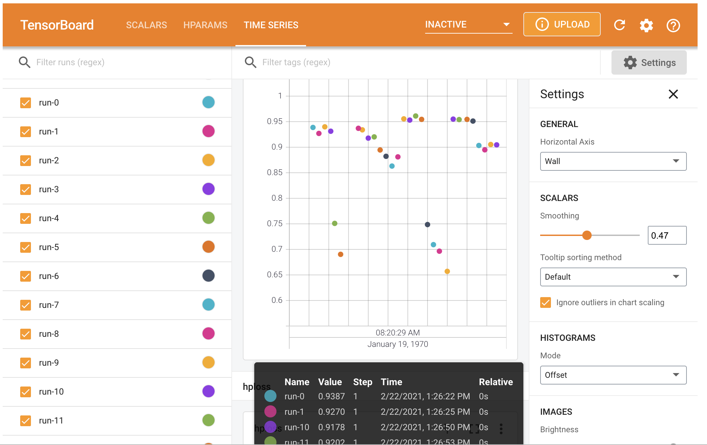
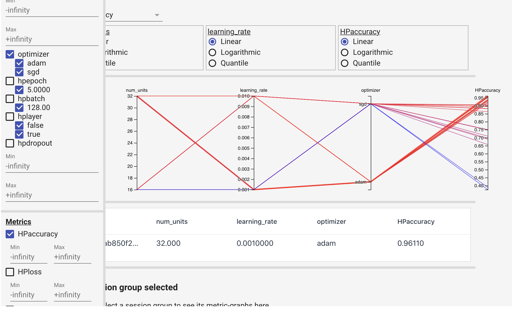

Hyperparameter tuning is much more important with neural networks than it has been with any other models. Other supervised learning models might have a couple of parameters, but neural networks can have dozens. These can substantially affect the accuracy of our models and although it can be a time consuming process, it is a necessary step when working with neural networks. 
Some of the important hyperparameters in neural networks to tune are batch_size, training epochs, optimization algorithms, learning rate, momentum, activation functions, dropout regularization, number of neurons in the hidden layers, number of the layers and so on.
Hyperparameter tuning comes with a challenge. How can we compare models specified with different hyperparameters if our model's final error metric can vary somewhat erratically? How do we avoid just getting unlucky and selecting the wrong hyperparameter? This is a problem that to a certain degree we just have to live with as we test and test again. However, we can minimize it somewhat by pairing our experiments with Cross Validation to reduce the variance of our final accuracy values.

### Hyperparameters in neural networks
Here we'll discuss trade-offs for commonly used hyperparamaters in neural networks.

* **Batch size:**
Batch size determines how many observations the model is shown before it calculates loss/error and updates the model weights via gradient descent. You're showing the model enough observations that you have enough information to update the weights, but not such a large batch size that you don't get a lot of weight update iterations performed in a given epoch. Feed-forward Neural Networks aren't as sensitive to batch_size as other networks. Smaller batch sizes will also take longer to train. Keras defaults to batch size of 32. Increasing the minibatch size could lower the effective learning rate that provides stable convergence.

* **Learning rate:**
For a given number of epochs, a small learning rate may not reach the optimum point and underfits. A very large learning rate can cause divergence behavior. 

* **Momentum:**
Momentum is a property that decides the willingness of an optimizer to overshoot beyond a local minimum. Imagine a ball rolling down one side of a bowl and then up the opposite side a little bit before settling back to the bottom. The purpose of momentum is to try and escape local minima.

* **Activation function:**
This is another hyperparameter to tune. Typically you'd want to use ReLU for hidden layers and either Sigmoid, or Softmax for output layers of binary and multi-class classification implementations respectively.

* **Network weight initialization:**
 Your model will get further with less epochs if you initialize it with weights that are well suited to the problem you're trying to solve. ```init_mode = ['uniform', 'lecun_uniform', 'normal', 'zero', 'glorot_normal', 'glorot_uniform', 'he_normal', 'he_uniform']```

* **Dropout regularization and the reight constraint:**
The Dropout Regularization value is a percentage of neurons that you want to be randomly deactivated during training. The weight constraint is a second regularization parameter that works in tandem with dropout regularization. You should tune these two values at the same time. Using dropout on visible vs hidden layers might have a different effect. 

* **Number of units (neurons) per layer and number of layers:**
Typically depth (more layers) is more important than width (more nodes) for neural networks. The more nodes and layers the longer it will take to train a network, and higher the probability of overfitting. The larger your network gets the more you'll need dropout regularization or other regularization techniques to keep it in check.

### Dataset
`tensorflow.keras.datasets.mnist` is used to train our neural network. The training set is 60K and validation data is 10K. The labels are fairly evenly distributed. We have 10 classes of hand written digits from 0 to 9. 
```
import numpy as np
from tensorflow.keras.datasets import mnist
(X_train, y_train), (X_test, y_test) = mnist.load_data()
print(X_train.shape, X_test.shape)
np.unique(y_train, return_counts=True)
```
((60000, 28, 28), (10000, 28, 28))
(array([0, 1, 2, 3, 4, 5, 6, 7, 8, 9], dtype=uint8),
 array([5923, 6742, 5958, 6131, 5842, 5421, 5918, 6265, 5851, 5949]))

The input sample images are represented by a 2-dimensional array of 28x28. Array values are from 0 to 255. Let's normalize the input data and flatten it at the same time.
```
maximum = np.concatenate([X_train, X_test]).max()
X_train = X_train / maximum
X_test = X_test / maximum
X_train = X_train.reshape(60000, 784)
X_test = X_test.reshape(10000, 784)
```
It's not 100% necessary to normalize/scale your input data before feeding it to a neural network, as the network can learn the appropriate weights to deal with data as long as it is numerically represented. However, it is recommended to normalize the input data as it can speed up the training and reduces the chances of the gradient descent to get stuck in a local optimum.

### Search strategies
There are different ways to search the hyperparamter space. Here are three popular approaches.

* **Grid search:**
 - This has a specific downside in that if we specify 5 hyperparameters with 5 values each then we've created 5^5 combinations of hyperparameters to train on. If we also decide to cross validate our results with 5-fold input cross validation then our model has to run 15,625 times! I recommend not using grid search to test combinations of different hyperparameters, but only using it to test different specifications of a single hyperparameter. It's rare that combinations between different hyperparameters lead to big performance gains. It's better to retain the best result for that single parameter while you test another, until you tune all the parameters in that way.

* **Random search:** 
 - Grid search treats every parameter as if it was equally important, but this just isn't the case. Random search allows searching to be specified along the most important parameter and experiments and less along the dimensions of less important hyperparameters. The downside of Random search is that it won't find the absolute best hyperparameters, but it is much less costly to perform than Grid Search.

* **Bayesian optimization:** 
 - Bayesian Optimization is a search strategy that tries to take into account the results of past searches in order to improve future ones. That is tuning our hyperparameter tuning. `keras-tuner` offers Bayesian methods implementation.

## Hyperparameter techniques in neural networks
In this ection we'll present three different techniques to tune hyperparameters of a neural network.

### 1) GridSearchCV through Keras sklearn wrapper
In order to utilize the GridSearchCV, we use sklearn wrapper for keras, `KerasClassifier`. GridSearchCV will handle the parameteric grid search and cross validation folding aspect and the KerasClassifier will train the neural network for each parameter set and run for the specified number of epochs. For each parameter set Pj and input fold of Xi, keras will train a model. The parameter set which yields the maximum average score over all the folds, Pjmax, will be selected to train the keras model with the entire input dataset of X again. Now let's create a Keras model that we can use in sklearn.GridSearchCV():
```
from sklearn.model_selection import GridSearchCV
from tensorflow.keras import Sequential
from tensorflow.keras.layers import Dense
from tensorflow.keras.wrappers.scikit_learn import KerasClassifier

# Function to create model, required for KerasClassifier
def create_model(units=32):
    model = Sequential()
    model.add(Dense(units, input_dim=784, activation='relu'))
    model.add(Dense(10, activation='softmax'))
    
    # Compile model
    model.compile(loss='sparse_categorical_crossentropy', optimizer='adam', metrics=['accuracy'])
    return model
    
# Instantiate the KerasClassifier model    
model = KerasClassifier(build_fn=create_model, verbose=1)  
```
The `create_model` function used in KerasClassifier needs to be able to accept the fit method. From here everything is the same as what we do in sklearn. We define hyperparamter search space, instantiate the GridSerchCV(), fit the model, .
```
param_grid = {'batch_size': [32,64,512],
              'epochs': [10, 20],
              'units': [8, 16, 32]
              }

grid = GridSearchCV(estimator=model, param_grid=param_grid, n_jobs=-1, cv=5, refit=True)
grid.fit(X_train, y_train)
```
The hyperparameters with the best score are:
```
print(grid.best_score_)
grid.best_params_
```
0.9623166680335998
{'batch_size': 64, 'epochs': 20, 'units': 32}
We can access the best model and the history results for the entire input X with:
```
best_NN = grid.best_estimator_.model
best_NN.history.history
```
Next we'll show how to use Tensorboard to archive the data and examine the effect of hyperparameters on its metrics.

### 2) HParams dashboard in TensorBoard
You will notice quickly that managing the results of all the experiments you are running becomes challenging. Which set of parameters did the best? Are my results today different than my results yesterday? Although we use Ipython Notebooks to work, the format is not well suited to logging experimental results. **Experiment tracking frameworks** such as [Comet.ml](https://www.comet.ml) and [Weights and Biases](https://wandb.ai), and [TensorBoard's Hyperparameter Dashboard](https://www.tensorflow.org/tensorboard/hyperparameter_tuning_with_hparams) help tracking experiments, store the results, and the code associated with those experiments. Experimental results can also be readily visualized to see changes in performance across any metric we care about. Data is sent to the tool as each epoch is completed, so we can also see if the model is converging.

HParams works with TensorBoard, which provides an *Experiment Tracking Framework* to manage the tuning work including the parameter set data, date, and metric results. As a first step we need to define hyperparameters and score metrics.
```
from tensorboard.plugins.hparams import api as hp

# Define hyper parametres and score metrics
HP_NUM_UNITS = hp.HParam('num_units', hp.Discrete([16,32]))
HP_LEARNING_RATE = hp.HParam('learning_rate', hp.RealInterval(0.001,.01))
HP_OPTIMIZER = hp.HParam('optimizer', hp.Discrete(['adam', 'sgd']))
HP_ADDLAYER = hp.HParam('hplayer', hp.Discrete([False, True]))
HP_DROPOUT = hp.HParam('hpdropout', hp.RealInterval(0.1, 0.2))
HP_EPOCH = hp.HParam('hpepoch', hp.Discrete([5]))
HP_BATCH = hp.HParam('hpbatch', hp.Discrete([128]))

METRIC_ACCURACY = 'hpaccuracy'
METRIC_LOSS = 'hploss'
METRIC_MSE = 'hpmse'

with tf.summary.create_file_writer('logs/hparam_tuning').as_default():
  hp.hparams_config(
      hparams=[HP_NUM_UNITS, HP_LEARNING_RATE, HP_OPTIMIZER, HP_EPOCH, HP_BATCH, HP_ADDLAYER, HP_DROPOUT],
      metrics=[hp.Metric(METRIC_ACCURACY, display_name='HPaccuracy'), 
               hp.Metric(METRIC_LOSS, display_name='HPloss'),
               hp.Metric(METRIC_MSE, display_name='HPmse')
                ]
  )
```
After creating experiment configuration, we need to adapt a model function with HParams.
```
def train_test_model(hparams):
    """
    hparams: a dictionary with keys being of HParams type and 
    values being list of possible values
    """
  
    model = tf.keras.Sequential([
        tf.keras.layers.Dense(hparams[HP_NUM_UNITS], activation='relu'),
        tf.keras.layers.Dropout(hparams[HP_DROPOUT])
    ])
    
    if hparams[HP_ADDLAYER] == True:
        model.add(tf.keras.layers.Dense(hparams[HP_NUM_UNITS], activation='relu'))

    model.add(tf.keras.layers.Dense(10, activation='softmax'))      
  

    # Optimizer need the learning rate
    opt_name = hparams[HP_OPTIMIZER]
    lr = hparams[HP_LEARNING_RATE]

    if opt_name == 'adam':
        opt = tf.keras.optimizers.Adam(learning_rate=lr)
    elif opt_name == 'sgd':
        opt = tf.keras.optimizers.SGD(learning_rate=lr)
    else:
        raise ValueError(f'Unexpected optimizer: {opt_name}')

    # Compile defines optimizer, loss function and metric
    model.compile(
        optimizer=opt,
        loss='sparse_categorical_crossentropy',
        metrics=['accuracy', 'mse']
      )

    model.fit(X_train, y_train, epochs=hparams[HP_EPOCH], batch_size=hparams[HP_BATCH])
    
    print("Metrics:", model.metrics_names)
    [loss, accuracy, mse] = model.evaluate(X_test, y_test)

    return loss, accuracy, mse
```
HParam can work with tensor.summary file which is accessible by tensorboard. We use HParam to record parameter sets in the file. Now we write a function that for each run, logs an hparams summary with the hyperparameters and measurement metrics.
```
def run(run_dir, hparams):
    """trains and evaluate the NN for the hparams and store the HParams into a summary file 
    for the given log directory as well as accuracy number in the form of tensor.
    The summary file is accessible by tensorboard for visualization and record keeping
    """
    with tf.summary.create_file_writer(run_dir).as_default():
        # .hparams() is a method of hp
        # This seems the only part that HParam brings value compare to a primitive variable
        hp.hparams(hparams)  # record the parameter values used in this trial
        
        [loss, accuracy, mse] = train_test_model(hparams)
        # The summary tag used for TensorBoard will be METRIC_ACCURACY='accuracy' prefixed by any active name scopes.
        tf.summary.scalar(name=METRIC_ACCURACY, data=accuracy, step=1)        
        tf.summary.scalar(name=METRIC_LOSS, data=loss, step=1)
        tf.summary.scalar(name=METRIC_MSE, data=mse, step=1)
```
Now we are going to create a series of HParam values and save the trained results in separate log file directories.
```
session_num = 0

# Basically a grid search
for num_units in HP_NUM_UNITS.domain.values:
  for learning_rate in (HP_LEARNING_RATE.domain.min_value,
                        HP_LEARNING_RATE.domain.max_value):
    for optimizer in HP_OPTIMIZER.domain.values:
        for batch in HP_BATCH.domain.values:
            for epoch in HP_EPOCH.domain.values:
                for layer in HP_ADDLAYER.domain.values:
                    for dropout_rate in (HP_DROPOUT.domain.min_value, HP_DROPOUT.domain.max_value):
                        # of parameter set with dict key of type hp.HParam
                          hparams = {
                              HP_NUM_UNITS: num_units,
                              HP_LEARNING_RATE: learning_rate,
                              HP_OPTIMIZER: optimizer,
                              HP_BATCH: batch,
                              HP_EPOCH: epoch,
                              HP_ADDLAYER: layer,
                              HP_DROPOUT: dropout_rate
                          }

                          run_name = f'run-{session_num}'
                          print(f'--- Starting trial: {run_name}')
                          # type(param): <class 'tensorboard.plugins.hparams.summary_v2.HParam'>
                          # param: <HParam 'num_units': {16, 32}>
                          #  param.name: num_units
                          print({param.name: hparams[param] for param in hparams})
                          run('logs/hparam_tuning/' + run_name, hparams)
                          session_num += 1
```
The saved file can be opened by TensorBoard: `%tensorboard  --logdir "logs/hparam_tuning"`.

<p float="left">
  
   
</p>

### 3) keras-tuner
The third approach to tune hyperparameters for a neural network is by ising keras-tuner. First we use RandomSearch technique.

#### RandomSearch()
In RandomSearch() an instance of `HyperParameters` class is passed to the hypermodel parameter as an argument. An instance of `HyperParameters` class contains information about both the search space and the current values of each hyperparameter. Here we configure the `HyperParameters` for different activation functions, different number of units in the first and subsequent dense layers and different dropout values in building model and finally different learning rate in compile phase.
```
from tensorflow import keras
from tensorflow.keras import layers
from kerastuner.tuners import RandomSearch
import kerastuner.tuners as kt

def build_model(hp1):
    
    hp_act = hp1.Choice('dense_activation', values=['relu', 'tanh', 'sigmoid'], default='relu')
    
    model = keras.Sequential()
    model.add(layers.Dense(units=hp1.Int('units',min_value=32,max_value=512,step=32, default=32), 
                            activation=hp_act, input_dim=784))
    
    for i in range(1,4,1):
        hp_units = hp1.Int('units_' + str(i), min_value=8, max_value=64, step=8)
        # The variable hp_units gets overwritten in each pass, but the layer does not.
        model.add(layers.Dense(units=hp_units, activation=hp_act))

    
    model.add(layers.Dropout(hp1.Float('dropout',min_value=0.0,max_value=0.1,default=0.005,step=0.01)))   
    model.add(layers.Dense(10, activation='softmax'))
    
    model.compile(optimizer=keras.optimizers.Adam(hp1.Float(
        'learning_rate', min_value=1e-4, max_value=1e-2, sampling='LOG', default=1e-3)),
        loss='sparse_categorical_crossentropy',metrics=['accuracy'])
    
    return model
    
tuner = RandomSearch(
    hypermodel=build_model,
    objective='val_accuracy',
    max_trials=5,
    hyperparameters=None,
    executions_per_trial=3,
    directory='./keras-tuner-trial',
    project_name='randomsearch')
```
In the above as mentioned before our search space has a size of 7, and can be viewed with ``tuner.search_space_summary(). Here `execution_per_trial` is the number of models that should be built and fit for each trial randomly, and `max_trials` represents the number of times that will be attempted by the tuner in a random search.
```
tuner.search(X_train, y_train,
             epochs=5,
             validation_data=(X_test, y_test))
```
Trial 5 Complete [00h 00m 42s]
val_accuracy: 0.9708333412806193

Best val_accuracy So Far: 0.9711333314577738
Total elapsed time: 00h 03m 39s

Best model is accessible and can be evalauated as follows:
```
best_model = tuner.get_best_models()[0]
# Evaluate the best model.
loss0, accuracy0 = best_model.evaluate(X_test, y_test)
print(f"""best accuracy: {accuracy0}""")
print("best parameters", tuner.get_best_hyperparameters(num_trials=1)[0].values)
```
313/313 [==============================] - 0s 730us/step - loss: 0.1086 - accuracy: 0.9708
best accuracy: 0.9753000140190125
best parameters {'dense_activation': 'sigmoid', 'units': 352, 'units_1': 24, 'units_2': 16, 'units_3': 40, 'dropout': 0.05, 'learning_rate': 0.00286700149775965}

#### Hyperband
Hyperband is an optimized version of random search which uses early-stopping to speed up the hyperparameter tuning process. The main idea is to fit a large number of models for a small number of epochs and to only continue training for the models achieving the highest accuracy on the validation set. The max_epochs variable is the max number of epochs that a model can be trained for.
```
tuner_hb = kt.Hyperband(build_model,
                     objective = 'val_accuracy', 
                     max_epochs = 8,
                     #factor: Int. Reduction factor for the number of epochs.
                     factor = 3,
                     directory = './kt-hyperband',
                     project_name = 'kt-HB')

tuner_hb.search(X_train, y_train, epoch=5, validation_data=(X_test, y_test))
```
Trial 11 Complete [00h 00m 10s]
val_accuracy: 0.9541000127792358

Best val_accuracy So Far: 0.972599983215332
Total elapsed time: 00h 01m 35s
INFO:tensorflow:Oracle triggered exit

And we can get the best parametersa and scores with `.get_best_models()` method.
```
# Evaluate the best model.
print("best accuracy: ", tuner_hb.get_best_models()[0].evaluate(X_test, y_test)[1])
print("best parameters", tuner_hb.get_best_hyperparameters(num_trials=1)[0].values)
```
313/313 [==============================] - 0s 734us/step - loss: 0.1175 - accuracy: 0.9684
best accuracy:  0.972599983215332
best parameters {'dense_activation': 'sigmoid', 'units': 352, 'units_1': 24, 'units_2': 64, 'units_3': 48, 'dropout': 0.01, 'learning_rate': 0.0027887024252856224, 'tuner/epochs': 5, 'tuner/initial_epoch': 2, 'tuner/bracket': 1, 'tuner/round': 1, 'tuner/trial_id': '3b6ae24399bfb6e6f7b9c46abb86ac61'}

### Conclusion
We presented three different approaches for hyperparamter tuning of a neural network. Using Keras sklearn wrapper, HParams Dashboard in TensorBoard, and keras-tuner. all three methods were applied on MNIST dataset to classify the digit labels. The tuned model achieved test accuracy of about 0.97.

### links
- [Github repo](https://github.com/skhabiri/ML-ANN/tree/main/module3-Tune)
- [Keras](https://keras.io)
- [TensorFlow](https://www.tensorflow.org)
