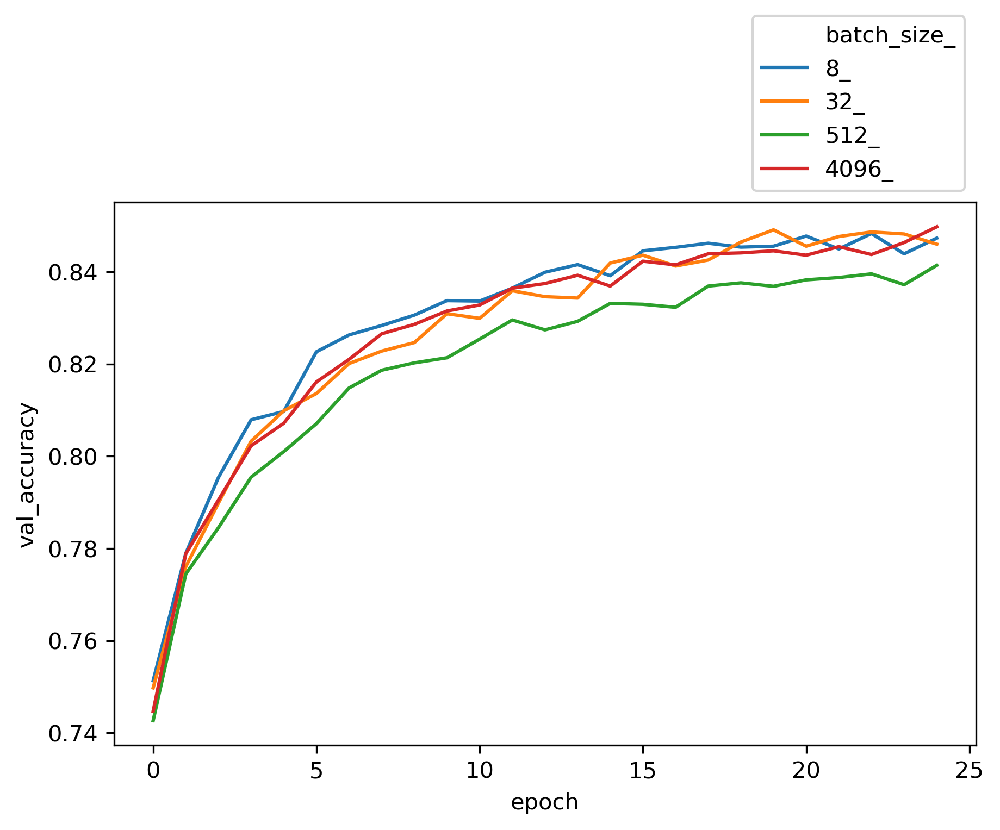
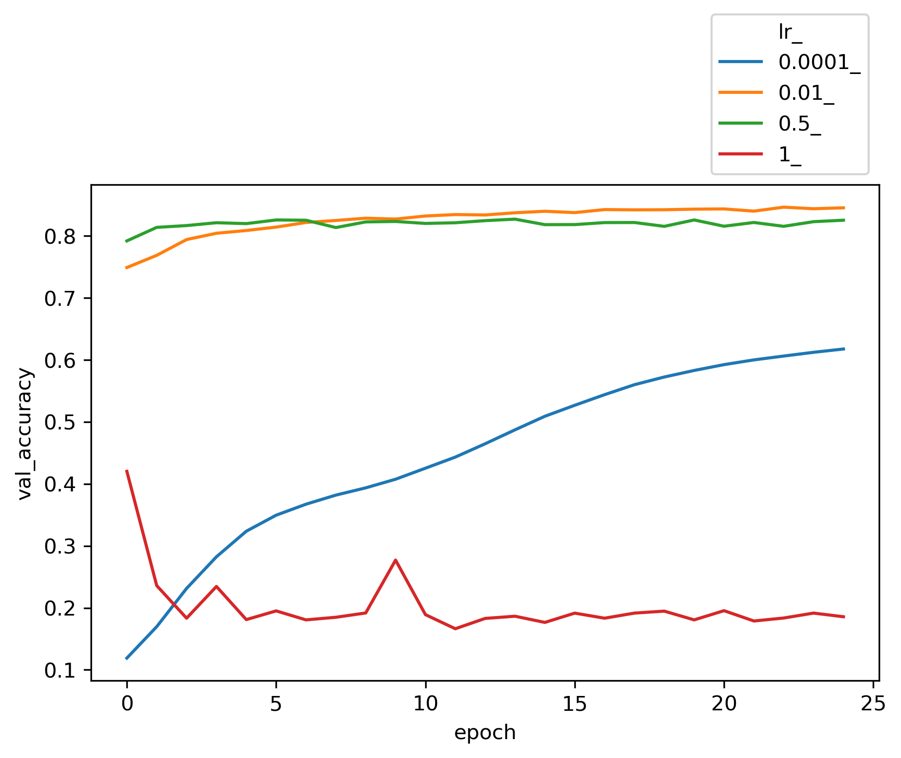

Hyperparameter tuning is much more important with neural networks than it has been with any other models. Other supervised learning models might have a couple of parameters, but neural networks can have dozens. These can substantially affect the accuracy of our models and although it can be a time consuming process, it is a necessary step when working with neural networks. 
Some of the important hyperparameters in neural networks to tune are batch_size, training epochs, optimization algorithms, learning rate, momentum, activation functions, dropout regularization, number of neurons in the hidden layers, number of the layers and so on.
Hyperparameter tuning comes with a challenge. How can we compare models specified with different hyperparameters if our model's final error metric can vary somewhat erratically? How do we avoid just getting unlucky and selecting the wrong hyperparameter? This is a problem that to a certain degree we just have to live with as we test and test again. However, we can minimize it somewhat by pairing our experiments with Cross Validation to reduce the variance of our final accuracy values.

### Hyperparameters in Neural Networks
* **Batch Size:**
Batch size determines how many observations the model is shown before it calculates loss/error and updates the model weights via gradient descent. You're showing the model enough observations that you have enough information to update the weights, but not such a large batch size that you don't get a lot of weight update iterations performed in a given epoch. Feed-forward Neural Networks aren't as sensitive to bach_size as other networks. Smaller batch sizes will also take longer to train. Keras defaults to batch size of 32. Increasing the minibatch size could lower the effective learning rate that provides stable convergence.

* **Learning rate:**
For a given number of epochs, a small learning rate may not reach the optimum point and under fit. A very large learning rate can cause divergence behavior. 

* **Momentum:**
Momentum is a property that decides the willingness of an optimizer to overshoot the minimum. Imagine a ball rolling down one side of a bowl and then up the opposite side a little bit before settling back to the bottom. The purpose of momentum is to try and escape local minima.

* **Activation Function:**
This is another hyperparameter to tune. Typically you'd want to use ReLU for hidden layers and either Sigmoid, or Softmax for output layers of binary and multi-class classification implementations respectively.

* **Network Weight Initialization:**
 Your model will get further with less epochs if you initialize it with weights that are well suited to the problem you're trying to solve. ```init_mode = ['uniform', 'lecun_uniform', 'normal', 'zero', 'glorot_normal', 'glorot_uniform', 'he_normal', 'he_uniform']```

* **Dropout Regularization and the Weight Constraint:**
The Dropout Regularization value is a percentage of neurons that you want to be randomly deactivated during training. The weight constraint is a second regularization parameter that works in tandem with dropout regularization. You should tune these two values at the same time. Using dropout on visible vs hidden layers might have a different effect. 

* **Number of units (neurons) per layer and number of layers:**
Typically depth (more layers) is more important than width (more nodes) for neural networks. The more nodes and layers the longer it will take to train a network, and higher the probability of overfitting. The larger your network gets the more you'll need dropout regularization or other regularization techniques to keep it in check.

### Dataset
`tensorflow.keras.datasets.mnist` is used to train our neural network. The training set is 60K and validation data is 10K. The labels are fairly evenly distributed. We have 10 classes of hand written digits from 0 to 9. 
```
import numpy as np
from tensorflow.keras.datasets import mnist
(X_train, y_train), (X_test, y_test) = mnist.load_data()
print(X_train.shape, X_test.shape)
np.unique(y_train, return_counts=True)
```
((60000, 28, 28), (10000, 28, 28))
(array([0, 1, 2, 3, 4, 5, 6, 7, 8, 9], dtype=uint8),
 array([5923, 6742, 5958, 6131, 5842, 5421, 5918, 6265, 5851, 5949]))

The input sample images are represented by a 2-dimensional array of 28x28. Array values are from 0 to 255. Let's normalize the input data and flatten it at the same time.
```
maximum = np.concatenate([X_train, X_test]).max()
X_train = X_train / maximum
X_test = X_test / maximum
X_train = X_train.reshape(60000, 784)
X_test = X_test.reshape(10000, 784)
```
It's not 100% necessary to normalize/scale your input data before feeding it to a neural network, as the network can learn the appropriate weights to deal with data as long as it is numerically represented. However, it is recommended to normalize the input data as it can speed up the training and reduces the chances of the gradient descent to get stuck in a local optimum.

## Hyperparameter techniques in Neural Networks
### Search strategies
There are different ways to search the hyperparamter space. Here are three popular approaches.
* **Grid search:**
 - This has a specific downside in that if we specify 5 hyperparameters with 5 values each then we've created 5^5 combinations of hyperparameters to train on. If we also decide to cross validate our results with 5-fold input cross validation then our model has to run 15,625 times! I recommend not using grid search to test combinations of different hyperparameters, but only using it to test different specifications of a single hyperparameter. It's rare that combinations between different hyperparameters lead to big performance gains. It's better to retain the best result for that single parameter while you test another, until you tune all the parameters in that way.

* **Random search:** 
 - Grid search treats every parameter as if it was equally important, but this just isn't the case. Random search allows searching to be specified along the most important parameter and experiments and less along the dimensions of less important hyperparameters. The downside of Random search is that it won't find the absolute best hyperparameters, but it is much less costly to perform than Grid Search.

* **Bayesian Optimization:** 
 - Bayesian Optimization is a search strategy that tries to take into account the results of past searches in order to improve future ones. That is tuning our hyperparameter tuning. `keras-tuner` offers Bayesian methods implementation.

### HP Tuning with GridSearchCV through Keras sklearn wrapper:
In order to utilize the GridSearchCV, we use sklearn wrapper for keras, `KerasClassifier`. GridSearchCV will handle the parameteric grid search and cross validation folding aspect and the KerasClassifier will train the neural network for each parameter set and run for the specified number of epochs. For each parameter set Pj and input fold of Xi, keras will train a model. The parameter set which yields the maximum average score over all the folds, Pjmax, will be selected to train the keras model with the entire input dataset of X again. Now let's create a Keras model that we can use in sklearn.GridSearchCV():
```
from sklearn.model_selection import GridSearchCV
from tensorflow.keras import Sequential
from tensorflow.keras.layers import Dense
from tensorflow.keras.wrappers.scikit_learn import KerasClassifier

# Function to create model, required for KerasClassifier
def create_model(units=32):
    model = Sequential()
    model.add(Dense(units, input_dim=784, activation='relu'))
    model.add(Dense(10, activation='softmax'))
    
    # Compile model
    model.compile(loss='sparse_categorical_crossentropy', optimizer='adam', metrics=['accuracy'])
    return model
    
# Instantiate the KerasClassifier model    
model = KerasClassifier(build_fn=create_model, verbose=1)  
```
The `create_model` function used in KerasClassifier needs to be able to accept the fit method. From here everything is the same as what we do in sklearn. We define hyperparamter search space and instantiate the GridSerchCV() instance.
```
param_grid = {'batch_size': [32,64,512],
              'epochs': [10, 20, 30],
              'units': [8, 16, 32]
              }

grid = GridSearchCV(estimator=model, param_grid=param_grid, n_jobs=-1, cv=5, refit=True)
```


<p float="left">
  
   
  
</p>

### Conclusion
We selected a feed forward perceptron topology to train a model to classify 10 target label classes from [Quickdraw dataset](https://github.com/googlecreativelab/quickdraw-dataset). The neural network that we used comprised of two dense layers with 32 neurons each and a 10 neuron output layer for 10 classes. The input tensor was 100K samples with 784 dimensions. To train the model we used TensorFlow and Keras API. We tried several Optimizer, batch sizes and learning rates to get a benchmark for this topology. With SGD optimizer, 0.01 learning rate and batch_size of 512 we got an accuracy of 0.84.

### links
- [Github repo](https://github.com/skhabiri/ML-ANN/tree/main/module2-Train)
- [Keras](https://keras.io)
- [TensorFlow](https://www.tensorflow.org)
