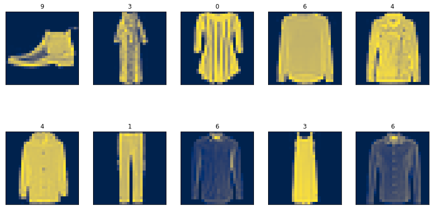
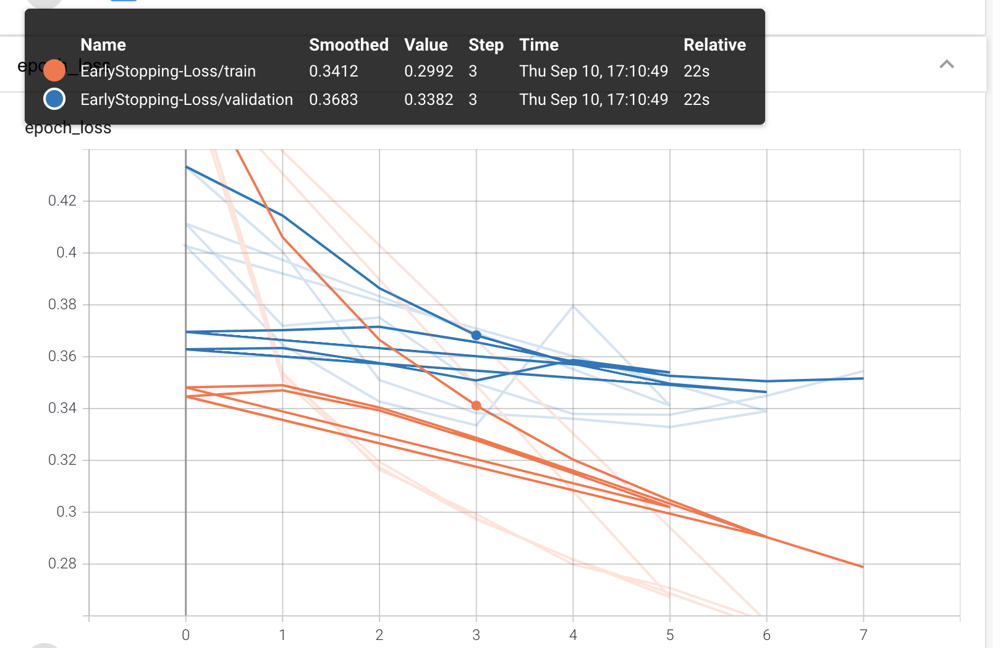

Neural Networks are highly parameterized models and can be easily overfit to the training data. The most salient way to combat this problem is with regularization techniques. A common technique to prevent overfitting is to use `EarlyStopping`. This strategy will prevent your weights from being updated well past the point of their peak usefulness. We can also combine `EarlyStopping`, `Weight Decay` and `Dropout`, or use `Weight Constraint` instead of `Weight Decay`, which accomplishes similar ends.

### Dataset
Our dataset is fashion_mnist with 60k train and 10k for test. There are 10 classes with equal distribution.
```
from tensorflow.keras.datasets import fashion_mnist

(X_train, y_train), (X_test, y_test) = fashion_mnist.load_data()
X_train.shape, X_test.shape
```
((60000, 28, 28), (10000, 28, 28))
Here is a sample of images of different classes:



### Build and compile the model
Next, we normalize and flatten the input tensor to make the array one dimensional. To convert a multidimensional tensor into a 1-D tensor, we can use `Flatten` layer from `tensorflow.keras.layers`. Flatten layer also acts as the input layer. Therefore, `input_shape` parameter needs to be defined in the Flatten layer. Our input layer is followed by three 128-unit dense layer with each of them cascaded with a parametric activation layer. Finally we have a dense output layer with 10 units and `softmax` activation function to predict the probability of each of the 10 target classes.
```
from tensorflow.keras.layers import Flatten, Dense
from tensorflow.keras.layers import ReLU
import tensorflow as tf
import os


model = tf.keras.Sequential([
    Flatten(input_shape=(28,28)),  # Treats as 784x1
    Dense(128),
    ReLU(negative_slope=.01),
    Dense(128),
    ReLU(negative_slope=.01),
    Dense(128),
    ReLU(negative_slope=.01),
    Dense(10, activation='softmax')
])
```
Next we will apply regularization technique to avoid overfittting the model. 

### Early stopping
`EarlyStopping` is a common technique that is used to prevent overfitting the model. In a neural network it can be simply implemented by a callback.
```
from tensorflow.keras.callbacks import EarlyStopping, TensorBoard

# create subdirectory to visualize EarlyStopping  in tensorboard
logdir = os.path.join("logs", "EarlyStopping-Loss")
tensorboard_callback = tf.keras.callbacks.TensorBoard(logdir, histogram_freq=1)

# Adding EarlyStopping call back
stop = tf.keras.callbacks.EarlyStopping(monitor='val_loss', min_delta=0.01, patience=3)
```
Here we monitor the validation loss and stop the training process if there is no significant improvement (min_delta=0.01) for three consecutive epochs.
For compiling the model we use sparse_categorical_crossentropy as the target classes are integer and not one hot encoded.
```
model.compile(loss='sparse_categorical_crossentropy', optimizer='nadam', metrics=['accuracy'])

model.fit(X_train, y_train, epochs=99, 
          validation_data=(X_test,y_test),
          callbacks=[tensorboard_callback, stop])
```
1875/1875 [==============================] - 3s 2ms/step - loss: 0.2517 - accuracy: 0.9064 - val_loss: 0.3449 - val_accuracy: 0.8775
Epoch 8/99
1875/1875 [==============================] - 3s 2ms/step - loss: 0.2412 - accuracy: 0.9093 - val_loss: 0.3544 - val_accuracy: 0.8756
<tensorflow.python.keras.callbacks.History at 0x7f9cf27fa240>

The model stops training after 8 epochs at 0.91 accuracy.



### Loss function for regularization
Ridge (l2) and Lasso (l1) are 2 out of possibily infinitly many ways to regularize a model by using a [distiance metric in Lp space](https://en.wikipedia.org/wiki/Lp_space). 
* Ridge L2:
Ordinary least squares (OLS) provides what is called the Best Linear Unbiased Estimator. That means that if you take any other unbiased estimator, it is bound to have a higher variance than the OLS solution. 
In Ridge, as a loss function we have sum of the squared errors (Ordinary Least Square) plus lambda times some of squared of model paramters except the y intercept (bias). $$Loss = \sum {E}^2 +\lambda\sum {{coef}^2}$$
The higher value of $\lambda$ lowers the slope (coefficients) which makes the fit to be more represented by y intercept. But it lowers the MSE for the unseen data as the model coefficients (slope) is less which means the model would not make a drastic change to fit the noisy data (overfitting). The MSE between the estimated model and training data represent the **bias**. The MSE between the estimated model and validation data represents the **variance**. Ridge regression adds to the model bias and in return lowers the variance.
* Lasso L1:
In Lasso loss is: $$Loss = \sum {E}^2 +\lambda\sum {|coef|}$$
Similar to ridge regression different coefficients may reduce ununiformely. However unlike ridge where a coefficient might reduce to zero for $\lambda \to \infty$, in Lasso a coefficient can reduce to **exactly** zero for a limited value of $\lambda$. This is a useful property where our data has some irrelevant features that we want to eliminate them from the model.

Both L2 and L1 are used to help prevent overfitting. The key difference between them is that L1 will calcualte zero valued feature weights (i.e. w = 0) for a subset of features with redundant information. Mathematically, this is refered to as [MultiCollinearity](https://en.wikipedia.org/wiki/Multicollinearity). While L2 will shrink the value of all feature weights but almost never down to zero.

### Weight Decay
Regularizers allow you to apply penalties on layer parameters or layer activity during optimization. These penalties are summed into the loss function that the network optimizes. We mostly use l1 and l2 as loss function for regularization.


### Conclusion
We presented three different approaches for hyperparamter tuning of a neural network. Using Keras sklearn wrapper, HParams Dashboard in TensorBoard, and keras-tuner. all three methods were applied on MNIST dataset to classify the digit labels. The tuned model achieved test accuracy of about 0.97.

### links
- [Github repo](https://github.com/skhabiri/ML-ANN/tree/main/module3-Tune)
- [Keras](https://keras.io)
- [TensorFlow](https://www.tensorflow.org)
