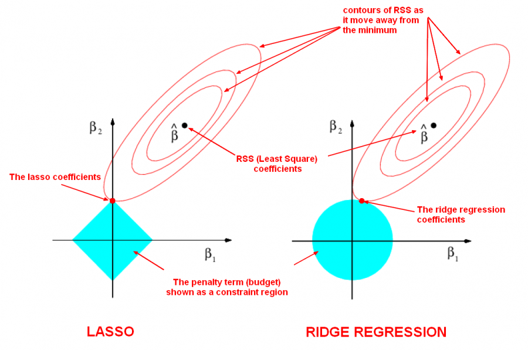
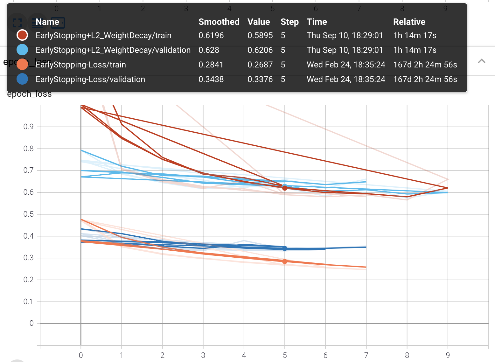
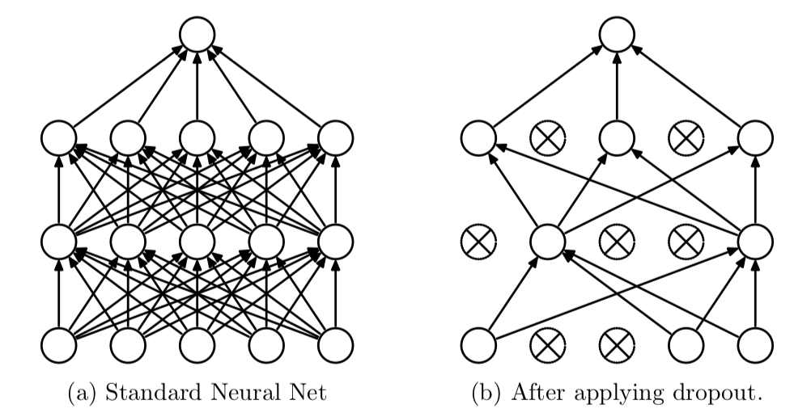

Neural Networks are highly parameterized models and can be easily overfit to the training data. The most salient way to combat this problem is with regularization techniques. A common technique to prevent overfitting is to use `EarlyStopping`. This strategy will prevent your weights from being updated well past the point of their peak usefulness. We can also combine `EarlyStopping`, `Weight Decay` and `Dropout`, or use `Weight Constraint` instead of `Weight Decay`, which accomplishes similar ends.

### Dataset
Our dataset is fashion_mnist with 60k train and 10k for test. There are 10 classes with equal distribution.
```
from tensorflow.keras.datasets import fashion_mnist

(X_train, y_train), (X_test, y_test) = fashion_mnist.load_data()
X_train.shape, X_test.shape
```
((60000, 28, 28), (10000, 28, 28))
Here is a sample of images of different classes:


### Build and compile the model
Next, we normalize and flatten the input tensor to make the array one dimensional. To convert a multidimensional tensor into a 1-D tensor, we can use `Flatten` layer from `tensorflow.keras.layers`. Flatten layer also acts as the input layer. Therefore, `input_shape` parameter needs to be defined in the Flatten layer. Our input layer is followed by three 128-unit dense layer with each of them cascaded with a parametric activation layer. Finally we have a dense output layer with 10 units and `softmax` activation function to predict the probability of each of the 10 target classes.
```
from tensorflow.keras.layers import Flatten, Dense
from tensorflow.keras.layers import ReLU
import tensorflow as tf
import os


model = tf.keras.Sequential([
    Flatten(input_shape=(28,28)),  # Treats as 784x1
    Dense(128),
    ReLU(negative_slope=.01),
    Dense(128),
    ReLU(negative_slope=.01),
    Dense(128),
    ReLU(negative_slope=.01),
    Dense(10, activation='softmax')
])
```
Next we will apply regularization technique to avoid overfittting the model. 

### Early Stopping
`EarlyStopping` is a common technique that is used to prevent overfitting the model. In a neural network it can be simply implemented by a callback.
```
from tensorflow.keras.callbacks import EarlyStopping, TensorBoard

# create subdirectory to visualize EarlyStopping  in tensorboard
logdir = os.path.join("logs", "EarlyStopping-Loss")
tensorboard_callback = tf.keras.callbacks.TensorBoard(logdir, histogram_freq=1)

# Adding EarlyStopping call back
stop = tf.keras.callbacks.EarlyStopping(monitor='val_loss', min_delta=0.01, patience=3)
```
Here we monitor the validation loss and stop the training process if there is no significant improvement (min_delta=0.01) for three consecutive epochs.
For compiling the model we use sparse_categorical_crossentropy as the target classes are integer and not one hot encoded.
```
model.compile(loss='sparse_categorical_crossentropy', optimizer='nadam', metrics=['accuracy'])

model.fit(X_train, y_train, epochs=99, 
          validation_data=(X_test,y_test),
          callbacks=[tensorboard_callback, stop])
```
1875/1875 [==============================] - 3s 2ms/step - loss: 0.2517 - accuracy: 0.9064 - val_loss: 0.3449 - val_accuracy: 0.8775
Epoch 8/99
1875/1875 [==============================] - 3s 2ms/step - loss: 0.2412 - accuracy: 0.9093 - val_loss: 0.3544 - val_accuracy: 0.8756
<tensorflow.python.keras.callbacks.History at 0x7f9cf27fa240>

The model stops training after 8 epochs at 0.91 accuracy.

As we see in the above TensorBoard's Graphs dashboard, after epoch=5 validation loss stops decreasing while training loss continue to improve. We could choose to relax the EarlyStopping condition in order to train the model further.

#### Loss function for regularization
Ridge (l2) and Lasso (l1) are 2 out of possibily infinitly many ways to regularize a model by using a [distiance metric in Lp space](https://en.wikipedia.org/wiki/Lp_space). 
* **Ridge L2:**
Ordinary least squares (OLS) provides what is called the Best Linear Unbiased Estimator. That means that if you take any other unbiased estimator, it is bound to have a higher variance than the OLS solution. 
In Ridge, as a loss function we have sum of the squared errors (Ordinary Least Square) plus lambda times some of squared of model paramters except the y intercept (bias). 

<p align="center">

</p>

The higher value of ƛ lowers the slope (coefficients) which makes the fit to be more represented by y intercept. But it lowers the MSE for the unseen data as the model coefficients (slope) is less which means the model would not make a drastic change to fit the noisy data (overfitting). The MSE between the estimated model and training data represent the **bias**. The MSE between the estimated model and validation data represents the **variance**. Ridge regression adds to the model bias and in return lowers the variance.
* **Lasso L1:**
Here the loss function is: 
<p align="center"></p>

Similar to ridge regression different coefficients may reduce ununiformely. However unlike ridge where a coefficient might reduce to zero for ƛ→∞, in Lasso a coefficient can reduce to **exactly** zero for a limited value of ƛ. This is a useful property where our data has some irrelevant features that we want to eliminate them from the model.

Both L2 and L1 are used to help prevent overfitting. The key difference between them is that L1 will calcualte zero valued feature weights (i.e. w = 0) for a subset of features with redundant information. Mathematically, this is refered to as [MultiCollinearity](https://en.wikipedia.org/wiki/Multicollinearity). While L2 will shrink the value of all feature weights but almost never down to zero.



### Weight Decay
Regularizers allow you to apply penalties on layer parameters or layer activity during optimization. These penalties are summed into the loss function that the network optimizes. We mostly use l1 and l2 as loss function for regularization. We can regularize different aspects of a layer:
- kernel_regularizer: to apply penalty on the layer's kernel weights
- bias_regularizer: to apply penalty on the layer's bias
- activity_regularizer: to apply penalty on the layer's activation output
Again we use two callbacks here. `TensorBoard` callback writes the results into a log file at every epoch and `EarlyStopping` callback stops the training process after 3 consecutive validation loss reductions, each less than the threshold 0.01.

```python
from tensorflow.keras import regularizers

model = tf.keras.Sequential([
    Flatten(input_shape=(28,28)),
    Dense(512, kernel_regularizer=regularizers.l2(l2=0.01)),
    ReLU(negative_slope=.01),
    Dense(512, kernel_regularizer=regularizers.l2(l2=0.01)),
    ReLU(negative_slope=.01),
    Dense(512, kernel_regularizer=regularizers.l2(l2=0.01)),
    ReLU(negative_slope=.01),
    Dense(10, activation='softmax')
])

model.compile(loss='sparse_categorical_crossentropy', optimizer='nadam',
              metrics=['accuracy'])

model.fit(X_train, y_train, epochs=99, 
          validation_data=(X_test,y_test),
          callbacks=[tensorboard_callback, stop])
```
Epoch 7/99
1875/1875 [==============================] - 15s 8ms/step - loss: 0.5852 - accuracy: 0.8422 - val_loss: 0.6197 - val_accuracy: 0.8260
Epoch 8/99
1875/1875 [==============================] - 15s 8ms/step - loss: 0.5689 - accuracy: 0.8459 - val_loss: 0.6612 - val_accuracy: 0.8096
<tensorflow.python.keras.callbacks.History at 0x7f9cfc6b03c8>



`Weight decay + stop loss` lowers the overall accuracy compared to having only the `stop loss`, as it puts more restriction on training the model from the onset. However, the model is more generalized and validation accuracy is the same level as the training accuracy. This is achieved by lowering the sensitivity of the model to any particular weight and consequently future unseen test data.

### Weight Constraint

If [L2-Norm](https://iq.opengenus.org/euclidean-distance) of the weights exceeds a set value of m, the weight constraint would scale the whole weight matrix by a factor that reduces the maximum norm to m. When using a simple L2 regularization only the high weights are penalized due to the loss function. However, in Weight constraint, we regularize directly. This seems to work especially well in combination with a dropout layer.

### Dropout Layer
Dropout deactivates a percentage of neurons of each layer randomly, each epoch the neurons will be randomly selected and deactivated, therefore the Forward propagation nor Backward propagation will not use these neurons to train the model.


It's worth mentioning that since drop out is an approach contrary to fine training, it would make sense to increase the learning rate when using drop out technique. It would also be beneficiary to increase the depth of the neural network as in each epoch a percentage of neurons are deactivated.
```
from tensorflow.keras.constraints import MaxNorm
from tensorflow.keras.layers import Dropout
wc = MaxNorm(max_value=2)

model = tf.keras.Sequential([
    Flatten(input_shape=(28,28)),
    Dense(256, kernel_constraint=wc),
    ReLU(negative_slope=.01),
    Dropout(.2),
    Dense(256, kernel_constraint=wc),
    ReLU(negative_slope=.01),
    Dropout(.2),
    Dense(256, kernel_constraint=wc),
    ReLU(negative_slope=.01),
    Dropout(.2),
    Dense(10, activation='softmax')
])

model.compile(loss='sparse_categorical_crossentropy', optimizer='nadam', metrics=['accuracy'])

model.fit(X_train, y_train, epochs=99, 
          validation_data=(X_test,y_test),
          callbacks=[tensorboard_callback, stop])
```
Epoch 5/99
1875/1875 [==============================] - 15s 8ms/step - loss: 0.3616 - accuracy: 0.8680 - val_loss: 0.3876 - val_accuracy: 0.8531
Epoch 6/99
1875/1875 [==============================] - 15s 8ms/step - loss: 0.3580 - accuracy: 0.8675 - val_loss: 0.3865 - val_accuracy: 0.8598
<tensorflow.python.keras.callbacks.History at 0x7ff9a9121eb8>

Training and validation accuracy are still close and overall they are less than the ones for a model without regularization.

## Model Deployment
You've built a image classification model, but it's just sitting in your Jupyter Notebook. What now? Well you deploy to some down stream application. TensorFlow supports three ways of deploying it's models:
- In-Browser with TensorFlow.js
- API with TensorFlow Serving (TFX) or another Framework
- On-Device with TensorFlow Lite

All those methods rely on the same core idea: save your weights and architecture information, load those parameters into application, and perform inference.

### ModelCheckpoint callback
ModelCheckpoint callback is used in conjunction with `.fit()` method to save a model or weights (in a checkpoint file) at some interval, so the model or weights can be loaded later to continue the training from a saved state. A few options this callback provides include:
- Whether to only keep the model that has achieved the "best performance" so far, or whether to save the model at the end of every epoch regardless of performance.
- Definition of 'best'; which quantity to monitor and whether it should be maximized or minimized.
- The frequency that it should save at. It could be saving at the end of every epoch, or after a fixed number of training batches.
- Whether only weights are saved, or the whole model is saved.
```python
# opting out of saving NN architecture
checkpoint_callback = tf.keras.callbacks.ModelCheckpoint(filepath="weights_best.h5", 
                                                         monitor='val_loss', 
                                                         verbose=1, 
                                                         save_best_only=False, 
                                                         save_freq='epoch',
                                                         save_weights_only=True)
                                                         

def create_model():
  model = tf.keras.Sequential([
      Flatten(input_shape=(28,28)),
      Dense(128),
      ReLU(negative_slope=.01),
      Dense(128),
      ReLU(negative_slope=.01),
      Dense(128),
      ReLU(negative_slope=.01),
      Dense(10, activation='softmax')
  ])

  model.compile(loss='sparse_categorical_crossentropy', optimizer='nadam',
                metrics=['accuracy'])

  return model

model = create_model()

model.fit(X_train, y_train, epochs=5, validation_data=(X_test,y_test),
          verbose=2, callbacks=[checkpoint_callback])
```

Epoch 1/5
1875/1875 - 5s - loss: 0.4753 - accuracy: 0.8280 - val_loss: 0.4177 - val_accuracy: 0.8427

Epoch 00001: saving model to weights_best.h5
Epoch 2/5
1875/1875 - 2s - loss: 0.3517 - accuracy: 0.8706 - val_loss: 0.3744 - val_accuracy: 0.8669

Epoch 00002: saving model to weights_best.h5
Epoch 3/5
1875/1875 - 2s - loss: 0.3166 - accuracy: 0.8822 - val_loss: 0.3596 - val_accuracy: 0.8666

Epoch 00003: saving model to weights_best.h5
Epoch 4/5
1875/1875 - 3s - loss: 0.2959 - accuracy: 0.8898 - val_loss: 0.3517 - val_accuracy: 0.8713

Epoch 00004: saving model to weights_best.h5
Epoch 5/5
1875/1875 - 2s - loss: 0.2807 - accuracy: 0.8950 - val_loss: 0.3432 - val_accuracy: 0.8780

Epoch 00005: saving model to weights_best.h5
<tensorflow.python.keras.callbacks.History at 0x7f9cb378b780>

The model is saved at the end of each epoch. Now if we evaluate the model:
```
model.evaluate(X_test, y_test)
```
313/313 [==============================] - 0s 866us/step - loss: 0.3432 - accuracy: 0.8780
[0.34324756264686584, 0.878000020980835]

```
model.evaluate(X_train, y_train)
```
1875/1875 [==============================] - 2s 995us/step - loss: 0.2627 - accuracy: 0.9021
[0.2627202272415161, 0.9020666480064392]

Notice that the loss from `.fit()` on the last epoch for train data is different from the loss from `.evaluate()` method but those loss numbers are the same for evaluation data. To answer this, please note:

* **.fit():** During the train process of even the last epoch at the end of each of its batch, we update the weights. even at the end of the last batch of the last epoch we update the weight one last time. That is for training data. The validation of the last epoch is fed in after the last epoch model weights are updated.

* **.evaluate():** The model is already finalized and the validation data is fed to the same model as the one after the last batch of the last epoch. So validation results are the same. That wouldn't be the case for the training data.

For training data in addition to back propagation update at the end of each batch, if we have random dropout, that would also come into effect during the fit(). However during evaluate() we do not have dropout any longer.

### Load exported model
Notice that in the previous section we only chose to save the weight and not the architecture of the model. In order to use the exported model we need to create a model template with the same architecture as before, `m = create_model()`. Now we can confidently load the weights from the last ntraining phse into the new model, `m.load_weights('./weights_best.h5') `. Now if we run the evaluate method on the loaded model we expect the same results:
```
m.evaluate(X_test, y_test, verbose=1)
```
313/313 [==============================] - 0s 857us/step - loss: 0.3432 - accuracy: 0.8780
[0.34324756264686584, 0.878000020980835]
```
m.evaluate(X_train, y_train)
```
1875/1875 [==============================] - 2s 1ms/step - loss: 0.2627 - accuracy: 0.9021
[0.2627202272415161, 0.9020666480064392]

Please note that the computation result is related to the average metric value of all the batches in that epoch. 
Saving the entire model could have make the model size too big and complicates the process of deployment. One way to address this issue is to trim the architecture by using smaller number of layers and neurons. Another tip would be to store the finalized model with reduced precision. In the process of training we do not want to lower the precision as it could fail to converge or affect the performance. However once the model is finalized and ready to be saved we could round the number of decimal points for the paramters and reduced the precision of the floating point numbers for the saved model.

### Conclusion
In this article we discussed different approaches to regularize the model and prevent overfitting. In particular we showed how to use call backs to trigger early stopping, use weigh decay and constraint with different loss functions to regularize the NN parameters, and finally using dropout technique to reduce the sensivity of the model to any particular path. We also discussed the practical aspects of saving a tensorflow model for deployment in a down stream application. 

### links
- [Github repo](https://github.com/skhabiri/ML-ANN/tree/main/module4-Deploy)
- [Keras callbacks](https://keras.io/api/callbacks/)
- [TensorFlow](https://www.tensorflow.org)
- [TensorBoard](https://www.tensorflow.org/tensorboard)
- [Regularizers](https://keras.io/api/layers/regularizers)
- [TensorFlow.js](https://www.tensorflow.org/js)
